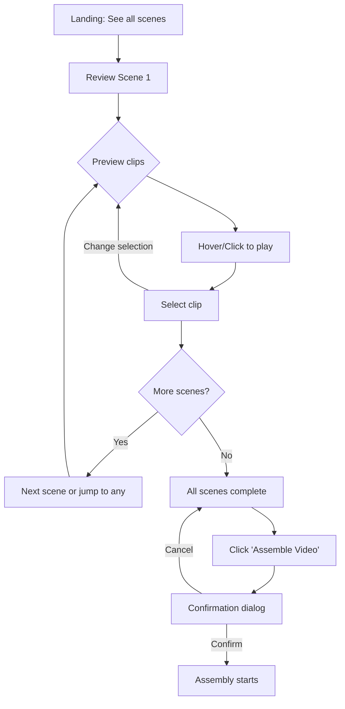

# AI Video Generator UX Design Specification

_Created on 2025-10-31 by lichking_
_Generated using BMad Method - Create UX Design Workflow v1.0_

---

## Executive Summary

**Project Vision:** AI Video Generator automates the entire video creation workflow from conversational brainstorming to final rendered video. The Visual Curation UI is the critical human-in-the-loop moment where the creator reviews AI-generated scripts scene-by-scene and selects the perfect B-roll clip from AI-curated suggestions.

**Target User:** Content creators who prioritize speed and efficiency, wanting to drastically reduce video production time from hours to minutes while maintaining creative control.

**Core Experience:** Empowered director reviewing and curating their story - previewing video clips and making confident selections with full visibility of script, options, and progress.

**Platform:** Desktop-first web application (FOSS stack)

**Inspiration:** InVideo AI's balance of AI automation with manual control, real-time preview, and timeline-style visual editing.

---

## 1. Design System Foundation

### 1.1 Design System Choice

**Selected: shadcn/ui (Tailwind-based)**

**Rationale:**
- Modern, customizable component library perfect for FOSS requirements
- Built on Radix UI primitives (accessibility built-in)
- Tailwind CSS provides rapid styling and responsive design
- Highly themeable for unique brand identity
- Excellent for media-heavy applications (video preview interfaces)
- Active community, well-documented
- Copy-paste components (no dependency bloat)

**What it provides:**
- Button, Card, Dialog/Modal, Form inputs, Select/Dropdown components
- Tabs, Accordion, Progress indicators
- Toast notifications for feedback
- Accessibility (WCAG AA compliant out of box)
- Dark/Light mode support

**Custom components needed:**
- Video player preview component
- Scene card with script + clip grid
- Progress tracker (scene completion indicator)
- Clip selection thumbnail grid

---

## 2. Core User Experience

### 2.1 Defining Experience

**The defining experience:** "Scene-by-scene video clip curation" - like being a director reviewing dailies and making the final cut decisions.

**Core interaction:** Preview → Select → Progress

**User's mental model:**
1. I see my script broken into scenes
2. For each scene, I see the text and multiple video clip options
3. I preview clips by clicking/hovering
4. I select the perfect clip
5. I see my progress (scenes completed)
6. When all scenes have clips selected, I trigger final assembly

**UX Pattern:** This is a **linear curation workflow** with **progressive completion** - similar to:
- Reviewing and approving design mockups
- Selecting photos for a photo album
- Curating a playlist

**Not like:** Traditional form filling, multi-step wizard, complex branching

---

## 3. Visual Foundation

### 3.1 Color System

**Theme Direction: Professional Creator Workspace**

**Primary Palette:**
- **Primary:** `#6366f1` (Indigo 500) - Actions, selected states, CTAs
  - Usage: "Assemble Video" button, selected clip borders, progress indicators
- **Secondary:** `#8b5cf6` (Violet 500) - Accent, hover states
  - Usage: Hover effects, secondary actions
- **Success:** `#10b981` (Emerald 500) - Completed scenes, success states
- **Warning:** `#f59e0b` (Amber 500) - Incomplete selections
- **Error:** `#ef4444` (Red 500) - Errors, destructive actions

**Neutral Palette (Dark Mode Optimized):**
- **Background:** `#0f172a` (Slate 900) - Main background
- **Surface:** `#1e293b` (Slate 800) - Cards, elevated surfaces
- **Border:** `#334155` (Slate 700) - Dividers, borders
- **Text Primary:** `#f8fafc` (Slate 50) - Main text
- **Text Secondary:** `#cbd5e1` (Slate 300) - Supporting text

**Rationale:**
- Dark interface reduces eye strain during extended curation sessions
- High contrast for video thumbnails to stand out
- Indigo/violet conveys creativity + professionalism
- Inspired by video editing tools (Premiere, DaVinci) that use dark UIs

### 3.2 Typography System

**Font Families:**
- **Headings:** Inter (weight: 600-700) - Clean, modern, professional
- **Body:** Inter (weight: 400-500) - Excellent readability
- **Monospace:** JetBrains Mono (for technical info if needed)

**Type Scale:**
- **h1:** 2.25rem (36px) - Page title
- **h2:** 1.5rem (24px) - Section headers
- **h3:** 1.25rem (20px) - Scene headers
- **Body:** 1rem (16px) - Script text, UI labels
- **Small:** 0.875rem (14px) - Captions, secondary info

### 3.3 Spacing & Layout

**Base unit:** 4px (Tailwind's default spacing scale)

**Spacing scale:**
- xs: 4px, sm: 8px, md: 16px, lg: 24px, xl: 32px, 2xl: 48px

**Layout:**
- Max content width: 1400px (desktop optimized)
- Grid system: CSS Grid for scene cards
- Responsive: Flexbox for component layouts

---

## 4. Design Direction

### 4.1 Chosen Design Approach

**Direction: "Scene-Focused Timeline Dashboard"**

**Layout Decisions:**
- **Navigation:** Top bar (minimal, persistent) with branding + "Assemble Video" CTA
- **Content Structure:** Vertical scrolling scene list (one scene at a time or accordion view)
- **Content Organization:** Card-based - each scene is a distinct card with script + clip grid

**Hierarchy Decisions:**
- **Visual Density:** Balanced - enough white space for focus, but information-rich
- **Header Emphasis:** Bold scene numbers + subtle script preview
- **Content Focus:** Video-first - large, scannable thumbnails with play-on-hover

**Interaction Decisions:**
- **Primary Action Pattern:** Inline selection (click thumbnail to select, no modal)
- **Information Disclosure:** Progressive - scenes can expand/collapse, but default is all visible
- **User Control:** Maximum flexibility - can jump between scenes, change selections anytime

**Visual Style Decisions:**
- **Weight:** Balanced with subtle elevation (cards have soft shadows)
- **Depth Cues:** Subtle elevation (2-4px shadows), selected state uses glow effect
- **Border Style:** Subtle rounded borders (8px radius for cards, 4px for thumbnails)

**Rationale:**
This approach feels like InVideo AI's timeline editor - spatial, visual, and gives full control. The scene card structure lets you see script context while previewing clips. The vertical scroll keeps scenes in order (like a timeline) but doesn't force linear progression.

---

## 5. User Journey Flows

### 5.1 Critical User Paths

#### Journey: Visual Curation Flow (Primary)

**User Goal:** Review AI-generated script and select the perfect video clip for each scene, then trigger final video assembly.

**Approach:** Progressive completion with non-linear navigation

**Flow Steps:**

**Step 1: Landing State**
- User arrives from conversational agent (video topic confirmed, generation complete)
- User sees:
  - Page header: "Select Your Clips" with progress (0/N scenes complete)
  - List of all scene cards in vertical scroll
  - Each card shows: Scene number, script text (truncated or full), 4-6 clip thumbnails
  - "Assemble Video" button (disabled until all scenes have selections)
- User does: Scrolls to review all scenes, begins with Scene 1
- System responds: Smooth scroll, cards are interactive on hover

**Step 2: Scene Review & Clip Preview**
- User sees: Scene card with script text and clip thumbnail grid
- User does: Hovers over thumbnail → video preview plays (or clicks to play)
- System responds:
  - Hover: Thumbnail enlarges slightly, play icon appears
  - Click: Video plays inline or in lightbox overlay
  - Visual feedback: Current scene highlighted with border

**Step 3: Clip Selection**
- User sees: Clip thumbnails in grid (4-6 options)
- User does: Clicks thumbnail to select
- System responds:
  - Selected clip: Border highlight (primary color), checkmark icon
  - Scene card: Updates to "completed" state (green indicator)
  - Progress bar: Updates (1/N → 2/N)
  - Previous selection (if exists): Deselected automatically
  - Scene card can collapse (optional) to show selection only

**Step 4: Progress & Navigation**
- User sees: Progress indicator in header, visual completion on each scene
- User does:
  - Scrolls to next scene, or
  - Jumps to any scene (non-linear), or
  - Changes previous selections
- System responds:
  - Smooth navigation
  - No data loss - all selections persist
  - Can revisit any scene anytime

**Step 5: Completion & Assembly Trigger**
- User sees: All scenes have green checkmarks, progress shows 100%
- User does: Clicks "Assemble Video" button (now enabled)
- System responds:
  - Confirmation dialog: "Ready to assemble? You've selected clips for all N scenes. This will generate your final video."
  - Confirm → Triggers assembly workflow
  - Shows loading state: "Assembling your video..."

**Decision Points:**
- User can change selections at any time before assembly
- User can skip scenes and come back (non-linear)
- User can preview clips multiple times before selecting

**Error States:**
- Clip fails to load → Show error message, "Retry" button
- Network issue → Toast notification, retry logic
- No clips available for scene → Show message, skip or manual search (future enhancement)

**Success State:**
- Completion feedback: "Video assembly started! You'll be notified when it's ready."
- Next action: Redirect to assembly progress page or dashboard

---

## 6. Component Library

### 6.1 Component Strategy

**From shadcn/ui:**
- Button (Primary, Secondary, variants)
- Card (for scene containers)
- Progress (bar for completion tracking)
- Dialog/Modal (confirmation, lightbox)
- Badge (scene status indicators)
- Scroll Area (smooth scrolling)
- Toast (notifications)

**Custom Components:**

#### 6.1.1 VideoPreviewThumbnail Component

**Purpose:** Display video clip thumbnail with play-on-hover preview

**Anatomy:**
- Thumbnail image (16:9 aspect ratio)
- Play icon overlay (center)
- Duration badge (bottom-right corner)
- Selection state (border + checkmark)

**States:**
- **Default:** Thumbnail with subtle border, play icon visible
- **Hover:** Slight scale (1.05x), shadow increases, preview plays (optional)
- **Playing:** Video plays inline, controls appear
- **Selected:** Primary color border (3px), checkmark icon top-right
- **Loading:** Skeleton placeholder with shimmer
- **Error:** Gray placeholder with error icon, "Retry" text

**Variants:**
- Size: Small (160px), Medium (220px), Large (300px)
- Aspect ratio: 16:9 (default), 9:16 (portrait), 1:1 (square)

**Behavior:**
- Click → Toggle selection (if not playing)
- Click (if playing) → Pause/Play
- Hover → Show enlarged preview (optional lightbox on second click)

**Accessibility:**
- ARIA role: `button`
- Keyboard: `Enter` or `Space` to select, `Tab` to navigate
- Screen reader: "Video clip option {number}, {duration}, {selected/not selected}"

#### 6.1.2 SceneCard Component

**Purpose:** Container for scene script text and clip selection grid

**Anatomy:**
- Scene number badge (top-left)
- Script text (full or truncated with expand)
- Clip grid (2x2, 2x3, or 3x2 depending on count)
- Completion indicator (checkmark or progress icon)
- Collapse/Expand toggle (optional)

**States:**
- **Default:** Expanded, no clip selected, border subtle
- **In Progress:** User is reviewing clips (hover state active)
- **Completed:** Clip selected, green checkmark visible, can collapse
- **Collapsed:** Shows only scene number + selected clip thumbnail + script preview

**Variants:**
- Expanded (default)
- Collapsed (minimal view)

**Behavior:**
- Click script → Expand full text if truncated
- Click collapse → Minimize to show selection only
- Selecting clip → Triggers completion state

**Accessibility:**
- ARIA role: `article`
- Keyboard: `Tab` to focus, arrow keys to navigate clips within
- Screen reader: "Scene {number}, {script text}, {completion status}"

#### 6.1.3 ProgressTracker Component

**Purpose:** Show overall curation progress (scenes completed)

**Anatomy:**
- Progress bar (visual)
- Text: "3 / 10 scenes complete"
- Optional: Mini scene checklist (scene numbers with checkmarks)

**States:**
- **0% Complete:** Gray progress bar, "Get started" message
- **In Progress:** Blue progress bar filling, "Keep going!"
- **100% Complete:** Green progress bar, "Ready to assemble!" message

**Variants:**
- Compact (just bar + text)
- Detailed (includes scene checklist)

**Accessibility:**
- ARIA role: `progressbar`
- `aria-valuenow`, `aria-valuemin`, `aria-valuemax`
- Screen reader: "Progress: 3 out of 10 scenes complete"

---

## 7. UX Pattern Decisions

### 7.1 Consistency Rules

**BUTTON HIERARCHY:**
- **Primary Action:** "Assemble Video" - Large, indigo fill, white text, prominent position (top-right sticky)
- **Secondary Action:** "Preview Selection" - Outline style, indigo border
- **Tertiary Action:** "Reset Scene" - Ghost/text button, subtle
- **Destructive Action:** "Cancel/Discard" - Red outline or text

**FEEDBACK PATTERNS:**
- **Success:** Toast notification top-right, green, 4s duration ("Clip selected for Scene 3!")
- **Error:** Toast notification top-right, red, persistent until dismissed ("Failed to load clip. Retry?")
- **Warning:** Toast notification, amber, 6s duration ("Remember to select clips for all scenes")
- **Info:** Toast notification, blue, 5s duration ("Tip: Hover over clips to preview")
- **Loading:** Skeleton loaders for thumbnails, spinner for video assembly trigger

**SELECTION PATTERNS:**
- Single selection per scene (radio button behavior)
- Click thumbnail → Deselects previous, selects new
- Visual feedback: Border highlight + checkmark instantly
- No confirmation needed for selection (undo by selecting different clip)

**MODAL PATTERNS:**
- **Confirmation Dialog:** Medium size, centered, for "Assemble Video" action
  - Backdrop: Semi-transparent dark overlay
  - Dismiss: Click outside or ESC key closes
  - Focus: Auto-focus on primary action button
- **Video Lightbox:** Large/full-screen, for expanded clip preview
  - Dismiss: Click outside, ESC, or close button
  - Stacking: Only one modal at a time

**NAVIGATION PATTERNS:**
- **Active State:** Currently viewing/focused scene has subtle highlight
- **Scroll Position:** Auto-scroll to next incomplete scene (optional)
- **Back Button:** Browser back returns to conversational agent (if applicable)
- **Deep Linking:** URL includes project ID for resuming (future)

**EMPTY STATE PATTERNS:**
- **First Use:** "Let's curate your video! Select clips for each scene below."
- **No Clips Available:** "No clips found for this scene. Try manual search or skip." (future enhancement)

**CONFIRMATION PATTERNS:**
- **Assemble Video:** Always confirm (irreversible action)
- **Change Selection:** No confirmation (easily undoable)
- **Leave Page Unsaved:** Browser warning if selections exist but not assembled (future)

**NOTIFICATION PATTERNS:**
- **Placement:** Top-right corner, stacked vertically
- **Duration:** Auto-dismiss (3-6s) except errors (manual dismiss)
- **Stacking:** Max 3 visible, older ones fade out
- **Priority:** Errors above warnings above success

---

## 8. Responsive Design & Accessibility

### 8.1 Responsive Strategy

**Target Devices:** Desktop-first (primary), Tablet (secondary support)

**Breakpoints:**
- **Desktop:** 1024px+ → 3-column clip grid, full layout
- **Tablet:** 768px-1023px → 2-column clip grid, simplified nav
- **Mobile:** <768px → Not optimized (desktop usage expected)

**Adaptation Patterns:**
- **Clip Grid:** 3 columns (desktop) → 2 columns (tablet) → 1 column (mobile - if ever needed)
- **Scene Cards:** Full width, stacked vertically (same across all sizes)
- **Navigation:** Top bar remains, "Assemble Video" button stays prominent
- **Video Preview:** Lightbox on tablet (less space for inline), inline on desktop

### 8.2 Accessibility Strategy

**Compliance Target:** WCAG 2.1 Level AA

**Key Requirements:**
- **Color Contrast:** 4.5:1 for text, 3:1 for UI components
- **Keyboard Navigation:** All clips, scenes, and buttons accessible via Tab, Enter, Space
- **Focus Indicators:** 2px solid ring on focus (visible, high contrast)
- **ARIA Labels:** Meaningful labels for screen readers on all interactive elements
- **Alt Text:** Video thumbnails have descriptive alt text (e.g., "Lion roaming savanna at sunset")
- **Form Labels:** Progress tracker and controls properly labeled
- **Error Identification:** Clear error messages with recovery actions
- **Touch Target Size:** Minimum 44x44px for clip thumbnails (desktop uses mouse, but tablet-friendly)

**Testing Strategy:**
- **Automated:** Lighthouse accessibility audit, axe DevTools
- **Manual:** Keyboard-only navigation testing
- **Screen Reader:** NVDA (Windows) / JAWS testing

---

## 9. Implementation Guidance

### 9.1 Technical Stack Recommendation

**Frontend Framework:** React (or Next.js for SSR)
**Styling:** Tailwind CSS + shadcn/ui components
**Video Player:** Video.js or Plyr (FOSS, accessible, customizable)
**State Management:** React Context or Zustand (lightweight)
**API:** REST or GraphQL for fetching script, clips, triggering assembly

### 9.2 Key Implementation Notes

1. **Video Preview Performance:**
   - Lazy load thumbnails (only load visible ones)
   - Use low-res preview videos for hover playback
   - Consider video sprite sheets for instant scrubbing

2. **Selection State:**
   - Store selections in local state (React state)
   - Persist to backend on selection (auto-save)
   - Handle concurrent editing (if multi-user in future)

3. **Responsive Video:**
   - Use aspect-ratio CSS for consistent thumbnail sizing
   - Ensure videos are properly encoded for web (H.264, VP9)

4. **Accessibility:**
   - Use semantic HTML (`<article>`, `<section>`, `<button>`)
   - Test with keyboard navigation early
   - Ensure proper ARIA attributes on custom components

---

## Appendix

### Related Documents

- Product Requirements: `D:\BMAD video generator\docs\prd.md`
- Product Brief: `D:\BMAD video generator\docs\product-brief.md`

### Next Steps & Follow-Up Workflows

This UX Design Specification serves as input to:

- **Solution Architecture Workflow** - Define technical architecture with UX context (NEXT REQUIRED STEP per workflow status)
- **Wireframe Generation Workflow** - Create detailed wireframes from user flows
- **Interactive Prototype Workflow** - Build clickable HTML prototypes
- **Component Showcase Workflow** - Create interactive component library
- **AI Frontend Prompt Workflow** - Generate prompts for v0, Lovable, Bolt, etc.

### Version History

| Date       | Version | Changes                         | Author    |
| ---------- | ------- | ------------------------------- | --------- |
| 2025-10-31 | 1.0     | Initial UX Design Specification | lichking |

---

_This UX Design Specification was created through collaborative design facilitation, not template generation. All decisions were made with project context and are documented with rationale._
