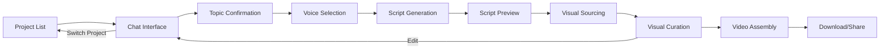
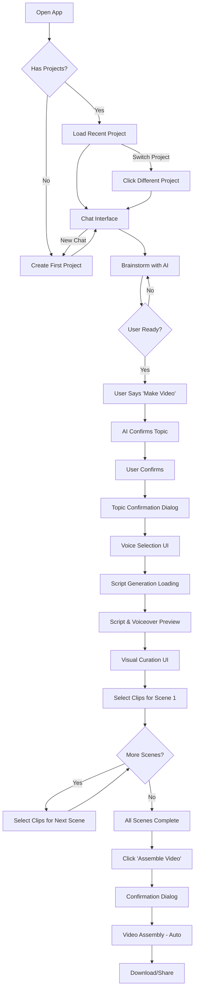

# AI Video Generator UX Design Specification

_Created on 2025-10-31 by lichking_
_Updated on 2025-11-04 to include full application scope (Project Management UI + Chat Interface + Visual Curation)_
_Updated on 2025-11-05 to include Epic 2 (Voice Selection + Script Generation + Voiceover Preview)_
_Updated on 2025-11-13 to include Epic 3 (Visual Sourcing Loading UI + Empty Clip State)_
_Updated on 2025-11-13 to add comprehensive UX patterns, accessibility standards, and testing strategy_
_Updated on 2025-11-18 to complete Epic 4 (Visual Curation Interface) with all 6 stories fully specified_
_Updated on 2025-11-22 to add Silent Video Indicator for VideoPreviewPlayer (audio stripped per Story 3.7)_
_Updated on 2025-11-23 to add Epic 5 (Video Assembly Progress UI + Export Page UI) - FULL MVP COMPLETE_
_Generated using BMad Method - Create UX Design Workflow v1.0_

**Version:** 3.5 (Production-Ready: Epic 1-5 Complete - Full MVP UX Specification)

---

## Executive Summary

**Project Vision:** AI Video Generator automates the entire video creation workflow from conversational brainstorming to final rendered video. Users interact with an AI assistant to refine video ideas, select a voice for narration, review AI-generated scripts with voiceover previews, then proceed through visual curation to produce publish-ready videos in minutes.

**Target User:** Content creators who prioritize speed and efficiency, wanting to drastically reduce video production time from hours to minutes while maintaining creative control over their content through transparent, reviewable automation.

**Core Experiences:**
1. **Multi-Project Management:** Organize multiple video ideas in separate conversations, switch between projects seamlessly, and resume work at any time
2. **Conversational Brainstorming:** Natural chat interface with AI assistant to explore ideas, refine topics, and trigger video creation
3. **Voice Selection & Script Preview:** Choose from multiple AI voices with audio previews, then review AI-generated script scene-by-scene with voiceover playback before committing to visual sourcing
4. **Scene-by-Scene Curation:** Director-style review interface for previewing and selecting perfect B-roll clips for each script scene

**Platform:** Desktop-first web application (FOSS stack: Next.js, Tailwind CSS, shadcn/ui, Ollama LLM)

**Inspiration:**
- ChatGPT's conversational interface for natural AI interaction
- InVideo AI's balance of automation with manual control
- Video editing tools (Premiere, DaVinci) for dark UI optimized for media work
- Notion's sidebar navigation for multi-project management

---

## 1. Design System Foundation

### 1.1 Design System Choice

**Selected: shadcn/ui (Tailwind-based)**

**Rationale:**
- Modern, customizable component library perfect for FOSS requirements
- Built on Radix UI primitives (accessibility built-in)
- Tailwind CSS provides rapid styling and responsive design
- Highly themeable for unique brand identity
- Excellent for media-heavy applications (video preview interfaces)
- Active community, well-documented
- Copy-paste components (no dependency bloat)

**What it provides:**
- Button, Card, Dialog/Modal, Form inputs, Select/Dropdown components
- Tabs, Accordion, Progress indicators
- Toast notifications for feedback
- Scroll Area (smooth scrolling for long content)
- Accessibility (WCAG AA compliant out of box)
- Dark/Light mode support

**Custom components needed:**
- ProjectSidebar (project list navigation)
- ChatInterface (message display + input)
- MessageBubble (user/assistant message rendering)
- VideoPreviewThumbnail (video clip preview component)
- SceneCard (scene script + clip grid container)
- ProgressTracker (scene completion indicator)
- VisualSuggestionGallery (clip suggestions grid with thumbnails, metadata, download status) **[Epic 4]**
- VideoPreviewPlayer (HTML5 video player with controls, keyboard shortcuts, fallback to YouTube) **[Epic 4]**
- AssemblyTriggerButton (sticky "Assemble Video" button with validation and confirmation modal) **[Epic 4]**

### 1.2 UX Pattern Consistency Rules

**These patterns ensure consistent UX across the entire application.**

#### 1.2.1 Button Hierarchy

**Primary Button:**
- **Background:** `#6366f1` (Indigo 500)
- **Color:** White
- **Usage:** Main actions ("Continue", "Assemble Video", "Send")
- **Hover:** Darker indigo (`#4f46e5`)
- **Disabled:** Gray background (`#475569`), opacity 0.5, cursor not-allowed

**Secondary Button:**
- **Background:** Transparent
- **Border:** 1px solid `#6366f1` (Indigo 500)
- **Color:** `#6366f1` (Indigo 500)
- **Usage:** Alternative actions ("Preview", "Back")
- **Hover:** Background `#334155` (Slate 700, 30% opacity)

**Destructive Button:**
- **Background:** `#ef4444` (Red 500)
- **Color:** White
- **Usage:** Delete actions, irreversible operations
- **Hover:** Darker red (`#dc2626`)

**Ghost Button:**
- **Background:** Transparent
- **Border:** None
- **Color:** `#cbd5e1` (Slate 300)
- **Usage:** Tertiary actions, cancel
- **Hover:** Background `#334155` (Slate 700, 20% opacity)

#### 1.2.2 Form Validation Patterns

**Validation Timing:**
- **On blur:** Validate individual fields when user leaves the field
- **On submit:** Validate entire form when user clicks submit
- **Real-time:** Only for password strength or character count

**Error Message Display:**
- **Location:** Below the field
- **Color:** `#ef4444` (Red 500)
- **Font Size:** 0.875rem (14px)
- **Icon:** ⚠ icon before text
- **Animation:** Fade in (0.2s)

**Error State Styling:**
- **Border:** 2px solid `#ef4444` (Red 500)
- **Background:** `#0f172a` (Slate 900) - unchanged
- **Focus:** Red border remains, no indigo

**Success State Styling:**
- **Border:** 2px solid `#10b981` (Emerald 500) - optional, brief
- **Icon:** ✓ checkmark (Emerald) - shown briefly

**Help Text:**
- **Location:** Below field (above error message if both present)
- **Color:** `#94a3b8` (Slate 400)
- **Font Size:** 0.875rem (14px)
- **Format:** Plain text, concise

**Required Fields:**
- **Indicator:** Asterisk (*) after label, red color
- **Label Format:** "Email Address *"
- **ARIA:** `aria-required="true"` attribute

**Field Labels:**
- **Position:** Above field
- **Font Weight:** 500 (medium)
- **Color:** `#f8fafc` (Slate 50)
- **Font Size:** 0.875rem (14px)
- **Association:** `<label for="field-id">` with matching input `id`

#### 1.2.3 Modal Patterns

**Modal Structure:**
- **Backdrop:** `#0f172a` (Slate 900, 80% opacity), blur 4px
- **Modal Container:** `#1e293b` (Slate 800)
- **Max Width:** 500px (small), 700px (medium), 900px (large)
- **Border Radius:** 16px
- **Box Shadow:** 0 8px 24px rgba(0,0,0,0.4)
- **Padding:** 24px (lg)

**Dismiss Behavior:**
- **ESC key:** Always closes modal (unless critical confirmation)
- **Click outside (backdrop):** Closes modal for non-critical modals
- **Close button (X):** Top-right corner, always visible
  - **Size:** 32px x 32px
  - **Icon:** X or close icon
  - **Color:** `#94a3b8` (Slate 400)
  - **Hover:** `#cbd5e1` (Slate 300)

**Focus Trapping:**
- **On open:** Focus moves to first interactive element (or close button if no other)
- **Tab navigation:** Cycles through modal elements only
- **On close:** Focus returns to element that triggered modal

**Modal Stacking:**
- **Rule:** Avoid multiple modals simultaneously
- **If needed:** Use nested content or multi-step modal
- **Z-index:** Base modal: 9998, nested: 9999

**Modal Types:**

**Confirmation Modal:**
- **Title:** Question format ("Delete this project?")
- **Description:** Consequences explanation
- **Primary Action:** Action verb ("Delete", "Confirm", "Continue")
- **Secondary Action:** "Cancel"

**Information Modal:**
- **Title:** Noun format ("About This Feature")
- **Description:** Information content
- **Primary Action:** "Got it" or "Close"

**Form Modal:**
- **Title:** Action format ("Add New Project")
- **Content:** Form fields
- **Primary Action:** "Save" or "Create"
- **Secondary Action:** "Cancel"

#### 1.2.4 Confirmation Patterns

**When to Use Confirmation:**
- **Destructive actions:** Delete project, discard changes
- **Irreversible operations:** Final video assembly (can't undo)
- **Significant state changes:** Switching projects with unsaved work

**When to Use Undo Instead:**
- **Non-destructive changes:** Selection changes (clip selection, voice selection)
- **Easily reversible:** Preferences, settings
- **Frequent actions:** Scene navigation, project switching

**Confirmation Dialog Structure:**
- **Title:** Clear question ("Delete 'Mars Colonization' project?")
- **Description:**
  - Explain consequences
  - Mention what will be lost
  - 1-2 sentences maximum
- **Primary Action Button:**
  - Destructive actions: Red background, action verb ("Delete")
  - Non-destructive: Indigo background, action verb ("Continue")
- **Secondary Action Button:**
  - Always "Cancel" (neutral, ghost style)
  - Position: Left of primary (or below on mobile)

**Example Confirmation Dialogs:**

**Delete Project:**
```
Title: Delete 'Mars Colonization' project?
Description: This will permanently delete all conversations, scripts, and settings for this project. This action cannot be undone.
Primary: [Delete] (Red)
Secondary: [Cancel] (Ghost)
```

**Assembly with Incomplete Scenes:**
```
Title: Assemble video with 3 of 5 scenes?
Description: 2 scenes don't have clips selected. The final video will only include the 3 completed scenes.
Primary: [Assemble Anyway] (Indigo)
Secondary: [Cancel] (Ghost)
```

#### 1.2.5 Notification Patterns (Toast)

**Placement:** Top-right corner
- **Position:** Fixed, 16px from top, 16px from right
- **Z-index:** 10000 (above modals)

**Duration:**
- **Success:** 5 seconds auto-dismiss
- **Info:** 5 seconds auto-dismiss
- **Warning:** 8 seconds auto-dismiss
- **Error:** Persistent (requires manual dismiss) or 15 seconds

**Stacking:**
- **Direction:** Stack vertically, newest on top
- **Gap:** 8px between toasts
- **Max Visible:** 3 toasts
- **Overflow:** Oldest toasts auto-dismiss when limit reached

**Toast Structure:**
- **Width:** 360px
- **Padding:** 16px
- **Border Radius:** 8px
- **Box Shadow:** 0 4px 12px rgba(0,0,0,0.3)
- **Animation:** Slide in from right (0.3s), fade out (0.2s)

**Toast Types:**

**Success Toast:**
- **Background:** `#10b981` (Emerald 500)
- **Color:** White
- **Icon:** ✓ checkmark (left side)
- **Example:** "Voice selection saved successfully"

**Error Toast:**
- **Background:** `#ef4444` (Red 500)
- **Color:** White
- **Icon:** ✗ or ! icon (left side)
- **Dismiss Button:** X (right side, white)
- **Example:** "Failed to load clips. Check your connection."

**Warning Toast:**
- **Background:** `#f59e0b` (Amber 500)
- **Color:** White
- **Icon:** ⚠ icon (left side)
- **Example:** "YouTube API quota approaching limit"

**Info Toast:**
- **Background:** `#6366f1` (Indigo 500)
- **Color:** White
- **Icon:** ℹ icon (left side)
- **Example:** "Script generation will take about 30 seconds"

**Toast Content:**
- **Title:** Bold, 0.875rem (14px) - optional
- **Message:** Regular, 0.875rem (14px) - required
- **Max Lines:** 2-3 lines, ellipsis if longer

#### 1.2.6 Empty State Patterns

**Structure:**
- **Container:** Center-aligned, padding 48px
- **Icon:** Large icon or illustration (64px+), gray color
- **Primary Text:** Clear message ("No projects yet")
- **Secondary Text:** Actionable guidance ("Click 'New Chat' to start")
- **CTA Button:** Primary action if applicable

**Contexts:**
- **First Use:** "Start your first video project!"
- **No Results:** "No clips found for this scene"
- **Cleared Content:** "Chat cleared. Start a new conversation?"

#### 1.2.7 Date/Time Patterns

**Format:** Relative time with fallback to absolute
- **< 1 minute:** "Just now"
- **< 1 hour:** "X minutes ago"
- **< 24 hours:** "Today, 2:34 PM"
- **Yesterday:** "Yesterday, 3:15 PM"
- **< 7 days:** "Monday, 1:20 PM"
- **> 7 days:** "Dec 28, 2024"

**Implementation:** `Intl.DateTimeFormat` for localization

**Tooltip on Hover:** Show full timestamp ("December 28, 2024 at 1:20:35 PM")

---

## 2. Application Architecture & Layout

### 2.1 Overall Application Structure

**Layout Pattern:** Sidebar + Main Content Area (persistent across all workflows)

```
┌─────────────────────────────────────────┐
│  [Logo]  AI Video Generator             │  Top Bar (if needed)
├──────────┬──────────────────────────────┤
│          │                              │
│  Project │                              │
│  Sidebar │     Main Content Area        │
│          │   (Chat / Curation / etc.)   │
│  [+New]  │                              │
│          │                              │
│  Project │                              │
│  List    │                              │
│          │                              │
│          │                              │
└──────────┴──────────────────────────────┘
```

**Layout Specifications:**
- **Sidebar Width:** 280px (fixed on desktop)
- **Main Content Area:** Flexible, max-width 1400px
- **Sidebar Background:** `#1e293b` (Slate 800)
- **Main Area Background:** `#0f172a` (Slate 900)
- **Border Between:** 1px solid `#334155` (Slate 700)

**Responsive Behavior:**
- **Desktop (1024px+):** Sidebar always visible (280px fixed width)
- **Tablet (768-1023px):** Sidebar collapsible with hamburger menu
- **Mobile (<768px):** Sidebar hidden by default, accessible via overlay

### 2.2 Navigation Patterns

**Primary Navigation:** Project switching via sidebar
**Secondary Navigation:** Workflow progression (Chat → Voice Selection → Curation → Assembly)
**Tertiary Navigation:** Within-workflow actions (scene navigation in curation)

**URL Structure:**
- `/` - Redirects to most recent project or new chat
- `/projects/:projectId` - Chat interface for specific project
- `/projects/:projectId/curation` - Visual curation for specific project
- `/projects/:projectId/assembly` - Video assembly progress

**Navigation Rules:**
- Clicking project in sidebar loads its current workflow step
- Browser back/forward work naturally with URL routing
- Active project visually highlighted in sidebar
- Current workflow step indicated in main content area

---

## 3. Visual Foundation

### 3.1 Color System

**Theme Direction: Professional Creator Workspace**

**Primary Palette:**
- **Primary:** `#6366f1` (Indigo 500) - Actions, selected states, CTAs
  - Usage: "Assemble Video" button, selected clips, active project, primary actions
- **Secondary:** `#8b5cf6` (Violet 500) - Accent, hover states
  - Usage: Hover effects, secondary actions, highlights
- **Success:** `#10b981` (Emerald 500) - Completed scenes, success states
  - Usage: Completed scenes, success toasts, checkmarks
- **Warning:** `#f59e0b` (Amber 500) - Incomplete selections, warnings
  - Usage: Pending states, warning notifications
- **Error:** `#ef4444` (Red 500) - Errors, destructive actions
  - Usage: Error states, delete actions, error toasts

**Neutral Palette (Dark Mode Optimized):**
- **Background:** `#0f172a` (Slate 900) - Main background, main content area
- **Surface:** `#1e293b` (Slate 800) - Cards, elevated surfaces, sidebar background
- **Surface Elevated:** `#334155` (Slate 700) - Hover states, borders, dividers
- **Text Primary:** `#f8fafc` (Slate 50) - Main text, headings
- **Text Secondary:** `#cbd5e1` (Slate 300) - Supporting text, captions
- **Text Tertiary:** `#94a3b8` (Slate 400) - Placeholder text, disabled states

**Rationale:**
- Dark interface reduces eye strain during extended creative sessions
- High contrast ensures video thumbnails and text stand out
- Indigo/violet conveys creativity + professionalism
- Inspired by video editing tools (Premiere, DaVinci) and ChatGPT's interface
- Dark theme aligns with content creator workflow (often working in low-light)

### 3.2 Typography System

**Font Families:**
- **Headings:** Inter (weight: 600-700) - Clean, modern, professional
- **Body:** Inter (weight: 400-500) - Excellent readability
- **Monospace:** JetBrains Mono (for technical info if needed, rarely used)

**Type Scale:**
- **h1:** 2.25rem (36px) - Main page title (rarely used)
- **h2:** 1.5rem (24px) - Section headers ("Select Your Clips")
- **h3:** 1.25rem (20px) - Scene headers, project names
- **Body:** 1rem (16px) - Chat messages, script text, UI labels
- **Small:** 0.875rem (14px) - Captions, timestamps, secondary info
- **Tiny:** 0.75rem (12px) - Badges, metadata

**Line Heights:**
- Headings: 1.2 (tight, more impact)
- Body: 1.6 (comfortable reading)
- Chat messages: 1.5 (balanced for conversation flow)

### 3.3 Spacing & Layout

**Base unit:** 4px (Tailwind's default spacing scale)

**Spacing scale:**
- xs: 4px, sm: 8px, md: 16px, lg: 24px, xl: 32px, 2xl: 48px

**Layout:**
- **Max content width:** 1400px (main content area for curation)
- **Max chat width:** 800px (centered for optimal reading)
- **Sidebar width:** 280px (fixed on desktop)
- **Grid system:** CSS Grid for scene cards, Flexbox for component layouts
- **Responsive:** Tailwind's responsive utilities

### 3.4 Touch Targets & Responsive Design

**Touch Target Policy:**
- **Minimum Size:** 44px x 44px (WCAG 2.2 Level AAA)
- **Applies to:** All buttons, links, form controls, interactive elements
- **Implementation:** Padding can extend beyond visual boundary to meet minimum
- **Exception:** Inline text links (use increased line-height/padding)

**Critical Touch Targets:**
- **Audio Player Button:** 44px x 44px (increased from 36px)
- **Close Buttons (X):** 44px x 44px
- **Play/Preview Buttons:** 44px x 44px minimum
- **Scene Status Badges:** If interactive, 44px height minimum
- **Project List Items:** 72px height minimum

**Responsive Breakpoints:**
- **Desktop:** 1024px+ (full sidebar, 3-column grids)
- **Tablet:** 768-1023px (collapsible sidebar, 2-column grids)
- **Mobile:** <768px (overlay sidebar, 1-column grids)

---

## 3.5 Accessibility Standards

**This application targets WCAG 2.1 Level AA compliance for all public-facing features.**

### 3.5.1 Color Contrast Requirements

**Text Contrast:**
- **Normal Text:** 4.5:1 minimum (WCAG AA)
- **Large Text (18px+ or 14px+ bold):** 3:1 minimum
- **UI Components:** 3:1 minimum (borders, icons, form controls)

**Verified Combinations:**
- **Primary Text on Background:** `#f8fafc` on `#0f172a` = 16.7:1 ✓
- **Secondary Text on Background:** `#cbd5e1` on `#0f172a` = 11.4:1 ✓
- **Primary Button (White on Indigo):** `#ffffff` on `#6366f1` = 6.2:1 ✓
- **Error Text:** `#ef4444` on `#0f172a` = 6.8:1 ✓
- **Success Badge:** `#10b981` on `#0f172a` = 4.7:1 ✓
- **Warning Badge:** `#f59e0b` on `#0f172a` = 7.1:1 ✓

**Non-Color Dependence:**
- **Status Indicators:** Never rely solely on color (always include icon or text)
- **Example:** Scene status uses icon (✓, ⚠, ✗) + color + text

### 3.5.2 Focus Indicators

**Global Focus Style:**
- **All Interactive Elements:** 2px solid `#6366f1` (Indigo 500) outline with 2px offset
- **Visible on:** Keyboard focus (`:focus-visible`)
- **Not visible on:** Mouse click (`:focus` without keyboard)
- **Never:** `outline: none` without custom alternative

**Implementation:**
```css
*:focus-visible {
  outline: 2px solid #6366f1;
  outline-offset: 2px;
}
```

**Applies to:**
- All buttons, links, form controls
- Video thumbnails, scene cards, project list items
- Any element with `tabindex="0"` or interactive role

**High Contrast Mode:**
- Use system colors for outlines (`outline-color: -webkit-focus-ring-color`)
- Ensure focus remains visible in Windows High Contrast Mode

### 3.5.3 Keyboard Navigation

**Tab Order:**
- **Logical sequence:** Top to bottom, left to right
- **Skip to Content:** "Skip to main content" link (hidden until focused)
- **Focus trapping:** Modals trap focus within dialog

**Keyboard Shortcuts:**
- **ESC:** Close modals, cancel actions
- **Enter/Space:** Activate buttons and links
- **Arrow Keys:** Navigate within lists (project sidebar, scene status list)
- **Tab/Shift+Tab:** Navigate between interactive elements

**Component-Specific Navigation:**
- **ProjectSidebar:** Tab to navigate, Enter to select, Arrow keys to move between projects
- **ChatInterface:** Tab to input, Enter to send, Escape to clear input
- **Voice Selection:** Tab to cards, Enter to select, Space to preview
- **Visual Curation:** Tab to thumbnails, Enter to select/deselect, Space to play preview
- **Audio Players:** Tab to controls, Space to play/pause, Arrow keys to scrub

### 3.5.4 ARIA & Semantic HTML

**ARIA Roles:**
- **ProjectSidebar:** `role="navigation"` with `aria-label="Project list"`
- **ChatInterface:** `role="log"` (live region) with `aria-label="Chat messages"`
- **MessageBubble:** `role="article"` with `aria-label="[User/Assistant] message at [timestamp]"`
- **VideoPreviewThumbnail:** `role="button"` with `aria-label="Play video clip preview"`

**Live Regions:**
- **Chat Messages:** `aria-live="polite"` for new messages
- **Toast Notifications:** `aria-live="assertive"` for errors, `polite` for success/info
- **Progress Updates:** `aria-live="polite"` for sourcing/generation progress

**Form Accessibility:**
- **Labels:** All inputs have associated `<label for="field-id">`
- **Required Fields:** `aria-required="true"` + visual asterisk
- **Error Messages:** `aria-describedby="error-id"` linking input to error
- **Error State:** `aria-invalid="true"` when validation fails
- **Help Text:** `aria-describedby="help-id"` linking input to help text

### 3.5.5 Alt Text Strategy

**Video Thumbnails:**
- **Format:** "[Video title] - Duration: [MM:SS]"
- **Example:** `alt="Lion roaming savanna at sunset - Duration: 0:15"`
- **Loading State:** `alt="Loading video preview"`
- **Error State:** `alt="Video preview unavailable"`

**Icons:**
- **Decorative Icons:** `aria-hidden="true"` (adjacent text provides context)
- **Functional Icons:** `aria-label` describing action
- **Example:** Play button: `aria-label="Play voiceover for scene 1"`

**Images:**
- **Project Icons:** `alt="Project icon"` (emoji already has semantic meaning)
- **Spinners:** `alt="Loading"` or `aria-label="Loading"`

### 3.5.6 Screen Reader Considerations

**Announcements:**
- **ProjectSidebar:** "Project: [name], last active [timestamp], [active/inactive]"
- **ChatInterface:** "User message: [content]" / "Assistant message: [content]"
- **Scene Status:** "Scene 1, completed, 6 clips found"
- **Progress Updates:** "Sourcing clips, scene 2 of 5 complete"

**Hidden Content:**
- **Skip Links:** Visually hidden but screen reader accessible
- **Icon-Only Buttons:** Must have `aria-label` or `aria-labelledby`
- **Loading States:** Announce loading and completion

### 3.5.7 Accessibility Testing Strategy

**Automated Testing:**
- **Tool:** axe DevTools browser extension
- **Frequency:** Every PR before merge
- **Coverage:** All new/modified pages and components
- **Pass Criteria:** Zero critical or serious violations
- **Integration:** Consider axe-core in CI/CD pipeline

**Keyboard Navigation Testing:**
- **Frequency:** Per feature implementation
- **Test Plan:**
  1. Tab through all interactive elements in logical order
  2. Activate all buttons/links with Enter/Space
  3. Close modals with ESC
  4. Navigate lists with Arrow keys
  5. Verify no keyboard traps (can always escape)
  6. Ensure focus visible on all elements
- **Pass Criteria:** All functionality accessible via keyboard alone (no mouse required)

**Screen Reader Testing:**
- **Tools:**
  - **NVDA** (Windows, free)
  - **VoiceOver** (Mac, built-in)
- **Frequency:** Per epic completion (before release)
- **Test Plan:**
  1. Navigate with screen reader shortcuts (H for headings, Tab for links)
  2. Verify all content is announced (no unlabeled elements)
  3. Verify ARIA labels are meaningful (not generic "button" or "link")
  4. Verify form labels and errors are announced
  5. Verify modal focus is trapped and announced
  6. Verify live regions announce updates
- **Pass Criteria:** All content comprehensible, no unlabeled elements, logical flow

**Manual Review Checklist:**
- **Frequency:** Per release candidate
- **Checklist:**
  - [ ] Color contrast meets 4.5:1 (text) and 3:1 (UI components)
  - [ ] Focus indicators visible on all interactive elements
  - [ ] No content relies solely on color (icons/text provide context)
  - [ ] All images have alt text
  - [ ] All forms have labels
  - [ ] Touch targets meet 44px x 44px minimum
  - [ ] Text is resizable to 200% without loss of functionality
  - [ ] Page is navigable with keyboard only
  - [ ] Screen reader announces all content logically

**Accessibility Regression Testing:**
- **Frequency:** Every major release
- **Process:** Re-run full accessibility test suite (automated + manual)
- **Documentation:** Maintain accessibility issues log with remediation status

**User Testing with Assistive Technology Users:**
- **Frequency:** Major releases or significant UX changes
- **Participants:** Recruit users who rely on screen readers, keyboard-only, or other assistive tech
- **Feedback:** Incorporate findings into backlog

---

## 4. Application Workflows Overview

The AI Video Generator follows a multi-step workflow. Each step has its own UI optimized for that task.

### 4.1 Workflow Steps



**Step Progression:**
1. **Project Management** (Story 1.6) - Select or create project
2. **Chat Interface** (Epic 1) - Brainstorm ideas with AI
3. **Topic Confirmation** (Story 1.7) - Confirm video topic
4. **Voice Selection** (Epic 2, Story 2.3) - Choose narrator voice
5. **Script Generation** (Epic 2, Story 2.4) - AI generates script (automatic)
6. **Script & Voiceover Preview** (Epic 2, Story 2.6) - Review script with audio playback
7. **Visual Sourcing** (Epic 3, Story 3.5) - YouTube API searches for clips (automatic)
8. **Visual Curation** (Epic 4) - Select clips for each scene
9. **Video Assembly** (Epic 5) - Final video generation (automatic)
10. **Download/Share** (Epic 5) - Get final video + thumbnail

**Current Scope of UX Spec (Version 3.3):**
- ✅ **Project Management UI** (Story 1.6) - Fully specified (Section 5)
- ✅ **Chat Interface** (Epic 1) - Fully specified (Section 6.1-6.4)
- ✅ **Voice Selection UI** (Epic 2, Story 2.3) - Fully specified (Section 6.5)
- ✅ **Script Generation UI** (Epic 2, Story 2.4) - Fully specified (Section 6.6)
- ✅ **Script & Voiceover Preview UI** (Epic 2, Story 2.6) - Fully specified (Section 6.7)
- ✅ **Visual Sourcing Loading UI** (Epic 3, Story 3.5) - Fully specified (Section 6.8)
- ✅ **Visual Curation UI** (Epic 4, Stories 4.1-4.6) - Fully specified (Section 7 + Section 7.5 + Components 8.12-8.14) + Interactive mockup (ux-epic-4-mockup.html)
- ✅ **Video Assembly Progress UI** (Epic 5, Stories 5.1-5.4) - Fully specified (Section 7.6) - Detailed scene-by-scene progress dashboard
- ✅ **Export Page UI** (Epic 5, Story 5.5) - Fully specified (Section 7.7) - Showcase layout with video + thumbnail downloads
- ✅ **UX Pattern Consistency** - Fully specified (Section 1.2)
- ✅ **Accessibility Standards** - WCAG 2.1 AA with testing strategy (Section 3.5)
- ✅ **Touch Targets & Responsive Design** - 44px minimum, breakpoints defined (Section 3.4)

---

## 5. Project Management UI (Story 1.6)

### 5.1 Overview

**Purpose:** Allow users to organize multiple video projects, switch between conversations, and resume work seamlessly.

**User Value:** Creators often work on multiple video ideas simultaneously (e.g., cooking series, gaming tutorials, travel vlogs). Project management keeps ideas organized and prevents context mixing.

**Key Features:**
- Sidebar showing all projects
- "New Chat" button to create new project
- Click project to switch/load conversation
- Auto-generated project names
- Visual highlight of active project
- Persist selected project across page reloads

### 5.2 Visual Design

**Sidebar Structure:**

```
┌────────────────────────┐
│  [+ New Chat]          │  <- Primary action button
├────────────────────────┤
│  📹 Mars colonizatio...│  <- Active project (highlighted)
│     Today, 2:34 PM     │
├────────────────────────┤
│  🎮 Gaming tutorial id │
│     Yesterday          │
├────────────────────────┤
│  🍳 Cooking recipes    │
│     Dec 28             │
├────────────────────────┤
│  ⋮ (more projects)     │
└────────────────────────┘
```

**Sidebar Specifications:**
- **Width:** 280px (fixed)
- **Background:** `#1e293b` (Slate 800)
- **Border Right:** 1px solid `#334155` (Slate 700)
- **Padding:** 16px (md)
- **Scroll:** Smooth scrolling for long project lists

**"New Chat" Button:**
- **Position:** Top of sidebar, sticky
- **Style:** Primary button (Indigo 500 background, white text)
- **Size:** Full width of sidebar minus padding
- **Icon:** Plus icon (+) on left
- **Text:** "New Chat"
- **Hover:** Darker indigo (`#4f46e5`)
- **Action:** Creates new project, switches to it, opens empty chat

**Project List Item:**
- **Height:** 72px (minimum)
- **Padding:** 12px (sm)
- **Border Radius:** 8px
- **Background (default):** Transparent
- **Background (hover):** `#334155` (Slate 700, 50% opacity)
- **Background (active):** `#334155` (Slate 700, 100% opacity) + left border 3px Indigo 500
- **Text Color:** `#f8fafc` (Slate 50) for title, `#94a3b8` (Slate 400) for timestamp
- **Cursor:** Pointer
- **Transition:** All properties 0.2s ease

**Project Item Content:**
- **Project Icon:** Emoji (🎬, 📹, 🎮, etc.) auto-assigned or user-selected (MVP: auto-assigned)
- **Project Name:** Truncated to 20 characters with ellipsis if longer
  - **Font Size:** 1rem (16px)
  - **Font Weight:** 500 (medium)
  - **Color:** `#f8fafc` (Slate 50)
- **Timestamp:** Relative time (e.g., "Today, 2:34 PM", "Yesterday", "Dec 28")
  - **Font Size:** 0.75rem (12px)
  - **Color:** `#94a3b8` (Slate 400)
  - **Format:** Uses Intl.DateTimeFormat for localization

**Project Name Generation:**
- **Source:** First user message in conversation
- **Logic:** Take first 30 characters, trim to last complete word
- **Example:** "Help me brainstorm fitness content for beginners" → "Help me brainstorm fitness..."
- **Fallback:** If first message < 5 chars, use "New Project" + timestamp

**Ordering:**
- **Sort by:** `last_active` timestamp (most recent first)
- **Update trigger:** Any activity in project (new message, selection, etc.)

### 5.3 Interaction Patterns

**Creating New Project:**
1. User clicks "New Chat" button
2. System creates new project in database (generates ID, initializes empty conversation)
3. System switches active project to new one
4. System clears main content area and shows empty chat interface
5. Sidebar updates: New project appears at top with "Just now" timestamp

**Switching Projects:**
1. User clicks project in sidebar
2. System saves current project state (if applicable)
3. System loads selected project's conversation history
4. System updates main content area with appropriate view (chat, curation, etc.)
5. Sidebar updates: Selected project highlighted, previous project unhighlighted
6. URL updates: `/projects/:newProjectId`

**Deleting Project (Optional MVP):**
1. User hovers over project → Three dots menu appears
2. User clicks three dots → Dropdown shows "Delete project"
3. User clicks "Delete" → Confirmation dialog appears
4. User confirms → Project deleted from database
5. Sidebar updates: Project removed from list
6. If deleted project was active, switch to most recent project

### 5.4 States

**Empty State (No Projects):**
- Message: "Start your first video project!"
- Subtext: "Click 'New Chat' to brainstorm your first video idea"
- Icon: 🎬 (centered)
- "New Chat" button prominent

**Loading State:**
- Skeleton loaders for project list items
- Shimmer animation
- 3-5 skeleton items shown

**Error State:**
- Message: "Failed to load projects"
- Retry button
- Error icon

---

## 6. Chat Interface (Epic 1)

### 6.1 Overview

**Purpose:** Provide natural conversational interface for brainstorming video ideas with AI assistant.

**User Value:** Creators can explore ideas naturally, receive guidance, and refine topics before committing to production. AI maintains context across multiple turns.

**Key Features:**
- Message history display (user + assistant messages)
- Text input for user messages
- Loading indicator while AI responds
- Auto-scroll to latest message
- Topic confirmation trigger
- Context maintenance across conversation

### 6.2 Visual Design

**Chat Interface Layout:**

```
┌─────────────────────────────────────┐
│  🎬 Mars colonization ideas         │  <- Project name header
├─────────────────────────────────────┤
│                                     │
│  [Assistant Message Bubble]         │
│  👤 "Hi! What video would you..."   │
│                                     │
│  [User Message Bubble]              │
│  "I want to make a video about..."  │
│                                     │
│  [Assistant Message Bubble]         │
│  🤖 "Great! Should we focus on..."  │
│                                     │
│  ↓ (scroll) ↓                       │
│                                     │
├─────────────────────────────────────┤
│  [Message Input]                    │
│  Type your message... [Send]        │
└─────────────────────────────────────┘
```

**Chat Container:**
- **Max Width:** 800px (centered in main content area)
- **Padding:** 24px (lg) on sides
- **Background:** `#0f172a` (Slate 900)
- **Scroll:** Smooth scrolling, auto-scroll to bottom on new message

**Message List:**
- **Display:** Flex column, gap 16px (md) between messages
- **Alignment:** User messages right-aligned, assistant messages left-aligned
- **Padding Bottom:** 100px (space for input at bottom)

**Message Bubble (User):**
- **Background:** `#6366f1` (Indigo 500)
- **Color:** `#ffffff` (white text)
- **Border Radius:** 16px (top-left, top-right, bottom-left), 4px (bottom-right)
- **Padding:** 12px 16px
- **Max Width:** 70% of container
- **Align Self:** flex-end (right side)
- **Font Size:** 1rem (16px)
- **Line Height:** 1.5
- **Word Break:** break-word (prevents overflow)

**Message Bubble (Assistant):**
- **Background:** `#1e293b` (Slate 800)
- **Color:** `#f8fafc` (Slate 50)
- **Border Radius:** 16px (top-left, top-right, bottom-right), 4px (bottom-left)
- **Padding:** 12px 16px
- **Max Width:** 70% of container
- **Align Self:** flex-start (left side)
- **Font Size:** 1rem (16px)
- **Line Height:** 1.5
- **Word Break:** break-word
- **Icon:** 🤖 or avatar icon (optional, shown to left of bubble)

**Message Metadata:**
- **Timestamp:** Shown on hover or for older messages
- **Font Size:** 0.75rem (12px)
- **Color:** `#94a3b8` (Slate 400)
- **Position:** Below bubble, aligned with bubble side

**Message Input Area:**
- **Position:** Fixed at bottom of chat container
- **Background:** `#1e293b` (Slate 800)
- **Border Top:** 1px solid `#334155` (Slate 700)
- **Padding:** 16px (md)
- **Sticky:** Always visible (sticky position)

**Message Input Field:**
- **Type:** Textarea (auto-expanding, max 5 lines)
- **Placeholder:** "Type your message..."
- **Background:** `#0f172a` (Slate 900)
- **Border:** 1px solid `#334155` (Slate 700)
- **Border Radius:** 8px
- **Padding:** 12px
- **Font Size:** 1rem (16px)
- **Color:** `#f8fafc` (Slate 50)
- **Focus:** Border color changes to `#6366f1` (Indigo 500), 2px width
- **Resize:** Vertical only (auto-expands up to 5 lines)

**Send Button:**
- **Position:** Inside input field, right side (absolute positioning)
- **Style:** Icon button (paper plane icon ➤)
- **Background:** `#6366f1` (Indigo 500)
- **Size:** 40px x 40px
- **Border Radius:** 6px
- **Color:** White
- **Hover:** Darker indigo (`#4f46e5`)
- **Disabled:** Gray when input empty or AI responding
- **Action:** Sends message on click or Enter key press

### 6.3 Interaction Patterns

**Sending Message:**
1. User types message in input field
2. User presses Enter (or clicks Send button)
3. Message added to history as user message (right-aligned, indigo bubble)
4. Input field clears immediately
5. Loading indicator appears (typing dots animation in assistant bubble)
6. AI response streams in or appears as complete message
7. Assistant message added to history (left-aligned, slate bubble)
8. Auto-scroll to bottom to show new messages

**Triggering Video Creation:**
- **Command Pattern:** User says "make a video about [topic]" or "create a video" after discussion
- **Detection:** AI recognizes command intent, extracts topic from context
- **Response:** AI confirms topic: "Understood. Shall I proceed with the video on '[topic]'?"
- **Confirmation:** User confirms with "yes", "correct", "proceed", etc.
- **Action:** Topic Confirmation Dialog appears (Story 1.7), workflow advances

**Auto-Scrolling:**
- Scrolls to bottom whenever new message arrives
- User can scroll up to read history (auto-scroll disabled while user scrolling)
- Resume auto-scroll when user reaches bottom 100px range

**Loading State:**
- Typing indicator (three animated dots) in assistant message bubble
- Send button disabled
- Input field disabled (can't send while AI responding)
- Loading text: "AI is thinking..." (optional, subtle)

### 6.4 States

**Empty State (First Message):**
- Show welcome message from AI:
  - "👋 Hi! I'm your AI video assistant. What video would you like to create today? Share your ideas and I'll help you refine them into a compelling video concept."
- This is the first assistant message, auto-generated when project created

**Conversation in Progress:**
- Multiple user + assistant messages
- Scrollable history
- Input field active and ready

**Loading (AI Responding):**
- Typing indicator visible
- Input disabled
- Send button disabled
- Previous messages visible

**Error State:**
- Error message in assistant bubble: "Sorry, I couldn't process that. Please try again."
- Retry button or prompt to resend message
- Error toast notification (top-right)

---

## 6.5. Voice Selection UI (Epic 2, Story 2.3)

### 6.5.1 Overview

**Purpose:** Allow users to choose an AI voice for video narration from multiple voice options before script generation.

**User Value:** Creators can personalize their videos by selecting a voice that matches their content's tone and target audience. Preview samples ensure confident selection.

**Key Features:**
- Display 3-5 voice options with metadata (name, gender, accent, tone)
- Audio preview playback for each voice
- Single voice selection per project
- Voice selection persists and applies to all scene voiceovers
- Smooth workflow integration between topic confirmation and script generation

### 6.5.2 Visual Design

**Voice Selection Interface Layout:**

```
┌─────────────────────────────────────┐
│  Select Your Voice                  │  <- Header
│  Choose a narrator for your video   │
├─────────────────────────────────────┤
│                                     │
│  ┌───────┐ ┌───────┐ ┌───────┐    │
│  │ Voice │ │ Voice │ │ Voice │    │  <- Voice cards (3-col grid)
│  │   1   │ │   2   │ │   3   │    │
│  │ ▶ Play│ │ ▶ Play│ │ ▶ Play│    │  <- Preview buttons
│  └───────┘ └───────┘ └───────┘    │
│                                     │
│  ┌───────┐ ┌───────┐              │
│  │ Voice │ │ Voice │              │
│  │   4   │ │   5   │              │
│  │ ▶ Play│ │ ▶ Play│              │
│  └───────┘ └───────┘              │
│                                     │
│              [Continue]             │  <- Disabled until selection
└─────────────────────────────────────┘
```

**Voice Selection Container:**
- **Max Width:** 1000px (centered in main content area)
- **Padding:** 32px (lg) on sides
- **Background:** `#0f172a` (Slate 900)

**Header:**
- **Title:** "Select Your Voice" (h2, 1.5rem)
- **Subtitle:** "Choose a narrator for your video" (0.875rem, Slate 300)
- **Margin Bottom:** 32px (lg)

**Voice Card Grid:**
- **Display:** CSS Grid
- **Columns:** 3 (desktop 1024px+), 2 (tablet 768px+), 1 (mobile)
- **Gap:** 16px (md)
- **Margin Bottom:** 32px (lg)

**Voice Card:**
- **Background:** `#1e293b` (Slate 800)
- **Border:** 2px solid `#334155` (Slate 700)
- **Border Radius:** 12px
- **Padding:** 20px
- **Min Height:** 180px
- **Cursor:** Pointer
- **Transition:** All 0.2s ease

**Voice Card (Hover):**
- **Border Color:** `#6366f1` (Indigo 500)
- **Transform:** scale(1.02)
- **Box Shadow:** 0 4px 12px rgba(99, 102, 241, 0.2)

**Voice Card (Selected):**
- **Border:** 3px solid `#6366f1` (Indigo 500)
- **Background:** `#1e293b` with slight indigo tint (rgba(99, 102, 241, 0.05) overlay)
- **Box Shadow:** 0 0 0 4px rgba(99, 102, 241, 0.1) (glow effect)
- **Checkmark Icon:** Top-right corner, white checkmark in indigo circle

**Voice Card (Playing Preview):**
- **Border Color:** `#8b5cf6` (Violet 500) - animated pulse
- **Waveform Animation:** Subtle animated bars indicating playback

**Voice Card Content:**

**1. Voice Avatar/Icon** (top, centered):
- **Size:** 48px circle
- **Background:** Gradient based on voice ID (indigo → violet)
- **Icon:** Microphone icon or voice waveform symbol
- **Color:** White

**2. Voice Name:**
- **Font Size:** 1.125rem (18px)
- **Font Weight:** 600 (semi-bold)
- **Color:** `#f8fafc` (Slate 50)
- **Text Align:** Center
- **Margin Top:** 12px

**3. Voice Metadata:**
- **Font Size:** 0.875rem (14px)
- **Color:** `#cbd5e1` (Slate 300)
- **Text Align:** Center
- **Line Height:** 1.6
- **Display:** Stacked labels
  - Gender: "Male" / "Female"
  - Accent: "American" / "British" / "Neutral"
  - Tone: "Professional" / "Friendly" / "Energetic"

**4. Preview Button:**
- **Position:** Bottom of card, centered
- **Style:** Secondary button (ghost style)
- **Background (default):** Transparent
- **Background (hover):** `#334155` (Slate 700, 30% opacity)
- **Border:** 1px solid `#6366f1` (Indigo 500)
- **Color:** `#6366f1` (Indigo 500)
- **Padding:** 8px 20px
- **Border Radius:** 6px
- **Icon:** Play icon ▶ (changes to pause ⏸ when playing)
- **Text:** "Preview" (or "Playing..." when active)

**Audio Playback Visualization (Optional Enhancement):**
- **Waveform Bar:** Horizontal bar below preview button
- **Width:** 80% of card width
- **Height:** 4px
- **Background:** `#334155` (Slate 700)
- **Progress Fill:** `#6366f1` (Indigo 500)
- **Animation:** Progress bar fills during playback

**"Continue" Button:**
- **Position:** Bottom center of container
- **Style:** Primary button (large)
- **Background:** `#6366f1` (Indigo 500)
- **Color:** White
- **Padding:** 12px 48px
- **Border Radius:** 8px
- **Font Size:** 1rem (16px)
- **Font Weight:** 600
- **State (disabled):** Gray background (#475569), cursor not-allowed, opacity 0.5
- **State (enabled):** Indigo background, hover darker (#4f46e5)
- **Text:** "Continue to Script Generation" or "Continue"

### 6.5.3 Interaction Patterns

**Previewing Voice:**
1. User clicks "Preview" button on voice card
2. System loads audio sample (short 10-15 second clip)
3. Preview button changes to "Playing..." with pause icon
4. Waveform visualization animates (optional)
5. Card border pulses with violet color during playback
6. If another voice preview is clicked, previous preview stops automatically
7. Audio completes → Button returns to "Preview" with play icon
8. Click pause or click preview again → Audio stops, button resets

**Selecting Voice:**
1. User clicks anywhere on voice card (not playing preview)
2. System applies "selected" state: Indigo border (3px), checkmark icon, glow effect
3. If previous voice selected → Deselect automatically (only one selection allowed)
4. "Continue" button enables (Indigo, no longer gray)
5. Selection persists even if user plays other previews (preview != selection)

**Confirming Selection:**
1. User has selected a voice (e.g., "Voice 2")
2. "Continue" button enabled
3. User clicks "Continue to Script Generation"
4. System saves voice_id to project database
5. System navigates to script generation loading screen (Section 6.6)

**Changing Selection:**
- User can click different voice card anytime before clicking "Continue"
- No confirmation needed (easily reversible)
- Previous selection deselects automatically
- New selection applies immediately

### 6.5.4 States

**Landing State:**
- User arrives from topic confirmation dialog (Story 1.7)
- All voice cards displayed, none selected
- "Continue" button disabled (gray)
- Instruction text: "Choose a narrator for your video"

**Preview Playing:**
- One voice card has "Playing..." button with pause icon
- Card border pulses with violet
- Waveform animation (optional)
- Audio plays for 10-15 seconds
- Other cards remain interactable

**Voice Selected:**
- One voice card has selected state (indigo border, checkmark, glow)
- "Continue" button enabled (Indigo, prominent)
- Can still preview other voices (selection persists)
- Can change selection by clicking different card

**Loading (Audio Preview):**
- Spinner overlay on preview button if audio takes time to load
- Card remains interactable
- Subtle loading message: "Loading preview..."

**Error State:**
- Audio preview fails to load → "Preview Unavailable" message on card
- Card remains selectable (can select without previewing if needed)
- Error toast notification: "Failed to load audio preview. You can still select this voice."
- Retry button on card (optional)

---

## 6.6. Script Generation UI (Epic 2, Story 2.4)

### 6.6.1 Overview

**Purpose:** Provide visual feedback during AI script generation process, keeping users informed while script is being created.

**User Value:** Transparent loading experience with progress indication prevents user confusion and builds trust in the automation process.

**Key Features:**
- Loading screen with progress indication
- Stage-based progress messages ("Analyzing topic...", "Structuring scenes...", etc.)
- Quality check feedback (if script regeneration triggered)
- Error handling with retry mechanism
- Auto-navigation to script preview when complete

### 6.6.2 Visual Design

**Script Generation Loading Screen:**

```
┌─────────────────────────────────────┐
│                                     │
│                                     │
│            [Spinner]                │  <- Animated spinner
│                                     │
│    Generating Your Script...        │  <- Main message
│                                     │
│    Analyzing topic and structure    │  <- Stage message
│                                     │
│    ━━━━━━━━━━━━━━━━━━━━━━━━        │  <- Progress bar (optional)
│                                     │
│                                     │
└─────────────────────────────────────┘
```

**Loading Container:**
- **Position:** Full-screen modal overlay
- **Background:** `#0f172a` (Slate 900, 95% opacity) - slight transparency
- **Backdrop Blur:** 8px (modern glass effect)
- **Display:** Flex, center aligned
- **Z-Index:** 9999 (top-most layer)

**Loading Content Box:**
- **Max Width:** 500px
- **Padding:** 48px
- **Background:** `#1e293b` (Slate 800)
- **Border:** 1px solid `#334155` (Slate 700)
- **Border Radius:** 16px
- **Box Shadow:** 0 8px 24px rgba(0,0,0,0.4)
- **Text Align:** Center

**Spinner:**
- **Type:** Circular indeterminate spinner
- **Size:** 64px diameter
- **Color:** `#6366f1` (Indigo 500)
- **Animation:** Smooth rotation, 1.2s duration, infinite
- **Style:** Ring with gradient (indigo → violet)
- **Margin Bottom:** 24px (lg)

**Main Message:**
- **Text:** "Generating Your Script..."
- **Font Size:** 1.5rem (24px)
- **Font Weight:** 600 (semi-bold)
- **Color:** `#f8fafc` (Slate 50)
- **Margin Bottom:** 12px (sm)

**Stage Message:**
- **Text:** Dynamic based on generation stage
- **Font Size:** 1rem (16px)
- **Font Weight:** 400 (regular)
- **Color:** `#cbd5e1` (Slate 300)
- **Margin Bottom:** 20px (md)
- **Animation:** Fade in/out when stage changes (0.3s transition)

**Stage Messages (Cycle):**
1. "Analyzing topic and structure..." (0-30%)
2. "Crafting professional narration..." (30-60%)
3. "Structuring scenes..." (60-80%)
4. "Quality check in progress..." (80-95%)
5. "Finalizing your script..." (95-100%)

**Progress Bar (Optional Enhancement):**
- **Width:** 100% of content box
- **Height:** 4px
- **Background:** `#334155` (Slate 700)
- **Fill:** Linear gradient (`#6366f1` → `#8b5cf6`)
- **Border Radius:** 2px
- **Animation:** Smooth progress fill (indeterminate if % unknown, determinate if stages tracked)

**Quality Check Retry Message (If Applicable):**
- **Trigger:** Quality validation fails, regeneration initiated
- **Text:** "Improving script quality, regenerating..."
- **Font Size:** 0.875rem (14px)
- **Color:** `#f59e0b` (Amber 500) - warning color
- **Icon:** ⚠ icon before text
- **Margin Top:** 12px
- **Display:** Only shown when quality check triggers retry

### 6.6.3 Interaction Patterns

**Script Generation Flow:**
1. User clicks "Continue" from voice selection (Section 6.5)
2. System navigates to script generation loading screen (full-screen overlay)
3. Spinner animates, main message displays
4. Stage messages cycle through generation phases (every 3-5 seconds or based on actual progress)
5. Progress bar fills (if determinate tracking available)
6. If quality check fails → Show quality retry message, continue loading
7. Script generation completes → Auto-navigate to Script Preview UI (Section 6.7)

**No User Interaction:**
- Loading screen is informational only (no buttons, no cancellation)
- User cannot dismiss or cancel generation (process is automatic)
- Navigation happens automatically on completion

### 6.6.4 States

**Loading (Normal):**
- Spinner rotating
- Stage messages cycling
- Progress bar filling (optional)
- No errors, smooth progression

**Loading (Quality Retry):**
- Spinner continues rotating
- Stage message: "Quality check in progress..."
- Quality retry message displayed: "Improving script quality, regenerating..."
- Amber warning icon
- Progress bar may reset or continue (depends on implementation)

**Error State:**
- Spinner stops
- Error icon displayed (red circle with X)
- Main message: "Script Generation Failed"
- Stage message: Error description ("LLM connection failed" or "Max retries exceeded")
- **Retry Button** appears:
  - Style: Secondary button
  - Text: "Retry Script Generation"
  - Background: `#6366f1` (Indigo 500)
  - Action: Restarts script generation process
- **Back Button** (optional): Return to voice selection

**Success (Transition):**
- Progress bar completes (100%)
- Stage message: "Finalizing your script..."
- Success checkmark animation (optional, brief)
- Auto-navigate to Script Preview UI (Section 6.7) after 0.5s delay

---

## 6.7. Script & Voiceover Preview UI (Epic 2, Story 2.6)

### 6.7.1 Overview

**Purpose:** Display generated script scene-by-scene with voiceover preview audio players, allowing users to review before proceeding to visual sourcing.

**User Value:** Transparency and confidence - users can review AI-generated script, preview voiceover quality, and confirm readiness before committing to visual curation.

**Key Features:**
- Scene-by-scene script display with text and audio preview
- Audio player for each scene voiceover
- Total video duration display
- Progressive loading (scenes appear as voiceovers generate)
- "Continue to Visual Sourcing" trigger when all ready
- (Post-MVP: Edit script capability, regenerate voiceover per scene)

### 6.7.2 Visual Design

**Script Preview Interface Layout:**

```
┌─────────────────────────────────────┐
│  Review Your Script                 │  <- Header
│  Total Duration: 2:45  [Continue]   │  <- Duration + CTA
├─────────────────────────────────────┤
│                                     │
│  ┌─────────────────────────────┐   │
│  │ Scene 1            0:15     │   │  <- Scene card
│  │ "Picture this: A million    │   │
│  │ humans living on Mars..."   │   │  <- Script text
│  │ [▶ Play] ━━━━━━━━━━ 0:15    │   │  <- Audio player
│  └─────────────────────────────┘   │
│                                     │
│  ┌─────────────────────────────┐   │
│  │ Scene 2            0:18     │   │
│  │ "The red planet, once just  │   │
│  │ a distant dream, is now..." │   │
│  │ [▶ Play] ━━━━━━━━━━ 0:18    │   │
│  └─────────────────────────────┘   │
│                                     │
│  ┌─────────────────────────────┐   │
│  │ Scene 3         [Loading]   │   │  <- Scene still generating
│  │ "SpaceX and NASA are..."    │   │
│  │ [⏳ Generating voiceover]    │   │
│  └─────────────────────────────┘   │
│                                     │
│  ↓ (scroll) ↓                       │
└─────────────────────────────────────┘
```

**Script Preview Container:**
- **Max Width:** 900px (centered in main content area)
- **Padding:** 32px (lg) on sides
- **Background:** `#0f172a` (Slate 900)

**Header:**
- **Background:** `#1e293b` (Slate 800), sticky at top (optional)
- **Padding:** 20px 32px
- **Border Bottom:** 1px solid `#334155` (Slate 700)
- **Display:** Flex row, space-between alignment
- **Contents:**
  - Left: Page title "Review Your Script" (h2, 1.5rem)
  - Center: Total Duration Display
  - Right: "Continue to Visual Sourcing" button

**Total Duration Display:**
- **Format:** "Total Duration: MM:SS" (e.g., "Total Duration: 2:45")
- **Font Size:** 1rem (16px)
- **Font Weight:** 500 (medium)
- **Color:** `#cbd5e1` (Slate 300)
- **Icon:** Clock icon (⏱) before text (optional)
- **Background:** `#334155` (Slate 700, 30% opacity) pill shape
- **Padding:** 8px 16px
- **Border Radius:** 20px

**"Continue to Visual Sourcing" Button:**
- **Style:** Primary button (large)
- **Background:** `#6366f1` (Indigo 500)
- **Color:** White
- **Padding:** 10px 32px
- **Border Radius:** 8px
- **Font Size:** 0.875rem (14px)
- **Font Weight:** 600
- **State (disabled):** Gray background (#475569), cursor not-allowed, opacity 0.5
  - Disabled when: Not all scenes have voiceovers generated
- **State (enabled):** Indigo background, hover darker (#4f46e5)
  - Enabled when: All scenes complete with audio
- **Icon:** Arrow right (→) after text (optional)

**Scene Cards Container:**
- **Display:** Flex column
- **Gap:** 20px (md) between scene cards
- **Margin Top:** 24px (lg)
- **Padding Bottom:** 48px (for scroll space)

**Scene Preview Card:**
- **Background:** `#1e293b` (Slate 800)
- **Border:** 1px solid `#334155` (Slate 700)
- **Border Radius:** 12px
- **Padding:** 20px
- **Box Shadow:** 0 2px 8px rgba(0,0,0,0.2)
- **Transition:** All 0.2s ease

**Scene Preview Card (Hover):**
- **Box Shadow:** 0 4px 12px rgba(0,0,0,0.3)
- **Transform:** translateY(-2px) (subtle lift)

**Scene Header:**
- **Display:** Flex row, space-between
- **Margin Bottom:** 12px (sm)
- **Contents:**
  - Left: Scene number badge
  - Right: Duration badge

**Scene Number Badge:**
- **Background:** `#6366f1` (Indigo 500)
- **Color:** White
- **Padding:** 4px 12px
- **Border Radius:** 6px
- **Font Size:** 0.875rem (14px)
- **Font Weight:** 700 (bold)
- **Text:** "Scene 1", "Scene 2", etc.

**Duration Badge:**
- **Background:** `#334155` (Slate 700)
- **Color:** `#cbd5e1` (Slate 300)
- **Padding:** 4px 12px
- **Border Radius:** 6px
- **Font Size:** 0.875rem (14px)
- **Font Weight:** 600
- **Text:** "0:15", "0:18", etc. (scene duration)

**Scene Script Text:**
- **Color:** `#f8fafc` (Slate 50)
- **Font Size:** 1rem (16px)
- **Line Height:** 1.6
- **Margin Bottom:** 16px (md)
- **Max Height:** None (full text shown, no truncation for MVP)
- **Word Break:** break-word (prevents overflow)
- **White Space:** pre-wrap (preserves formatting)

**Scene Audio Player:**
- **Display:** Flex row
- **Align Items:** Center
- **Gap:** 12px (sm)
- **Padding:** 12px
- **Background:** `#0f172a` (Slate 900)
- **Border Radius:** 8px
- **Margin Top:** 12px (sm)

**Audio Player Components:**

**1. Play/Pause Button:**
- **Size:** 44px x 44px (meets WCAG 2.2 Level AAA touch target requirements)
- **Background:** `#6366f1` (Indigo 500)
- **Border Radius:** 50% (circle)
- **Color:** White
- **Icon:** Play ▶ (default), Pause ⏸ (when playing)
- **Hover:** Darker indigo (#4f46e5), slight scale (1.05)
- **Active:** Press animation (scale 0.95)
- **Cursor:** Pointer

**2. Progress Bar:**
- **Width:** Flexible (fills remaining space)
- **Height:** 6px
- **Background:** `#334155` (Slate 700)
- **Border Radius:** 3px
- **Cursor:** Pointer (scrubbing enabled)

**Progress Bar Fill:**
- **Background:** `#6366f1` (Indigo 500)
- **Height:** 6px
- **Border Radius:** 3px
- **Width:** Dynamic based on playback position (e.g., 45% if 45% played)

**Progress Bar Scrubber (on hover/drag):**
- **Handle:** White circle, 14px diameter
- **Position:** At current playback position
- **Box Shadow:** 0 2px 4px rgba(0,0,0,0.3)
- **Drag:** Allows scrubbing to any position

**3. Current Time Display:**
- **Format:** "MM:SS / MM:SS" (e.g., "0:08 / 0:15")
- **Font Size:** 0.75rem (12px)
- **Color:** `#cbd5e1` (Slate 300)
- **Font Weight:** 500
- **Min Width:** 80px (prevents layout shift)

**4. Volume Control (Optional Enhancement):**
- **Icon:** Speaker icon 🔊
- **Size:** 20px
- **Color:** `#cbd5e1` (Slate 300)
- **Hover:** Shows volume slider
- **Volume Slider:** Vertical slider (0-100%) on hover

**5. Playback Speed (Optional Enhancement):**
- **Text:** "1x" (default)
- **Options:** 0.5x, 0.75x, 1x, 1.25x, 1.5x, 2x
- **Style:** Dropdown or cycle button
- **Font Size:** 0.75rem (12px)
- **Color:** `#cbd5e1` (Slate 300)

### 6.7.3 Interaction Patterns

**Reviewing Script:**
1. User arrives from script generation loading screen (Section 6.6)
2. System displays all scenes with script text
3. Scenes with completed voiceovers show audio player
4. Scenes still generating show loading indicator
5. User scrolls through scenes, reads script
6. User can preview any scene's voiceover by clicking play

**Playing Scene Audio:**
1. User clicks play button on Scene 1 audio player
2. Play icon changes to pause icon
3. Progress bar starts filling left-to-right
4. Current time updates (e.g., "0:03 / 0:15")
5. If user clicks play on Scene 2 while Scene 1 playing → Scene 1 auto-pauses, Scene 2 starts
6. Audio completes → Play button resets, progress bar returns to start
7. User can scrub by dragging progress bar handle to any position

**Progressive Loading (Async Voiceover Generation):**
1. Script generation completes → User navigates to Script Preview UI
2. Initially, some scenes may still be generating voiceovers
3. Scene cards display immediately with script text
4. Scenes without audio show "Generating voiceover..." with loading spinner
5. As each voiceover completes → Audio player appears for that scene (real-time update)
6. Total duration updates as more scenes complete
7. "Continue" button enables only when ALL scenes have audio

**Continuing to Visual Sourcing:**
1. All scenes have voiceovers generated
2. "Continue to Visual Sourcing" button enabled (Indigo, prominent)
3. Total duration displayed (e.g., "Total Duration: 2:45")
4. User clicks "Continue"
5. System saves current_step = 'visual-sourcing' to database
6. System navigates to Visual Sourcing Loading UI (Section 6.8)

### 6.7.4 States

**Landing State (All Scenes Loaded):**
- User arrives from script generation
- All scenes displayed with script text and audio players
- Total duration calculated and displayed
- "Continue" button enabled
- All audio players ready to play

**Progressive Loading State:**
- Some scenes have audio players (voiceovers complete)
- Some scenes show loading indicator (voiceovers generating)
- Total duration shows "Calculating..." or partial duration
- "Continue" button disabled (gray)
- Real-time updates as voiceovers complete

**Audio Playing State:**
- One scene's audio player active (pause button, progress filling)
- Other audio players paused/idle
- User can switch between scenes (auto-pause previous)

**All Complete State:**
- All scenes have voiceovers
- Total duration displayed accurately
- "Continue" button enabled and prominent
- Success message (optional): "✓ Your script is ready for visual sourcing"

**Error State (Scene Voiceover Failed):**
- Scene card shows error indicator
- Error message: "Voiceover generation failed"
- **Retry Button** on scene card:
  - Style: Secondary button, small
  - Text: "Retry"
  - Action: Regenerates voiceover for this scene only
- Other scenes remain unaffected
- "Continue" button remains disabled until all scenes succeed

**Loading (Audio Preview):**
- Spinner on play button if audio file takes time to load
- Scene card remains visible
- Other scenes remain interactable

---

## 6.8. Visual Sourcing Loading UI (Epic 3, Story 3.5)

### 6.8.1 Overview

**Purpose:** Provide visual feedback during YouTube API sourcing process, keeping users informed while video clips are being searched, retrieved, and filtered for each scene.

**User Value:** Transparent loading experience with scene-by-scene progress indication prevents user confusion during the 10-30 second sourcing delay and builds trust in the automation.

**Key Features:**
- Loading screen with scene-by-scene progress indication (e.g., "Analyzing scene 2 of 5...")
- Stage-based progress messages per scene ("Analyzing scene...", "Searching YouTube...", "Filtering results...")
- Error handling for API failures (quota exceeded, network error, no results)
- Auto-navigation to Visual Curation UI when complete
- Retry mechanism for failed scenes
- Partial completion support (proceed with some scenes if others fail)

### 6.8.2 Visual Design

**Visual Sourcing Loading Screen:**

Similar to Section 6.6 (Script Generation Loading), but with scene-by-scene progress tracking:

```
┌─────────────────────────────────────┐
│                                     │
│            [Spinner]                │  <- Animated spinner
│                                     │
│    Sourcing Video Clips...          │  <- Main message
│                                     │
│    Analyzing scene 2 of 5           │  <- Scene counter
│    Searching YouTube for clips...   │  <- Stage message
│                                     │
│    ━━━━━━━━━━⬜⬜⬜⬜⬜⬜⬜⬜⬜        │  <- Progress bar (40% = 2/5)
│                                     │
│    Scene 1: ✓ 6 clips found        │  <- Scene status list
│    Scene 2: ⏳ Searching...         │
│    Scene 3: ⏸ Pending               │
│    Scene 4: ⏸ Pending               │
│    Scene 5: ⏸ Pending               │
│                                     │
└─────────────────────────────────────┘
```

**Loading Container:**
- **Position:** Full-screen modal overlay
- **Background:** `#0f172a` (Slate 900, 95% opacity) - slight transparency
- **Backdrop Blur:** 8px (modern glass effect)
- **Display:** Flex, center aligned
- **Z-Index:** 9999 (top-most layer)

**Loading Content Box:**
- **Max Width:** 600px
- **Padding:** 48px
- **Background:** `#1e293b` (Slate 800)
- **Border:** 1px solid `#334155` (Slate 700)
- **Border Radius:** 16px
- **Box Shadow:** 0 8px 24px rgba(0,0,0,0.4)
- **Text Align:** Center

**Spinner:**
- **Type:** Circular indeterminate spinner
- **Size:** 64px diameter
- **Color:** `#6366f1` (Indigo 500)
- **Animation:** Smooth rotation, 1.2s duration, infinite
- **Style:** Ring with gradient (indigo → violet)
- **Margin Bottom:** 24px (lg)

**Main Message:**
- **Text:** "Sourcing Video Clips..."
- **Font Size:** 1.5rem (24px)
- **Font Weight:** 600 (semi-bold)
- **Color:** `#f8fafc` (Slate 50)
- **Margin Bottom:** 12px (sm)

**Scene Counter:**
- **Text:** "Analyzing scene X of Y" (e.g., "Analyzing scene 2 of 5")
- **Font Size:** 1rem (16px)
- **Font Weight:** 500 (medium)
- **Color:** `#cbd5e1` (Slate 300)
- **Margin Bottom:** 8px

**Stage Message:**
- **Text:** Dynamic based on sourcing stage
- **Font Size:** 0.875rem (14px)
- **Font Weight:** 400 (regular)
- **Color:** `#94a3b8` (Slate 400)
- **Margin Bottom:** 20px (md)
- **Animation:** Fade in/out when stage changes (0.3s transition)

**Stage Messages (Per Scene Cycle):**
1. "Analyzing scene text..." (5-10% per scene)
2. "Generating search queries..." (10-20%)
3. "Searching YouTube for clips..." (20-60%)
4. "Filtering and ranking results..." (60-90%)
5. "Found X clips" (90-100%)

**Progress Bar:**
- **Width:** 100% of content box
- **Height:** 6px
- **Background:** `#334155` (Slate 700)
- **Fill:** Linear gradient (`#6366f1` → `#8b5cf6`)
- **Border Radius:** 3px
- **Animation:** Smooth progress fill based on completed scenes (e.g., 2/5 = 40%)
- **Margin Bottom:** 24px (lg)

**Scene Status List:**
- **Display:** Flex column, left-aligned within content box
- **Gap:** 8px (sm) between status items
- **Max Height:** 200px (scrollable if many scenes)
- **Margin Top:** 24px (lg)
- **Padding:** 16px
- **Background:** `#0f172a` (Slate 900)
- **Border Radius:** 8px

**Scene Status Item:**
- **Format:** "Scene N: [Icon] [Status]"
- **Font Size:** 0.875rem (14px)
- **Line Height:** 1.6
- **Display:** Flex row, align-items center

**Status Icons and Colors:**
- **✓ Complete (Emerald):** `#10b981` - "6 clips found"
- **⏳ In Progress (Indigo):** `#6366f1` - "Searching..." (animated pulse)
- **⏸ Pending (Gray):** `#64748b` - "Pending"
- **⚠ Error (Amber):** `#f59e0b` - "Retrying with broader search..."
- **✗ Failed (Red):** `#ef4444` - "Failed - Retry available"

**Quality Retry Message (If Applicable):**
- **Trigger:** No results found for scene, automatic retry with relaxed filters
- **Text:** "No results found - Trying broader search criteria"
- **Font Size:** 0.875rem (14px)
- **Color:** `#f59e0b` (Amber 500) - warning color
- **Icon:** ⚠ icon before text
- **Display:** Below scene status list when retry triggered

### 6.8.3 Interaction Patterns

**Normal Sourcing Flow:**
1. User clicks "Continue to Visual Sourcing" from Script Preview (Section 6.7)
2. System navigates to Visual Sourcing loading screen (full-screen overlay)
3. Spinner animates, main message "Sourcing Video Clips..." displays
4. For each scene (sequential or parallel processing):
   - Scene status changes to ⏳ "Searching..."
   - Scene counter updates: "Analyzing scene X of Y"
   - Stage messages cycle through sourcing phases
   - On success: Status changes to ✓ "X clips found" (where X is typically 4-6)
   - Progress bar updates (e.g., 1/5 = 20% → 2/5 = 40%)
5. All scenes complete → Auto-navigate to Visual Curation UI (Section 7) after 0.5s delay

**No User Interaction:**
- Loading screen is informational only (no buttons, no manual cancellation)
- User cannot dismiss or cancel sourcing (process is automatic)
- Navigation happens automatically on completion or partial success

**Error Handling Scenarios:**

**Scenario 1: No Results for Scene (Auto-Retry)**
1. YouTube API returns zero results for scene search
2. Scene status: ⚠ "No results - Retrying with broader search" (Amber)
3. Stage message: "Trying broader search criteria"
4. System applies relaxed filters (Epic 3 Story 3.4: relax criteria incrementally)
5. If retry succeeds: Status → ✓ "4 clips found"
6. If retry fails again: Status → ⚠ "Limited results - 2 clips found" (proceed with fewer clips)
7. If no clips after all retries: Status → ✗ "Failed - No clips available"

**Scenario 2: YouTube API Quota Exceeded**
1. YouTube API returns 403 quota exceeded error
2. Spinner stops
3. Error icon displayed (red circle with !)
4. Main message: "YouTube API Quota Exceeded"
5. Stage message: "The YouTube API daily limit has been reached. Please try again later or contact support."
6. Scene status list shows: Completed scenes (✓), Current scene (✗ Failed), Remaining scenes (⏸ Pending)
7. **"Try Again Later" button** (disabled, shows timer if quota reset time known)
8. **"Back to Script Preview" button** (returns to Section 6.7)

**Scenario 3: Network Error (Auto-Retry with Backoff)**
1. YouTube API request fails due to network error
2. Scene status: ⚠ "Connection error - Retrying..." (Amber)
3. System retries with exponential backoff (Epic 3 Story 3.1: max 3 attempts)
4. After 3 failed retries:
   - Spinner stops
   - Error icon displayed
   - Main message: "Visual Sourcing Failed"
   - Stage message: "Could not connect to YouTube API. Check your internet connection."
   - **"Retry Visual Sourcing" button** (restarts entire sourcing process)
   - **"Back to Script Preview" button** (returns to Section 6.7)

**Scenario 4: Partial Failure (Some Scenes Succeed, Some Fail)**
1. Some scenes complete successfully (✓ "X clips found")
2. Some scenes fail after retries (✗ "Failed - Network error" or "No clips available")
3. Progress bar shows partial completion (e.g., 3/5 = 60%)
4. Main message: "Visual Sourcing Partially Complete"
5. Stage message: "3 of 5 scenes have clips. You can proceed with available clips or retry failed scenes."
6. Failed scenes show **"Retry Scene X" button** (inline, per scene)
7. **"Continue with Available Clips" button** (proceeds to Section 7 with only successful scenes)
8. **"Retry All Failed Scenes" button** (retries only failed scenes, not successful ones)

### 6.8.4 States

**Loading (Normal):**
- Spinner rotating
- Scene status list updating in real-time as scenes complete
- Progress bar filling based on completed scenes
- Stage messages cycling per scene
- No errors, smooth progression

**Loading (Retry - No Results):**
- Specific scene status: ⚠ "No results - Retrying with broader search" (Amber)
- Amber warning indicator
- Stage message: "Trying broader search criteria"
- Other scenes continue processing normally

**Error (Quota Exceeded):**
- Spinner stops
- Error icon (red circle with !)
- Main message: "YouTube API Quota Exceeded"
- Stage message: Explanation + action guidance
- "Try Again Later" button (disabled, may show timer)
- "Back to Script Preview" button (enabled)
- Scene status list shows: ✓ Completed, ✗ Failed (quota), ⏸ Pending

**Error (Network Failure):**
- Spinner stops
- Error icon (red circle with !)
- Main message: "Visual Sourcing Failed"
- Stage message: "Could not connect to YouTube API. Check your internet connection."
- **"Retry Visual Sourcing" button** (enabled, restarts process)
- **"Back to Script Preview" button** (enabled, returns to Section 6.7)
- Scene status list shows: ✓ Completed, ✗ Failed (network), ⏸ Pending

**Error (Partial Failure):**
- Spinner stops
- Warning icon (amber triangle with !)
- Main message: "Visual Sourcing Partially Complete"
- Stage message: "X of Y scenes have clips. Proceed or retry?"
- Scene status list shows:
  - ✓ Successful scenes: "6 clips found"
  - ✗ Failed scenes: "Failed - No clips available" with inline **"Retry Scene X" button**
- **"Continue with Available Clips" button** (proceeds to curation with partial data)
- **"Retry All Failed Scenes" button** (retries only failed scenes)
- **"Back to Script Preview" button** (returns to Section 6.7)

**Success (Transition):**
- All scenes show ✓ Complete (Emerald): "X clips found"
- Progress bar: 100%
- Main message: "Clips Sourced Successfully!"
- Stage message: "Found clips for all scenes. Preparing curation interface..."
- Success checkmark animation (optional, brief)
- Auto-navigate to Visual Curation UI (Section 7) after 0.5s delay

---

## 7. Visual Curation UI (Epic 4)

### 7.1 Overview

**Purpose:** Scene-by-scene video clip curation interface where users review AI-generated script and select perfect B-roll clips for each scene.

**User Value:** Empowered director experience - preview multiple clip options per scene and make confident selections with full visibility of script, options, and progress.

**Key Features:**
- Display script broken into scenes
- Show 4-6 AI-suggested video clips per scene
- Video clip preview (play-on-hover or click-to-play)
- Single clip selection per scene
- Progress tracking (X/N scenes complete)
- "Assemble Video" trigger when all scenes complete

### 7.2 Visual Design

**Curation Interface Layout:**

```
┌─────────────────────────────────────┐
│  Select Your Clips    [2/5 complete]│  <- Header + progress
│  [🟦🟦⬜⬜⬜]            [Assemble]   │
├─────────────────────────────────────┤
│                                     │
│  ┌─────────────────────────────┐   │
│  │ Scene 1            ✓        │   │  <- Scene card
│  │ "A majestic lion roams..." │   │
│  │ [🎬] [🎬] [🎬]             │   │  <- Clip thumbnails
│  │ [🎬] [🎬] [🎬]             │   │
│  └─────────────────────────────┘   │
│                                     │
│  ┌─────────────────────────────┐   │
│  │ Scene 2            ⚠        │   │
│  │ "The camera pans across..." │   │
│  │ [🎬] [🎬] [🎬]             │   │
│  └─────────────────────────────┘   │
│                                     │
│  ↓ (scroll) ↓                       │
└─────────────────────────────────────┘
```

**Curation Header:**
- **Background:** `#1e293b` (Slate 800), sticky at top
- **Padding:** 20px 32px
- **Border Bottom:** 1px solid `#334155` (Slate 700)
- **Display:** Flex row, space-between alignment
- **Contents:**
  - Left: Page title "Select Your Clips" (h2, 1.5rem)
  - Center: Progress bar with text "2 / 5 scenes complete"
  - Right: "Assemble Video" button (primary, large)

**Progress Indicator:**
- **Progress Bar:** Linear progress, 200px width, 8px height
- **Background:** `#334155` (Slate 700)
- **Fill:** `#6366f1` (Indigo 500)
- **Border Radius:** 4px
- **Text:** "2 / 5 scenes complete" below bar
- **Color (incomplete):** `#cbd5e1` (Slate 300)
- **Color (complete):** `#10b981` (Emerald 500) + "Ready to assemble!"

**"Assemble Video" Button:**
- **State (disabled):** Gray background, cursor not-allowed, opacity 0.5
- **State (enabled):** Indigo 500 background, white text, hover darker
- **Size:** Large (padding 12px 32px)
- **Action:** Opens confirmation dialog, triggers video assembly workflow

**Scene Cards Container:**
- **Max Width:** 1400px
- **Padding:** 32px
- **Display:** Flex column, gap 24px (lg) between scene cards
- **Background:** `#0f172a` (Slate 900)

**Scene Card:**
- **Background:** `#1e293b` (Slate 800)
- **Border:** 1px solid `#334155` (Slate 700)
- **Border Radius:** 12px
- **Padding:** 24px (lg)
- **Box Shadow:** 0 2px 8px rgba(0,0,0,0.2)
- **Transition:** All 0.2s ease (for expand/collapse)

**Scene Header:**
- **Display:** Flex row, space-between
- **Margin Bottom:** 16px (md)
- **Contents:**
  - Left: Scene number badge (e.g., "Scene 1")
  - Right: Status badge (✓ Complete, ⚠ Pending)

**Scene Number Badge:**
- **Background:** `#6366f1` (Indigo 500)
- **Color:** White
- **Padding:** 6px 16px
- **Border Radius:** 6px
- **Font Size:** 0.875rem (14px)
- **Font Weight:** 700 (bold)

**Status Badge:**
- **Complete:** Green background (#10b981), "✓ Complete"
- **Pending:** Amber background (#f59e0b), "⚠ Pending"
- **Padding:** 6px 12px
- **Border Radius:** 6px
- **Font Size:** 0.75rem (12px)
- **Font Weight:** 600

**Scene Script Text:**
- **Color:** `#cbd5e1` (Slate 300)
- **Font Size:** 0.875rem (14px)
- **Line Height:** 1.6
- **Margin Bottom:** 16px (md)
- **Max Height:** None (full text shown)
- **Expandable:** Future enhancement if text very long

**Clip Grid:**
- **Display:** CSS Grid
- **Columns:** 3 (desktop 1024px+), 2 (tablet 768px+), 1 (mobile)
- **Gap:** 12px (sm)
- **Margin Top:** 16px (md)

**Clip Thumbnail:** (See Component Library section 8.1 for detailed spec)
- **Aspect Ratio:** 16:9 (enforced with CSS aspect-ratio)
- **Border:** 2px solid `#334155` (Slate 700)
- **Border Radius:** 8px
- **Background:** `#0f172a` (Slate 900)
- **Cursor:** Pointer
- **Hover:** Border color `#6366f1` (Indigo 500), slight scale (1.02)
- **Selected:** Border 3px solid `#6366f1`, checkmark icon top-right, glow effect

### 7.3 Interaction Patterns

**Previewing Clips:**
1. User hovers over thumbnail → Play icon appears, subtle scale animation
2. User clicks thumbnail → Video plays inline (or in lightbox on tablet)
3. Video controls appear (play/pause, scrubbing)
4. Click outside or press ESC → Video stops, returns to thumbnail

**Selecting Clip:**
1. User clicks thumbnail (while not playing)
2. System applies "selected" state: Border highlight, checkmark icon, glow
3. If previous clip selected in same scene → Deselect automatically
4. Scene status updates to "✓ Complete"
5. Progress bar updates (e.g., 2/5 → 3/5)
6. If all scenes complete → "Assemble Video" button enables

**Triggering Assembly:**
1. All scenes have clip selected
2. "Assemble Video" button enables (Indigo 500, no longer gray)
3. User clicks button
4. Confirmation dialog appears: "Ready to assemble? You've selected clips for all N scenes. This will generate your final video."
5. User confirms → Loading screen appears, assembly begins
6. User cancels → Dialog closes, stays in curation view

**Changing Selection:**
- User can click different thumbnail in same scene anytime
- No confirmation needed (easily reversible)
- Previous selection deselects automatically
- New selection applies immediately

### 7.4 States

**Landing State:**
- User arrives from chat workflow (topic confirmed, script generated)
- All scenes displayed, none have clips selected
- Progress: 0/N scenes complete
- "Assemble Video" button disabled

**In Progress:**
- Some scenes have clips selected, some don't
- Progress bar partially filled
- Can scroll and navigate freely
- "Assemble Video" button still disabled

**All Scenes Complete:**
- Every scene has ✓ Complete status
- Progress: 100% (green)
- "Assemble Video" button enabled (Indigo, prominent)
- Success message: "Ready to assemble your video!"

**Loading (Clip Preview):**
- Skeleton placeholder with shimmer while thumbnail loads
- Spinner overlay if video takes time to load

**Error State:**
- Clip fails to load → Gray placeholder + error icon + "Retry" text
- Network error → Toast notification "Failed to load clips. Check connection."

**Empty Clip State (No Clips Available):**
- **Trigger:** Scene has zero clips after Visual Sourcing (Section 6.8) completes with failure or partial failure
- **Scene Card Display:**
  - Scene number badge: "Scene 3" (Indigo)
  - Status badge: ⚠ "No clips available" (Amber background, `#f59e0b`)
  - Scene script text displayed normally
  - **Empty State Message (in place of clip grid):**
    - Icon: 🎬 or empty video icon (gray, `#64748b`)
    - Primary text: "No suitable video clips found for this scene"
    - Secondary text: "The YouTube search returned no results. Try manual search or skip this scene."
    - Background: `#0f172a` (Slate 900)
    - Border: 1px dashed `#475569` (Slate 600)
    - Border Radius: 8px
    - Padding: 32px
    - Text align: center
- **Action Buttons (within empty state):**
  - **"Search YouTube Manually" button:**
    - Style: Secondary (ghost)
    - Background: Transparent
    - Border: 1px solid `#6366f1` (Indigo 500)
    - Color: `#6366f1`
    - Icon: Search icon (🔍) before text
    - Action: Opens manual search dialog (future enhancement - post-MVP)
    - Note: For MVP, this button can be disabled with tooltip "Manual search coming soon"
  - **"Skip This Scene" toggle:**
    - Style: Checkbox with label
    - Label: "Skip this scene and continue without it"
    - Color: `#cbd5e1` (Slate 300)
    - Checked state: Scene marked as skipped, excluded from final video
    - Unchecked state: Scene remains incomplete, blocks "Assemble Video" button
- **Progress Tracking:**
  - If scene skipped: Progress counts scene as "complete" (e.g., 4/5 → 5/5 if Scene 3 skipped)
  - "Assemble Video" button enables when: All scenes complete OR incomplete scenes are skipped
- **User Flow:**
  1. User arrives at Visual Curation UI from Visual Sourcing (Section 6.8)
  2. Scene with no clips shows empty state with message + action buttons
  3. User can:
     - **Option A:** Skip the scene (toggle checkbox) → Scene excluded from video
     - **Option B:** Return to Script Preview (Section 6.7) and regenerate script with different content
     - **Option C (Future):** Use manual search to find clips for this scene

### 7.5 Workflow Integration & Navigation (Epic 4, Story 4.6)

**Purpose:** Integrate Visual Curation into project workflow with seamless navigation and error recovery

**Navigation Flow:**
```
Epic 2: Voiceover Preview → [Continue Button] → Epic 3: Visual Sourcing → [Auto-Navigate] → Epic 4: Visual Curation → [Assemble Button] → Epic 5: Video Assembly
```

**Entry Points:**

1. **From Voiceover Preview (Epic 2, Story 2.6):**
   - After voiceover generation completes
   - "Continue to Visual Curation" button appears in script preview page
   - Button navigates to `/projects/[id]/visual-curation`
   - Updates `projects.current_step = 'visual-sourcing'` first (triggers Epic 3)

2. **Auto-Navigate from Visual Sourcing (Epic 3, Story 3.5):**
   - After visual sourcing completes (all scenes processed OR partial success)
   - 0.5s delay, then auto-navigate to `/projects/[id]/visual-curation`
   - Updates `projects.current_step = 'visual-curation'`

3. **Direct URL Access:**
   - User can navigate directly to `/projects/[id]/visual-curation`
   - **Validation:** Check `projects.current_step = 'visual-curation'`
   - **If wrong step:** Redirect to correct workflow step with warning toast:
     - If `current_step = 'chat'` → Redirect to `/projects/[id]` with message: "Complete topic discussion first"
     - If `current_step = 'voice'` → Redirect to `/projects/[id]/voice-selection` with message: "Complete voice selection first"
     - If `current_step = 'script'` → Redirect to `/projects/[id]/script-preview` with message: "Review script first"
     - If `current_step = 'visual-sourcing'` → Redirect to `/projects/[id]/visual-sourcing` with message: "Visual sourcing in progress"

4. **From Project Page:**
   - If `projects.current_step = 'visual-curation'`
   - Show "Resume Visual Curation" button
   - Navigate to `/projects/[id]/visual-curation`

**Navigation Controls:**

1. **Header Breadcrumbs:**
   - Display: `Project → Script → Voiceover → Visual Curation`
   - Clickable links to previous steps (if user wants to review)
   - Current step highlighted (Indigo 500)

2. **"Back to Script Preview" Link:**
   - Located at top of page (below header, above scenes)
   - Style: Secondary ghost button with ← back arrow icon
   - Action: Navigate to `/projects/[id]/script-preview` (Epic 2, Story 2.6)
   - Tooltip: "Review script and voiceover before continuing"

3. **"Regenerate Visuals" Button:**
   - Located next to "Back to Script Preview" link
   - Style: Secondary ghost button with 🔄 refresh icon
   - Action: Trigger POST `/api/projects/[id]/generate-visuals` to re-run Epic 3
   - Confirmation modal: "Regenerate visual suggestions? This will replace current suggestions with new searches."
   - Loading state: Shows visual sourcing loading screen (Section 6.8)
   - Use case: User unsatisfied with current clip suggestions

**Session Persistence (localStorage):**

1. **Scroll Position:**
   - Save scroll position when user scrolls curation page
   - Key: `curation-scroll-${projectId}`
   - Restore scroll position on page reload
   - Clear on navigation away from page

2. **Preview State:**
   - Save which clip user last previewed (if any)
   - Key: `curation-preview-${projectId}`
   - Value: `{sceneNumber: X, suggestionId: Y}`
   - Use case: User reloads page while previewing → restore preview state (optional)

3. **Selection State:**
   - **Primary:** Selections stored in Zustand store (in-memory, session-only)
   - **Backup:** On selection change → save to localStorage
   - Key: `curation-selections-${projectId}`
   - Value: `{scene1: clipId, scene2: clipId, ...}`
   - On mount → Check localStorage, restore selections if Zustand store empty
   - Sync selections to database via POST `/api/projects/[id]/select-clip` (Story 4.4)

**Unsaved Changes Warning:**

- **Trigger:** User navigates away with incomplete selections (any scene missing clip AND not skipped)
- **Warning Modal:**
  - Heading: "You haven't selected clips for all scenes"
  - Message: "You've selected clips for {X} out of {N} scenes. Your progress will be saved, but you'll need to return to complete curation."
  - Buttons:
    - **"Stay and Continue"** (primary) → Close modal, stay on page
    - **"Leave Anyway"** (secondary ghost) → Navigate away
- **Implementation:** Use `beforeunload` event OR Next.js router change detection

**Edge Case Handling:**

1. **Scene Missing Voiceover:**
   - **Check:** `scenes.audio_file_path` is NULL
   - **Display:** Error message in scene card: "Voiceover unavailable for this scene. Regenerate voiceovers to continue."
   - **Action Button:** "Regenerate Voiceovers" → Navigate to Epic 2 voiceover generation

2. **Visual Suggestions Deleted/Expired:**
   - **Check:** GET `/api/projects/[id]/visual-suggestions` returns 0 results for scene
   - **Display:** Empty state (Section 7.4) with "Retry Visual Sourcing" button
   - **Action:** Trigger POST `/api/projects/[id]/generate-visuals` to re-run Epic 3

3. **Script Modified After Visual Sourcing:**
   - **Detection:** Compare `scenes.script_text` timestamp with `visual_suggestions.created_at`
   - **Warning:** Show info banner: "⚠ Script was modified after visual suggestions were generated. Suggestions may not match current script. Regenerate?"
   - **Action Button:** "Regenerate Visuals" to update suggestions

4. **Missing Downloaded Segments:**
   - **Check:** `visual_suggestions.download_status = 'error'` OR `default_segment_path` is NULL
   - **Display:** Download status badge shows error icon (⚠)
   - **Fallback:** VideoPreviewPlayer uses YouTube iframe embed instead (Section 8.13)
   - **User Impact:** Preview still works, but loads from YouTube (not instant)

**Workflow State Management:**

- **Current Step Tracking:** `projects.current_step` column
- **Valid Progression:**
  ```
  'chat' → 'voice' → 'script' → 'visual-sourcing' → 'visual-curation' → 'assembly' → 'complete'
  ```
- **Update Triggers:**
  - Enter Visual Curation page → Ensure `current_step = 'visual-curation'`
  - Click "Assemble Video" (Story 4.5) → Update `current_step = 'assembly'`
- **Validation:** Server-side check on API calls to prevent out-of-order workflow access

**Performance Optimizations:**

1. **Lazy Load Suggestions:** Fetch visual suggestions for visible scenes first (viewport-based)
2. **Infinite Scroll (Future):** For projects with 10+ scenes, load scenes in batches
3. **Image Optimization:** Use Next.js Image component for YouTube thumbnails with blur placeholder
4. **Debounced Selection:** Save selections to database with 500ms debounce (avoid excessive API calls)

---

## 7.6. Video Assembly Progress UI (Epic 5, Stories 5.1-5.4)

### 7.6.1 Overview

**Purpose:** Provide detailed progress feedback during video assembly process, keeping users informed while their video is being created.

**User Value:** Transparency builds trust - creators see exactly what's happening with their video at each stage. Detailed progress reduces anxiety and sets accurate expectations for completion time.

**Key Features:**
- Scene-by-scene progress tracking
- Detailed stage messages for each processing phase
- Overall progress bar with percentage
- Estimated time remaining
- Error handling with retry mechanism
- Auto-navigation to Export page on completion

### 7.6.2 Visual Design

**Video Assembly Progress Screen:**

```
┌─────────────────────────────────────┐
│                                     │
│     Assembling Your Video           │  <- Main header
│                                     │
│     ━━━━━━━━━━━━━━━━━━━━━ 67%       │  <- Overall progress bar
│     Estimated: 1:23 remaining       │  <- ETA
│                                     │
│  ┌─────────────────────────────┐   │
│  │ Scene 1         ✓ Complete  │   │  <- Scene progress cards
│  │ Scene 2         ✓ Complete  │   │
│  │ Scene 3         ⏳ Processing│   │  <- Current scene
│  │   └── Overlaying audio...   │   │  <- Stage detail
│  │ Scene 4         ○ Pending   │   │
│  │ Scene 5         ○ Pending   │   │
│  └─────────────────────────────┘   │
│                                     │
│     Generating thumbnail...         │  <- Final stage
│                                     │
└─────────────────────────────────────┘
```

**Assembly Progress Container:**
- **Position:** Full-screen modal overlay OR dedicated page at `/projects/:id/assembly`
- **Background:** `#0f172a` (Slate 900)
- **Display:** Flex, center aligned
- **Max Width:** 600px (centered)
- **Padding:** 48px

**Main Header:**
- **Text:** "Assembling Your Video"
- **Font Size:** 1.5rem (24px)
- **Font Weight:** 600 (semi-bold)
- **Color:** `#f8fafc` (Slate 50)
- **Margin Bottom:** 24px (lg)
- **Text Align:** Center

**Overall Progress Bar:**
- **Width:** 100%
- **Height:** 8px
- **Background:** `#334155` (Slate 700)
- **Border Radius:** 4px
- **Fill:** Linear gradient (`#6366f1` → `#8b5cf6`)
- **Animation:** Smooth width transition (0.3s ease)

**Percentage Display:**
- **Position:** Right of progress bar
- **Font Size:** 1.125rem (18px)
- **Font Weight:** 600
- **Color:** `#6366f1` (Indigo 500)
- **Format:** "67%"

**Estimated Time Remaining:**
- **Font Size:** 0.875rem (14px)
- **Color:** `#94a3b8` (Slate 400)
- **Margin Top:** 8px
- **Format:** "Estimated: 1:23 remaining" or "Less than a minute remaining"
- **Icon:** Clock icon (⏱) optional

**Scene Progress List:**
- **Background:** `#1e293b` (Slate 800)
- **Border:** 1px solid `#334155` (Slate 700)
- **Border Radius:** 12px
- **Padding:** 16px
- **Margin:** 24px 0
- **Max Height:** 300px (scrollable if many scenes)

**Scene Progress Item:**
- **Display:** Flex row, space-between
- **Padding:** 12px 0
- **Border Bottom:** 1px solid `#334155` (Slate 700) - except last

**Scene Progress Item Content:**
- **Left:** Scene name ("Scene 1", "Scene 2", etc.)
  - Font Size: 0.875rem (14px)
  - Color: `#f8fafc` (Slate 50)
- **Right:** Status indicator

**Status Indicators:**

**✓ Complete:**
- **Icon:** Green checkmark (✓)
- **Color:** `#10b981` (Emerald 500)
- **Text:** "Complete"

**⏳ Processing:**
- **Icon:** Spinning loader or hourglass
- **Color:** `#6366f1` (Indigo 500)
- **Text:** "Processing"
- **Animation:** Spinner rotation

**○ Pending:**
- **Icon:** Empty circle (○)
- **Color:** `#94a3b8` (Slate 400)
- **Text:** "Pending"

**Stage Detail (for current scene):**
- **Display:** Indented below scene name
- **Font Size:** 0.75rem (12px)
- **Color:** `#cbd5e1` (Slate 300)
- **Icon:** └── arrow indicator
- **Text:** Current operation ("Trimming video...", "Overlaying audio...", etc.)
- **Animation:** Subtle pulse or dots animation

**Stage Messages (Cycle for each scene):**
1. "Downloading clip..." (if needed)
2. "Trimming to voiceover duration..."
3. "Overlaying audio..."
4. "Encoding scene..."

**Final Stages (after all scenes):**
1. "Concatenating scenes..."
2. "Rendering final video..."
3. "Generating thumbnail..."
4. "Finalizing..."

**Thumbnail Generation Indicator:**
- **Position:** Below scene list
- **Text:** "Generating thumbnail..."
- **Font Size:** 0.875rem (14px)
- **Color:** `#cbd5e1` (Slate 300)
- **Icon:** Image icon (🖼) or spinner
- **Visibility:** Only shown during thumbnail generation phase

### 7.6.3 Interaction Patterns

**Assembly Progress Flow:**
1. User clicks "Assemble Video" from Visual Curation (Section 7.5)
2. System navigates to Assembly Progress page
3. Overall progress bar starts at 0%
4. Each scene processes sequentially:
   a. Scene status changes from Pending → Processing
   b. Stage detail shows current operation
   c. Scene completes → status changes to Complete (✓)
   d. Progress bar updates (e.g., 20% per scene for 5 scenes)
5. After all scenes: "Concatenating scenes..." → "Generating thumbnail..."
6. Progress reaches 100%
7. Brief success animation (optional: checkmark, confetti)
8. Auto-navigate to Export Page (Section 7.7) after 1 second delay

**No User Interaction (Read-Only):**
- Assembly screen is informational only
- No cancel button (process is automatic and cannot be interrupted safely)
- User can navigate away (assembly continues in background)
- Return shows current progress state

**ETA Calculation:**
- Initial estimate based on scene count and average processing time
- Updates dynamically as scenes complete (learns actual pace)
- Minimum display: "Less than a minute remaining"

### 7.6.4 States

**Processing (Normal):**
- Progress bar advancing
- Scenes completing sequentially
- ETA updating
- Stage messages cycling

**Processing (Final Stage):**
- All scenes complete (✓)
- "Concatenating scenes..." or "Generating thumbnail..."
- Progress bar at 80-99%
- ETA: "Almost done..."

**Success (Completion):**
- Progress bar at 100%
- All scenes show ✓ Complete
- Success message: "Your video is ready!"
- Checkmark animation (green, centered)
- Auto-navigate to Export Page after 1 second

**Error State:**
- Progress bar stops
- Error icon (red circle with X) on failed scene
- Scene status: "✗ Failed"
- Error message below: "FFmpeg encoding failed" or specific error
- **Retry Button** appears:
  - Style: Primary button
  - Text: "Retry Assembly"
  - Action: Retries from failed scene (not from beginning)
- **Back Button:**
  - Style: Ghost button
  - Text: "Back to Visual Curation"
  - Action: Returns to Visual Curation for clip changes

**Network/Connection Error:**
- Error message: "Connection lost. Assembly will resume when reconnected."
- Spinner continues (optimistic)
- Auto-retry when connection restored

### 7.6.5 Accessibility

- **ARIA Live Region:** `aria-live="polite"` for progress updates
- **Screen Reader Announcements:**
  - "Assembling video, 20% complete, Scene 1 finished"
  - "Scene 3 processing, trimming video"
  - "Video assembly complete, navigating to download page"
- **Progress Bar:** `role="progressbar"` with `aria-valuenow`, `aria-valuemin`, `aria-valuemax`
- **Focus Management:** Focus on error message/retry button if error occurs

---

## 7.7. Export Page UI (Epic 5, Story 5.5)

### 7.7.1 Overview

**Purpose:** Display completed video and thumbnail with download options, celebrating the user's completed creation.

**User Value:** Clear, satisfying conclusion to the video creation workflow. Easy access to final outputs with all relevant metadata. Encourages users to create more videos.

**Key Features:**
- Large video player showcasing final output
- Thumbnail preview in sidebar
- Download buttons for video and thumbnail
- Video metadata display (duration, size, resolution)
- Project summary
- "Create New Video" CTA for retention

### 7.7.2 Visual Design

**Export Page Layout (Showcase Style):**

```
┌─────────────────────────────────────────────────────┐
│  🎉 Your Video is Ready!                            │  <- Header
├─────────────────────────────────────────────────────┤
│                                                     │
│  ┌───────────────────────────┐  ┌───────────────┐  │
│  │                           │  │               │  │
│  │                           │  │  Thumbnail    │  │
│  │      Video Player         │  │   Preview     │  │
│  │       (16:9)              │  │               │  │
│  │                           │  │ [Download]    │  │
│  │                           │  │               │  │
│  └───────────────────────────┘  └───────────────┘  │
│                                                     │
│  [▼ Download Video]                                 │  <- Primary CTA
│                                                     │
│  ┌─────────────────────────────────────────────┐   │
│  │ Duration: 2:34  |  Size: 45 MB  |  720p     │   │  <- Metadata
│  │ Topic: Mars Colonization  |  5 Scenes       │   │
│  └─────────────────────────────────────────────┘   │
│                                                     │
│  [+ Create New Video]        [← Back to Curation]  │  <- Actions
│                                                     │
└─────────────────────────────────────────────────────┘
```

**Export Page Container:**
- **URL:** `/projects/:id/export`
- **Max Width:** 1200px (centered)
- **Padding:** 32px (lg)
- **Background:** `#0f172a` (Slate 900)

**Header:**
- **Text:** "🎉 Your Video is Ready!"
- **Font Size:** 1.5rem (24px)
- **Font Weight:** 600 (semi-bold)
- **Color:** `#f8fafc` (Slate 50)
- **Margin Bottom:** 24px (lg)
- **Icon:** Party popper emoji (🎉) for celebration

**Main Content Layout:**
- **Display:** CSS Grid
- **Columns:** `2fr 1fr` (Video 66%, Thumbnail 33%)
- **Gap:** 24px (lg)
- **Margin Bottom:** 24px

**Video Player Section:**
- **Aspect Ratio:** 16:9
- **Background:** `#000000` (pure black for video contrast)
- **Border Radius:** 12px
- **Box Shadow:** 0 4px 12px rgba(0,0,0,0.4)
- **Overflow:** Hidden

**Video Player Controls:**
- **Type:** HTML5 video with native controls
- **Controls:** Play/pause, progress bar, volume, fullscreen
- **Autoplay:** No (user initiates playback)
- **Poster:** First frame of video or generated thumbnail

**Thumbnail Preview Section:**
- **Background:** `#1e293b` (Slate 800)
- **Border:** 1px solid `#334155` (Slate 700)
- **Border Radius:** 12px
- **Padding:** 16px
- **Display:** Flex column

**Thumbnail Image:**
- **Aspect Ratio:** 16:9
- **Border Radius:** 8px
- **Max Width:** 100%
- **Object Fit:** Cover
- **Box Shadow:** 0 2px 8px rgba(0,0,0,0.3)

**Thumbnail Label:**
- **Text:** "Thumbnail"
- **Font Size:** 0.875rem (14px)
- **Font Weight:** 600
- **Color:** `#cbd5e1` (Slate 300)
- **Margin Bottom:** 12px

**Thumbnail Download Button:**
- **Style:** Secondary button (full width)
- **Background:** Transparent
- **Border:** 1px solid `#6366f1` (Indigo 500)
- **Color:** `#6366f1` (Indigo 500)
- **Padding:** 8px 16px
- **Border Radius:** 6px
- **Margin Top:** 12px
- **Icon:** Download icon (↓) before text
- **Text:** "Download Thumbnail"
- **Hover:** Background `#334155` (Slate 700, 30% opacity)

**Primary Download Button (Video):**
- **Position:** Below video player, full width of video section
- **Style:** Primary button (large)
- **Background:** `#6366f1` (Indigo 500)
- **Color:** White
- **Padding:** 14px 32px
- **Border Radius:** 8px
- **Font Size:** 1rem (16px)
- **Font Weight:** 600
- **Icon:** Download icon (↓) before text
- **Text:** "Download Video"
- **Hover:** Darker indigo (`#4f46e5`)
- **Box Shadow:** 0 4px 12px rgba(99, 102, 241, 0.3)

**Metadata Card:**
- **Background:** `#1e293b` (Slate 800)
- **Border:** 1px solid `#334155` (Slate 700)
- **Border Radius:** 8px
- **Padding:** 16px
- **Margin Top:** 24px
- **Display:** Flex row, wrap, justify center
- **Gap:** 24px

**Metadata Items:**
- **Format:** Icon + Label + Value
- **Font Size:** 0.875rem (14px)
- **Color:** Label `#94a3b8` (Slate 400), Value `#f8fafc` (Slate 50)
- **Items:**
  - **Duration:** ⏱ "Duration: 2:34"
  - **File Size:** 📁 "Size: 45 MB"
  - **Resolution:** 🖥 "Resolution: 1280x720"
  - **Topic:** 📝 "Topic: Mars Colonization"
  - **Scenes:** 🎬 "Scenes: 5"

**Action Buttons (Bottom):**
- **Display:** Flex row, space-between
- **Margin Top:** 32px

**"Create New Video" Button:**
- **Style:** Primary button
- **Background:** `#6366f1` (Indigo 500)
- **Color:** White
- **Padding:** 10px 24px
- **Border Radius:** 6px
- **Icon:** Plus icon (+) before text
- **Text:** "Create New Video"
- **Action:** Creates new project, navigates to empty chat

**"Back to Curation" Button:**
- **Style:** Ghost button
- **Background:** Transparent
- **Color:** `#cbd5e1` (Slate 300)
- **Padding:** 10px 24px
- **Border Radius:** 6px
- **Icon:** Arrow left (←) before text
- **Text:** "Back to Curation"
- **Action:** Returns to Visual Curation page (for re-selection if needed)

### 7.7.3 Interaction Patterns

**Arriving at Export Page:**
1. User auto-navigated from Assembly Progress after completion
2. Video player loads with final video (not autoplaying)
3. Thumbnail preview loads
4. Metadata populated from project/video data
5. Download buttons active immediately

**Downloading Video:**
1. User clicks "Download Video" button
2. Browser initiates download
3. Filename: `{video-title}-sanitized.mp4` (e.g., "mars-colonization.mp4")
4. File saves to user's Downloads folder
5. Success toast: "Video downloaded successfully"

**Downloading Thumbnail:**
1. User clicks "Download Thumbnail" button
2. Browser initiates download
3. Filename: `{video-title}-thumbnail.jpg`
4. Success toast: "Thumbnail downloaded successfully"

**Filename Sanitization:**
- Replace spaces with hyphens
- Remove special characters (!@#$%^&*()+=)
- Lowercase all characters
- Truncate to 50 characters
- Example: "The Best Mars Facts! (2024)" → "the-best-mars-facts-2024.mp4"

**Creating New Video:**
1. User clicks "Create New Video"
2. System creates new project in database
3. System navigates to `/projects/:newId` (empty chat)
4. Sidebar updates with new project at top

**Returning to Curation:**
1. User clicks "Back to Curation"
2. System navigates to `/projects/:id/visual-curation`
3. User can change clip selections and re-assemble

### 7.7.4 States

**Normal (Loaded):**
- Video player ready with final video
- Thumbnail preview loaded
- All metadata displayed
- Download buttons enabled
- Action buttons visible

**Loading:**
- Skeleton loaders for video player and thumbnail
- Metadata shows "Loading..."
- Download buttons disabled
- Loading spinner in place of content

**Download in Progress:**
- Button shows loading spinner
- Button text changes to "Downloading..."
- Button disabled until download initiates
- Progress indication (browser-native)

**Error (Video Not Found):**
- Video player shows error state: "Video file not found"
- Download button disabled
- Error message: "Assembly may have failed. Return to Visual Curation?"
- Retry assembly button

**Error (Thumbnail Not Found):**
- Thumbnail preview shows placeholder: "Thumbnail unavailable"
- Thumbnail download button disabled
- Video download still works

### 7.7.5 Accessibility

- **Video Player:** Native HTML5 controls (accessible by default)
- **Keyboard Navigation:**
  - Tab to video player controls
  - Tab to download buttons
  - Tab to action buttons
- **ARIA Labels:**
  - Download Video: `aria-label="Download video file, 45 megabytes"`
  - Download Thumbnail: `aria-label="Download thumbnail image"`
  - Video Player: `aria-label="Final video preview, duration 2 minutes 34 seconds"`
- **Screen Reader Announcements:**
  - On page load: "Your video is ready. Press Tab to navigate to download options."
  - On download: "Video download started"
- **Focus:** Auto-focus on "Download Video" button on page load
- **Alt Text:** Thumbnail image: `alt="{video-title} thumbnail, 1920 by 1080 pixels"`

### 7.7.6 Responsive Design

**Desktop (1024px+):**
- Two-column layout (Video + Thumbnail sidebar)
- Video player 66% width
- Metadata in single row

**Tablet (768-1023px):**
- Single column layout
- Video player full width
- Thumbnail below video (smaller, 50% width, centered)
- Metadata in two rows

**Mobile (<768px):**
- Single column, stacked layout
- Video player full width
- Thumbnail full width below
- Metadata stacked vertically
- Buttons full width, stacked

---

## 8. Component Library

### 8.1 Component Strategy

**From shadcn/ui:**
- Button (Primary, Secondary, Destructive, Ghost variants)
- Card (for scene containers, message bubbles)
- Progress (bar for completion tracking)
- Dialog/Modal (confirmation, topic confirmation, lightbox)
- Badge (scene status, project metadata)
- Scroll Area (smooth scrolling for chat, sidebar)
- Toast (notifications for feedback)
- Input/Textarea (message input, search)
- Avatar (user/assistant icons, optional)

**Custom Components:**

### 8.2 ProjectSidebar Component

**Purpose:** Display list of projects with "New Chat" button and project switching

**Anatomy:**
- "New Chat" button (top, sticky)
- Project list (scrollable)
- Each project item: Icon, Name, Timestamp
- Active state indicator (left border highlight)

**States:**
- **Default:** List visible, no project selected
- **Active Project:** One project highlighted with indigo left border
- **Hover:** Project item background changes to Slate 700
- **Loading:** Skeleton loaders for project items
- **Empty:** "No projects yet" message + "New Chat" button prominent
- **Error:** "Failed to load projects" + Retry button

**Variants:**
- Desktop: 280px fixed width
- Tablet: Collapsible with hamburger toggle
- Mobile: Overlay (full-screen modal)

**Behavior:**
- Click "New Chat" → Creates new project, switches to it
- Click project item → Loads project, switches main content area
- Hover project → Shows three-dot menu for actions (delete, rename)
- Auto-updates when project activity occurs (new message, etc.)

**Accessibility:**
- ARIA role: `navigation`
- ARIA label: "Project list"
- Keyboard: Tab to navigate, Enter to select, Arrow keys to move between projects
- Screen reader: "Project: [name], last active [timestamp], [active/inactive]"

### 8.3 ChatInterface Component

**Purpose:** Display conversation history and message input for AI brainstorming

**Anatomy:**
- Message list (scrollable, auto-scroll to bottom)
- Message bubbles (user + assistant)
- Message input area (textarea + send button)
- Loading indicator (typing dots)

**States:**
- **Empty:** Welcome message from AI
- **Conversation:** Multiple messages visible, scrollable
- **Loading:** Typing indicator while AI responds, input disabled
- **Error:** Error message bubble, retry option

**Variants:**
- Full-width (when used alone in main content area)
- Constrained (max 800px width, centered)

**Behavior:**
- Auto-scroll to bottom on new message
- Disable auto-scroll when user scrolls up (resume when back at bottom)
- Enter key sends message (Shift+Enter for new line)
- Input expands vertically up to 5 lines
- Disable input while AI responding

**Accessibility:**
- ARIA role: `log` for message list (live region)
- ARIA label: "Chat messages"
- Keyboard: Tab to input, Enter to send, Escape to clear input
- Screen reader: "User message: [content]", "Assistant message: [content]"

### 8.4 MessageBubble Component

**Purpose:** Display individual chat message (user or assistant)

**Anatomy:**
- Avatar/icon (optional, left for assistant)
- Message text (word-wrapped)
- Timestamp (shown on hover)
- Background bubble shape

**States:**
- **User:** Right-aligned, indigo background, white text
- **Assistant:** Left-aligned, slate background, white text
- **Typing (loading):** Animated dots in assistant bubble
- **Error:** Red background or icon indicating failed message

**Variants:**
- User message (right-aligned, indigo)
- Assistant message (left-aligned, slate)
- System message (centered, gray, for workflow transitions)

**Behavior:**
- Hover → Shows timestamp
- Long text → Word-wraps, no horizontal scroll
- Links → Clickable, open in new tab
- Code blocks → Monospace font, syntax highlighting (future)

**Accessibility:**
- ARIA role: `article`
- ARIA label: "[User/Assistant] message at [timestamp]"
- Keyboard: Tab to focus (if links inside)
- Screen reader: Reads message content with role context

### 8.5 VideoPreviewThumbnail Component

**Purpose:** Display video clip thumbnail with play-on-hover preview and selection

**Anatomy:**
- Thumbnail image (16:9 aspect ratio)
- Play icon overlay (center)
- Duration badge (bottom-right corner)
- Selection state (border + checkmark)

**States:**
- **Default:** Thumbnail with subtle border, play icon visible
- **Hover:** Slight scale (1.02), border color changes to indigo, play icon prominent
- **Playing:** Video plays inline or in lightbox, controls visible
- **Selected:** Indigo border (3px), checkmark icon top-right, glow effect
- **Loading:** Skeleton placeholder with shimmer animation
- **Error:** Gray placeholder with error icon, "Retry" text

**Variants:**
- Size: Small (160px), Medium (220px), Large (300px)
- Aspect ratio: 16:9 (default), 9:16 (portrait), 1:1 (square)

**Behavior:**
- Hover → Scale animation, border highlight
- Click (not playing) → Toggle selection
- Click (playing) → Pause/Play
- Double-click → Open full-screen lightbox (future)

**Accessibility:**
- ARIA role: `button`
- ARIA label: "Video clip option {number}, {duration}, {selected/not selected}"
- Keyboard: Enter or Space to select/play, Tab to navigate
- Screen reader: Announces selection state changes

### 8.6 SceneCard Component

**Purpose:** Container for scene script text and clip selection grid

**Anatomy:**
- Scene number badge (top-left)
- Status badge (top-right: Complete/Pending)
- Script text (full or truncated with expand)
- Clip grid (2x2, 2x3, or 3x2 depending on count)
- Collapse/Expand toggle (optional future enhancement)

**States:**
- **Default:** Expanded, no clip selected, pending status
- **In Progress:** User hovering/reviewing clips
- **Completed:** Clip selected, green checkmark, script can collapse
- **Collapsed:** Shows only scene number + selected clip + script preview (future)

**Variants:**
- Expanded (default, shows full grid)
- Collapsed (compact, shows only selection - future enhancement)

**Behavior:**
- Click script → Expand full text if truncated (future)
- Select clip → Status updates to "Complete", badge turns green
- Deselect/change clip → Updates selection, maintains Complete status
- Collapse → Minimizes to show selection only (future)

**Accessibility:**
- ARIA role: `article`
- ARIA label: "Scene {number}, {completion status}"
- Keyboard: Tab to focus, arrow keys to navigate clips within scene
- Screen reader: "Scene {number}, {script text}, {completion status}, {clip count} options"

### 8.7 ProgressTracker Component

**Purpose:** Show overall curation progress (scenes completed)

**Anatomy:**
- Progress bar (visual, linear)
- Text: "3 / 10 scenes complete"
- Optional: Mini scene checklist (scene numbers with checkmarks - future)

**States:**
- **0% Complete:** Gray progress bar, "Get started" message
- **In Progress (1-99%):** Indigo progress bar filling, "{X/N} scenes complete"
- **100% Complete:** Green progress bar, "Ready to assemble!" message

**Variants:**
- Compact (just bar + text, used in header)
- Detailed (includes scene checklist - future enhancement)

**Behavior:**
- Updates live as user selects clips
- Smooth animation when progress changes
- Color shifts from indigo (in progress) to green (complete)

**Accessibility:**
- ARIA role: `progressbar`
- ARIA attributes: `aria-valuenow`, `aria-valuemin="0"`, `aria-valuemax="{N}"`
- ARIA label: "Curation progress: {X} out of {N} scenes complete"
- Screen reader: Announces progress percentage on update

### 8.8 VoiceSelectionCard Component (Epic 2)

**Purpose:** Display individual voice option with metadata and audio preview capability

**Anatomy:**
- Voice avatar/icon (gradient circle with microphone icon)
- Voice name (centered, prominent)
- Voice metadata (gender, accent, tone stacked vertically)
- Preview button (play/pause with waveform visualization)
- Selection indicator (checkmark, border highlight, glow)

**States:**
- **Default:** Slate 800 background, Slate 700 border, preview button ready
- **Hover:** Indigo 500 border, scale 1.02, subtle shadow
- **Selected:** Indigo 500 border (3px), checkmark icon top-right, glow effect
- **Playing Preview:** Violet 500 border with pulse animation, "Playing..." text
- **Loading:** Spinner on preview button, "Loading preview..." text
- **Error:** "Preview Unavailable" message, card still selectable

**Variants:**
- Standard (180px min height)
- Compact (reduced padding for smaller screens)

**Behavior:**
- Click card (not preview button) → Select voice
- Click preview button → Play/pause audio sample
- Auto-deselect previous selection when new voice selected
- Auto-pause previous preview when new preview starts
- Waveform progress bar fills during playback (optional)

**Accessibility:**
- ARIA role: `button`
- ARIA label: "Voice option {name}, {gender}, {accent}, {tone}. {selected/not selected}. Preview voice sample."
- Keyboard: Tab to focus, Enter/Space to select, arrow keys to navigate between cards
- Screen reader: Announces selection state changes, playback state changes
- ARIA live region for playback status

### 8.9 ScriptGenerationLoader Component (Epic 2)

**Purpose:** Full-screen loading indicator during AI script generation with progress feedback

**Anatomy:**
- Full-screen modal overlay (glassmorphism effect)
- Centered content box (Slate 800 with border)
- Circular spinner (indigo gradient, 64px)
- Main message ("Generating Your Script...")
- Stage message (dynamic, cyclingthrough generation phases)
- Progress bar (optional, indeterminate or determinate)
- Quality retry message (conditional, appears if quality check fails)
- Error state (retry button, error icon)

**States:**
- **Loading (Normal):** Spinner rotating, stage messages cycling, smooth progress
- **Loading (Quality Retry):** Quality check message displayed in amber, spinner continues
- **Error:** Spinner stops, error icon (red X), error message, retry button appears
- **Success (Transition):** Progress bar completes, brief success animation, auto-navigate

**Variants:**
- Standard (with progress bar)
- Minimal (spinner + messages only)

**Behavior:**
- Auto-displays on navigation from voice selection
- Stage messages cycle every 3-5 seconds or based on actual progress
- No user interaction (no cancel, no dismiss)
- Auto-navigates to script preview on completion
- If error → Show retry button, allow user to restart generation

**Accessibility:**
- ARIA role: `alert` for modal, `status` for stage messages
- ARIA label: "Script generation in progress"
- ARIA live region: `polite` for stage message updates
- ARIA busy: `true` during loading
- Screen reader: Announces stage transitions
- Focus trap: Keeps focus within modal (though no interactive elements in normal state)

### 8.10 ScenePreviewCard Component (Epic 2)

**Purpose:** Display individual scene with script text and voiceover audio player for preview

**Anatomy:**
- Scene header (scene number badge + duration badge)
- Script text (full scene narration, readable formatting)
- Audio player (play/pause, progress bar, time display, controls)
- Loading indicator (for scenes still generating voiceovers)
- Error state (retry button for failed voiceovers)

**States:**
- **Default:** Scene text visible, audio player ready, play button idle
- **Playing:** Audio playing, pause button visible, progress bar filling, time updating
- **Loading:** Scene text visible, "Generating voiceover..." with spinner instead of audio player
- **Complete:** Audio player ready, scene fully loaded
- **Error:** Error message displayed, retry button available, other scenes unaffected

**Variants:**
- Standard (with full audio controls)
- Compact (minimal audio controls for mobile)

**Behavior:**
- Click play → Start audio playback, change to pause icon
- Audio playing → Progress bar fills, time updates
- Click pause → Pause audio, change to play icon
- Scrub progress bar → Seek to specific timestamp
- Scene audio plays → Auto-pause other scenes' audio
- Voiceover completes generation → Audio player appears with smooth transition
- Real-time updates as voiceovers generate progressively

**Accessibility:**
- ARIA role: `article` for scene card, `region` for audio player
- ARIA label: "Scene {number}: {first 50 chars of script}, duration {duration}"
- Audio player: Native HTML5 audio controls with custom styling
- ARIA live region for loading/completion status updates
- Keyboard: Tab to audio player controls, Space/Enter to play/pause, arrow keys to scrub
- Screen reader: Announces scene number, script content, playback state, time remaining
- Audio player labeled: "Scene {number} voiceover preview"

### 8.11 SceneAudioPlayer Component (Epic 2)

**Purpose:** Custom audio playback control for scene voiceover preview

**Anatomy:**
- Play/Pause button (circular, indigo)
- Progress bar (horizontal, scrubbing enabled)
- Progress bar scrubber handle (appears on hover)
- Current time display ("MM:SS / MM:SS")
- Volume control (optional, icon + slider on hover)
- Playback speed control (optional, dropdown or cycle button)

**States:**
- **Idle:** Play icon, progress bar empty, time "0:00 / [duration]"
- **Playing:** Pause icon, progress bar filling, time updating
- **Paused:** Play icon, progress bar at current position, time at pause point
- **Loading:** Spinner on play button, progress bar disabled
- **Error:** Error icon, "Audio unavailable", optional retry button
- **Scrubbing:** Progress handle visible, time updates on drag
- **Buffering:** Loading indicator on progress bar if buffering

**Variants:**
- Full (all controls: play, progress, time, volume, speed)
- Standard (play, progress, time only)
- Minimal (play and progress only)

**Behavior:**
- Click play → Start playback from current position
- Click pause → Pause at current position
- Drag progress bar → Seek to timestamp (scrubbing)
- Audio completes → Reset to start, play button returns
- Volume hover → Show volume slider
- Playback speed → Cycle through speeds (0.5x, 1x, 1.5x, 2x)

**Accessibility:**
- ARIA role: `group` with label "Audio player"
- ARIA label for play/pause: "Play" / "Pause audio"
- ARIA label for progress: "Audio progress, {percentage}% played"
- ARIA live region for time display
- Keyboard: Tab to controls, Space/Enter for play/pause, arrow keys for scrubbing
- Screen reader: Announces playback state, time remaining, volume level
- Focus indicators visible on all controls

### 8.12 VisualSuggestionGallery Component (Epic 4, Story 4.2)

**Purpose:** Display grid of AI-suggested video clips for each scene with thumbnails, metadata, and download status indicators

**Anatomy:**
- Grid container (CSS Grid, responsive columns)
- Suggestion cards (5-8 per scene)
- Each card contains:
  - YouTube thumbnail image (16:9 aspect ratio)
  - Video metadata overlay (title, channel, duration)
  - Download status indicator badge (pending/downloading/complete/error icon)
  - Play icon overlay (centered)
  - Rank indicator (optional, top-left: #1, #2, etc.)
  - Selection state (checkmark, border highlight, glow)
- Loading skeleton placeholders
- Empty state message (if 0 suggestions)
- Retry button (if visual sourcing failed)

**States:**
- **Loading:** Skeleton placeholders (5-8 cards) with shimmer animation
- **Loaded:** All suggestion cards visible with thumbnails, metadata, download status
- **Empty (No Suggestions):** Empty state message: "No clips found for this scene. The script may be too abstract or specific. Try editing the script text." + "Retry Visual Sourcing" button
- **Error (Failed Load):** Error message + "Retry" button
- **Partial (Some Downloaded):** Mix of complete/downloading/pending status indicators

**Download Status Indicators:**
- **Pending:** Gray icon (⏳ hourglass), tooltip: "Queued for download"
- **Downloading:** Indigo spinner icon, tooltip: "Downloading segment... X%"
- **Complete:** Green checkmark icon (✓), tooltip: "Ready to preview"
- **Error:** Red warning icon (⚠), tooltip: "Download failed. Will use YouTube embed."

**Variants:**
- Grid: 3 columns (desktop 1024px+), 2 columns (tablet 768px+), 1 column (mobile)
- Card size: Standard (220px width), Compact (180px width for smaller screens)

**Behavior:**
- On mount → Fetch visual suggestions from GET /api/projects/[id]/visual-suggestions?scene={sceneNumber}
- Loading → Show skeleton placeholders
- Loaded → Render suggestion cards ordered by rank (1-8)
- Hover card → Scale 1.02, border highlight, play icon prominent
- Click card → Toggle selection (if not playing video)
- Download status updates → Real-time badge updates as segments download
- Empty state → Show message + "Retry Visual Sourcing" button
- Click retry → Call POST /api/projects/[id]/generate-visuals to re-run Epic 3

**Accessibility:**
- ARIA role: `grid` with label "Video clip suggestions for scene {number}"
- Each card: ARIA role `gridcell`, ARIA label: "Video option {rank}, {title}, {duration}, download status: {status}, {selected/not selected}"
- Keyboard: Tab to navigate cards, Enter/Space to select, arrow keys to move between cards
- Screen reader: Announces selection state changes, download status updates
- Download status badge: ARIA live region (polite) for status updates

### 8.13 VideoPreviewPlayer Component (Epic 4, Story 4.3)

**Purpose:** HTML5 video player for previewing downloaded video segments with controls and keyboard shortcuts

**Anatomy:**
- Video container (16:9 aspect ratio, responsive)
- HTML5 `<video>` element
- Custom controls overlay:
  - Play/Pause button (center, large)
  - Progress bar (bottom, scrubbing enabled)
  - Time display (current / total)
  - **Silent video indicator (🔇 icon with tooltip - audio intentionally stripped)**
  - Fullscreen toggle (optional)
- Video metadata header (title, channel name)
- Close button (top-right, X icon)
- Loading spinner (while video loads)
- Error state (fallback to YouTube embed)

**Note:** Volume control removed - all preview videos have audio stripped at download time (Story 3.7). Silent indicator communicates this is intentional, not a bug.

**States:**
- **Idle (Not Playing):** Large play icon in center, controls hidden
- **Playing:** Play icon hidden, controls appear on hover, progress bar updating
- **Paused:** Pause icon visible, controls visible, progress bar at current position
- **Loading:** Spinner overlay, controls disabled, "Loading video..."
- **Error (Fallback):** YouTube iframe embed instead of HTML5 player, message: "Using YouTube preview (download unavailable)"
- **Fullscreen:** Video fills screen, controls at bottom, ESC to exit

**Video Source Logic:**
- **Primary:** Load downloaded segment from `default_segment_path` (`.cache/videos/{projectId}/scene-{sceneNumber}-default.mp4`)
- **Fallback:** If `download_status = 'error'` OR `default_segment_path` is NULL → Embed YouTube iframe with `video_id`

**Controls Specification:**
- **Play/Pause Button:**
  - Size: 64px diameter (center overlay when idle), 44px (bottom controls when playing)
  - Icon: ▶ (play) / ⏸ (pause)
  - Background: Indigo 500 with opacity 0.9, white icon
  - Hover: Indigo 600, scale 1.05
- **Progress Bar:**
  - Height: 6px (8px on hover for easier scrubbing)
  - Background: Slate 700 (`#334155`)
  - Fill: Indigo 500 (`#6366f1`)
  - Scrubber handle: 14px circle, appears on hover
  - Tooltip: Shows timestamp on hover
- **Silent Video Indicator:**
  - Icon: 🔇 (static mute icon - not interactive)
  - Position: Bottom-left of controls bar, before time display
  - Size: 16px, matching other control icons
  - Color: `text-muted-foreground` (Slate 400, `#94a3b8`) - not alarming
  - Tooltip: "Audio removed for preview" (appears on hover)
  - No slider or unmute option (audio permanently stripped)
  - Purpose: Communicates that silence is intentional, not broken playback
- **Time Display:**
  - Format: "MM:SS / MM:SS"
  - Color: Slate 300 (`#cbd5e1`)
  - Font size: 0.875rem (14px)

**Keyboard Shortcuts:**
- **Space:** Play/Pause toggle
- **Esc:** Close preview player, return to gallery
- **Left/Right Arrow:** Rewind/Forward 5 seconds
- **F:** Fullscreen toggle

**Note:** Volume shortcuts (M, Up/Down for volume) removed - audio is permanently stripped from all preview videos.

**Interaction Patterns:**
- Click suggestion card → Open preview player modal/lightbox
- Video loads → Show spinner, then auto-play on load
- Hover video → Show controls (play/pause, progress bar, volume)
- Click outside player OR press ESC → Close preview, return to gallery
- Video completes → Pause at end, show replay button
- Error loading → Show fallback YouTube embed with iframe

**Behavior:**
- **Lazy Loading:** Only load video when user clicks to preview (not on page load)
- **Preload on Hover (Optional):** Start loading video segment when user hovers suggestion card for >500ms
- **Auto-Pause Previous:** If user opens new preview while another is playing → pause/close previous player
- **Session Tracking:** Track which clips user previewed (analytics, optional)

**Accessibility:**
- ARIA role: `region` with label "Video preview player"
- ARIA label for video: "{title} by {channel}, duration {duration}"
- ARIA label for play/pause: "Play video" / "Pause video"
- ARIA label for progress bar: "Video progress, {percentage}% played"
- ARIA label for silent indicator: "Audio removed for preview"
- ARIA live region for time display, playback state
- Keyboard: Tab to controls, Space/Enter for play/pause, arrow keys for scrubbing
- Screen reader: Announces playback state, time remaining, silent audio status
- Focus indicators visible on all controls
- Closed captions support (if available in video metadata)

**Note:** Volume-related accessibility features removed as audio is permanently stripped from preview videos.

**Responsive Design:**
- **Desktop (1024px+):** Player opens in lightbox modal (max-width 800px, centered)
- **Tablet (768-1023px):** Player opens fullscreen with close button top-right
- **Mobile (<768px):** Player opens fullscreen, touch-optimized controls, larger touch targets (44px minimum)

### 8.14 AssemblyTriggerButton Component (Epic 4, Story 4.5)

**Purpose:** Sticky "Assemble Video" button with validation, confirmation modal, and assembly trigger


**Anatomy:**
- Sticky footer container (fixed at bottom of viewport)
- Primary button: "Assemble Video"
- Validation tooltip (disabled state)
- Confirmation modal (triggered on click when enabled)
- Loading spinner (during assembly request)
- Error toast (if assembly fails)

**States:**
- **Disabled (Incomplete Selections):** Gray background (#475569 Slate 600), opacity 0.6, cursor not-allowed, tooltip: "Select clips for all X scenes to continue"
- **Enabled (All Selections Complete):** Indigo 500 background, white text, cursor pointer, hover: Indigo 600
- **Loading (Assembly Request Processing):** Indigo 500 background, white spinner icon, text: "Assembling...", button disabled
- **Error (Assembly Failed):** Button returns to enabled state, error toast appears: "Failed to start assembly. Please try again."

**Button Specification:**
- **Size:** Large (padding 16px 48px, height 56px)
- **Font Size:** 1.125rem (18px)
- **Font Weight:** 600 (semibold)
- **Border Radius:** 8px
- **Box Shadow:** 0 4px 12px rgba(99, 102, 241, 0.4) when enabled
- **Icon:** Optional video assembly icon (🎬) before text
- **Position:** Fixed at bottom of viewport, z-index 100
- **Width:** auto (centered with padding)
- **Animation:** Smooth transition between states (0.2s ease)

**Sticky Footer Container:**
- **Background:** `#1e293b` (Slate 800) with slight blur (backdrop-filter: blur(8px))
- **Border Top:** 1px solid `#334155` (Slate 700)
- **Padding:** 16px 32px
- **Display:** Flex row, center alignment
- **Height:** 88px
- **Sticky:** position: sticky, bottom: 0
- **Z-index:** 100 (above page content)

**Confirmation Modal:**
- **Trigger:** Click enabled "Assemble Video" button
- **Background:** Glassmorphism overlay (rgba(15, 23, 42, 0.9) with blur)
- **Modal Container:**
  - Background: Slate 800 (`#1e293b`)
  - Border: 1px solid Slate 700 (`#334155`)
  - Border Radius: 12px
  - Padding: 32px
  - Max Width: 500px
  - Center aligned
- **Modal Content:**
  - **Icon:** Video assembly icon (🎬) or checkmark circle (large, indigo)
  - **Heading:** "Ready to Assemble Your Video?" (h2, 1.5rem)
  - **Summary:** "You've selected clips for all {N} scenes. This will create your final video with synchronized voiceovers."
  - **Scene Count Display:** "{N} scenes • ~{total duration} estimated"
  - **Action Buttons:**
    - **Cancel:** Secondary ghost button, "Not Yet", closes modal
    - **Confirm:** Primary button, "Assemble Video", triggers assembly
- **Modal Behavior:**
  - ESC key → Close modal (cancel)
  - Click outside → Close modal (cancel)
  - Click "Confirm" → Call POST /api/projects/[id]/assemble, show loading spinner, navigate to assembly status page

**Validation Logic:**
- On mount → Check all scenes have `selected_clip_id` in Zustand store
- On selection change → Re-validate, update button state
- **Enabled conditions:**
  - All scenes have selected_clip_id (non-null)
  - OR all incomplete scenes are marked as "skipped"
- **Disabled conditions:**
  - ANY scene missing selected_clip_id AND not marked as skipped
- **Tooltip content:**
  - "Select clips for all {X} scenes to continue" (shows missing scene count)

**Assembly Trigger Flow:**
1. User clicks enabled "Assemble Video" button
2. Confirmation modal appears
3. User clicks "Assemble Video" in modal
4. Button shows loading spinner, text: "Assembling..."
5. POST /api/projects/[id]/assemble with scene data:
   - `scene_number`, `script_text`, `selected_clip_id`, `voiceover_audio_path`, `clip_duration`
6. **Success Response:**
   - Update `projects.current_step = 'assembly'` (or 'export')
   - Navigate to assembly status page: `/projects/{id}/assembly-status`
   - Show success toast: "Video assembly started! This may take a few minutes."
7. **Error Response:**
   - Button returns to enabled state
   - Show error toast: "Failed to start assembly. Please try again."
   - Keep user on curation page

**Accessibility:**
- ARIA role: `button`
- ARIA label: "Assemble video with {N} selected clips" (enabled) / "Assemble video disabled, select clips for all scenes first" (disabled)
- ARIA disabled: `true` when validation fails
- ARIA live region for tooltip message
- Keyboard: Tab to focus, Enter/Space to trigger (if enabled)
- Screen reader: Announces button state, validation message, modal content
- Focus indicator: 2px solid Indigo 500 outline with 2px offset
- Tooltip: ARIA describedby pointing to validation message element

**Responsive Design:**
- **Desktop (1024px+):** Sticky footer, button centered with padding
- **Tablet (768-1023px):** Full-width sticky footer, button spans 90% width
- **Mobile (<768px):** Full-width sticky footer, button full width with 16px side padding, larger touch target (56px height)

---

## 9. User Journey Flows

### 9.1 Complete End-to-End Workflow



### 9.2 Journey 1: First-Time User - Create First Video

**User Goal:** Create first video from scratch using the application.

**Preconditions:** User has never used the app before (no projects exist).

**Flow Steps:**

**Step 1: Welcome & First Project Creation**
- User opens app at `/`
- System detects no projects exist
- System auto-creates first project, loads chat interface
- User sees:
  - Empty sidebar with "New Chat" button
  - Chat interface with AI welcome message: "👋 Hi! I'm your AI video assistant. What video would you like to create today?"
  - Prompt to start conversation

**Step 2: Brainstorming Conversation**
- User types message: "I want to make a video about healthy eating tips"
- AI responds with questions: "Great! Should we focus on meal prep, nutrition basics, or specific diet types like Mediterranean or keto?"
- User: "Let's focus on meal prep for busy people"
- AI: "Perfect! I can help you create a video on 'Meal Prep Tips for Busy People.' Shall we cover 5-day prep strategies, time-saving recipes, or storage techniques?"
- User: "All of the above sounds good. Let's make the video."

**Step 3: Topic Confirmation**
- AI: "Understood. Shall I proceed with the video on 'Meal Prep Tips for Busy People'?"
- User: "Yes, proceed"
- Topic Confirmation Dialog appears:
  - Title: "Confirm Video Topic"
  - Field: "Meal Prep Tips for Busy People" (editable)
  - Buttons: [Cancel] [Confirm & Continue]
- User clicks "Confirm & Continue"

**Step 4: Voice Selection**
- System navigates to Voice Selection UI (Section 6.5)
- User sees 5 voice options displayed as cards
- Each card shows: Voice name, gender, accent, tone, preview button
- User clicks "Preview" on Voice 2 → Audio sample plays (10 seconds)
- User decides Voice 2 fits the friendly, approachable tone desired
- User clicks Voice 2 card to select → Card highlights with indigo border + checkmark
- "Continue to Script Generation" button enables
- User clicks "Continue"

**Step 5: Script Generation** (Automatic)
- System navigates to Script Generation Loading screen (Section 6.6)
- Full-screen loading modal displays
- Spinner animates, main message: "Generating Your Script..."
- Stage messages cycle:
  - "Analyzing topic and structure..."
  - "Crafting professional narration..."
  - "Structuring scenes..."
  - "Quality check in progress..."
  - "Finalizing your script..."
- Script generation completes (takes 30-60 seconds)
- System auto-navigates to Script & Voiceover Preview UI (Section 6.7)

**Step 6: Script & Voiceover Preview**
- User arrives at Script Preview UI
- Sees page title: "Review Your Script"
- Total Duration displayed: "Total Duration: 2:12"
- 6 scene cards displayed vertically with script text
- First 3 scenes have audio players (voiceovers complete)
- Last 3 scenes show "Generating voiceover..." with spinner
- User reads Scene 1 script: "Picture this: A million humans living on Mars by 2050..."
- User clicks play button on Scene 1 audio player → Voiceover plays in Voice 2
- Progress bar fills, current time updates ("0:05 / 0:18")
- User listens to quality, confirms voiceover sounds natural
- User scrolls down, reads Scene 2 and Scene 3 scripts
- While reviewing, Scenes 4-6 voiceovers complete (real-time UI updates)
- Audio players appear for Scenes 4-6
- "Continue to Visual Sourcing" button enables (turns indigo)
- User clicks "Continue to Visual Sourcing"
- System navigates to Visual Curation UI (Section 7)

**Step 7: Visual Curation**
- User sees Visual Curation UI with:
  - Header: "Select Your Clips" + Progress "0/6 scenes complete"
  - 6 scene cards with script text + 4-6 clip options each
  - "Assemble Video" button (disabled)
- User scrolls through scenes, reads script

**Step 8: Selecting Clips**
- User clicks first clip thumbnail in Scene 1
- System highlights clip (indigo border + checkmark)
- Progress updates: "1/6 scenes complete"
- User continues selecting clips for remaining scenes

**Step 9: Assembly Trigger**
- User selects last clip (Scene 6)
- Progress: "6/6 scenes complete (100%)" - turns green
- "Assemble Video" button enables (Indigo, prominent)
- User clicks "Assemble Video"
- Confirmation dialog: "Ready to assemble? You've selected clips for all 6 scenes."
- User clicks "Confirm"

**Step 10: Video Assembly & Completion** (Future)
- Loading screen: "Assembling your video..."
- Progress bar shows assembly stages
- Completion screen: "Your video is ready!"
- Download button + Share options
- Option to start new video or return to chat

**Success Metrics:**
- User completes first video end-to-end
- Time to completion: < 10 minutes
- User understands workflow progression

### 9.3 Journey 2: Epic 2 Deep Dive - Voice Selection & Script Preview

**User Goal:** Select the perfect voice for narration and review AI-generated script before visual sourcing.

**Preconditions:** User has confirmed video topic via Topic Confirmation Dialog (Story 1.7 complete).

**Flow Steps:**

**Step 1: Arriving at Voice Selection**
- User clicks "Confirm & Continue" in Topic Confirmation Dialog
- System navigates to Voice Selection UI (Section 6.5)
- Page loads with title: "Select Your Voice"
- Subtitle: "Choose a narrator for your video"
- 5 voice option cards displayed in 3-column grid
- "Continue" button disabled (gray) at bottom

**Step 2: Exploring Voice Options**
- User sees Voice 1 card: "Professional Alex | Male | American | Professional"
- User sees Voice 2 card: "Friendly Sarah | Female | British | Friendly"
- User sees Voice 3 card: "Energetic Marcus | Male | Neutral | Energetic"
- User sees Voice 4 card: "Calm Emma | Female | American | Professional"
- User sees Voice 5 card: "Dynamic Jordan | Male | British | Energetic"
- All cards have gradient avatar icons and "Preview" buttons

**Step 3: Previewing Voices**
- User clicks "Preview" button on Voice 1 (Professional Alex)
- Audio sample plays (10 seconds): Professional male voice sample
- Preview button changes to "Playing..." with pause icon
- Card border pulses with violet color during playback
- User listens fully, audio completes, button resets to "Preview"
- User clicks "Preview" on Voice 2 (Friendly Sarah)
- Voice 1 preview auto-stops (only one plays at a time)
- Voice 2 preview plays: Friendly female British voice
- User decides Voice 2 feels warmer and more engaging

**Step 4: Selecting Voice**
- User clicks Voice 2 card (not preview button)
- Card highlights with:
  - 3px indigo border
  - Checkmark icon appears in top-right corner
  - Glow effect around card
- If Voice 1 was previously selected → Auto-deselects (only one selection allowed)
- "Continue to Script Generation" button enables (turns indigo)

**Step 5: Confirming Voice Selection**
- User reviews selected voice: "Friendly Sarah | Female | British | Friendly"
- Can still preview other voices (selection persists)
- Can change selection by clicking different card
- Satisfied with Voice 2 selection
- User clicks "Continue to Script Generation" button
- System saves voice_id to database (voice_id: 2)

**Step 6: Script Generation Loading**
- System navigates to Script Generation Loading screen (Section 6.6)
- Full-screen modal overlay displays (glassmorphism effect)
- Centered content box with spinner (64px, indigo gradient)
- Main message: "Generating Your Script..."
- Stage message appears: "Analyzing topic and structure..."
- User waits (no interaction possible, no cancel option)
- After 10 seconds → Stage message updates: "Crafting professional narration..."
- After 20 seconds → Stage message: "Structuring scenes..."
- After 30 seconds → Stage message: "Quality check in progress..."
- LLM generates 5 scenes with professional narration
- Quality validation runs → Script passes quality check
- After 45 seconds → Stage message: "Finalizing your script..."
- Script generation completes successfully

**Step 7: Arriving at Script Preview**
- System auto-navigates to Script & Voiceover Preview UI (Section 6.7)
- User sees page layout:
  - Header: "Review Your Script"
  - Center: "Total Duration: Calculating..."
  - Right: "Continue to Visual Sourcing" button (disabled, gray)
- 5 scene cards displayed vertically
- All scenes show script text immediately
- Scenes 1-2 have audio players (voiceovers complete)
- Scenes 3-5 show "Generating voiceover..." with spinner

**Step 8: Reading Script Scenes**
- User reads Scene 1 script:
  ```
  "Picture this: A million humans living on Mars by 2050.
  Sounds like science fiction, right? But SpaceX and NASA
  are betting everything on making it reality."
  ```
- Scene 1 badge: "Scene 1" (indigo), Duration: "0:18"
- User reads Scene 2 script:
  ```
  "The red planet, once just a distant dream, is now
  humanity's next home. Here's how we're actually
  going to pull it off."
  ```
- Scene 2 badge: "Scene 2", Duration: "0:15"
- User notes script quality: Natural, engaging, non-robotic language
- Satisfied with professional tone and narrative flow

**Step 9: Previewing Voiceovers**
- User clicks play button on Scene 1 audio player
- Play icon changes to pause icon
- Audio plays in Voice 2 (Friendly Sarah) with text narration
- Progress bar fills left-to-right
- Current time updates: "0:03 / 0:18"
- User listens to full voiceover
- Confirms voiceover matches script text exactly
- Confirms voice quality is natural and clear
- Audio completes → Play button resets
- User clicks play on Scene 2 audio player
- Scene 2 voiceover plays (Scene 1 auto-pauses)

**Step 10: Progressive Voiceover Loading**
- While user reviews Scene 2 audio → Scene 3 voiceover completes
- Scene 3 "Generating voiceover..." spinner disappears
- Scene 3 audio player appears with smooth fade-in transition
- Total Duration updates: "Total Duration: 1:15" (partial)
- User continues reading Scene 3 and Scene 4 scripts
- Scene 4 voiceover completes → Audio player appears
- Scene 5 voiceover completes → Audio player appears
- Total Duration updates: "Total Duration: 2:05" (final)
- "Continue to Visual Sourcing" button enables (turns indigo)

**Step 11: Reviewing All Scenes**
- User scrolls back to top to preview all voiceovers
- Clicks play on Scene 3, listens to full narration
- Satisfied with voice consistency across all scenes
- Notes that all scenes use same Voice 2 (Friendly Sarah)
- Confirms total video duration: 2:05 (acceptable length)
- Ready to proceed to visual sourcing

**Step 12: Continuing to Visual Sourcing**
- User clicks "Continue to Visual Sourcing" button
- System saves current_step = 'visual-sourcing' to database
- System navigates to Visual Curation UI (Section 7)
- User begins selecting B-roll clips for each scene

**Success Metrics:**
- User selects voice within 2 minutes (exploration + decision)
- User listens to at least 2 voice previews before selecting
- User understands script content and structure
- User previews at least 1 scene voiceover
- User completes Epic 2 workflow without errors or confusion
- Total Epic 2 time: 3-5 minutes (including script generation wait)

**Alternative Flows:**

**Alt 1: Voice Preview Failure**
- Step 3: User clicks "Preview" on Voice 3
- Audio fails to load (network error or missing file)
- Error toast: "Failed to load audio preview. You can still select this voice."
- Card shows "Preview Unavailable" message
- User can still select Voice 3 card without previewing
- Or user can try "Preview" again (retry button)

**Alt 2: Script Generation Failure**
- Step 6: Script generation reaches 95%
- LLM connection fails or timeout occurs
- Stage message changes to: "Script Generation Failed"
- Error message: "LLM connection failed. Please try again."
- Spinner stops, error icon (red X) displayed
- "Retry Script Generation" button appears
- User clicks "Retry"
- System restarts script generation process

**Alt 3: Quality Check Retry**
- Step 6: Script generation completes initial pass
- Quality validation detects robotic language ("In today's video...")
- Stage message: "Quality check in progress..."
- Quality retry message appears: "Improving script quality, regenerating..."
- Amber warning icon displayed
- LLM regenerates script with improved prompt
- Second attempt passes quality check
- System proceeds to voiceover generation
- User unaware of retry (seamless)

**Alt 4: Voiceover Generation Failure (Single Scene)**
- Step 10: Scene 3 voiceover generation fails (TTS service error)
- Scene 3 card shows error indicator (red icon)
- Error message: "Voiceover generation failed"
- Small "Retry" button appears on Scene 3 card
- Other scenes unaffected (Scenes 4-5 continue generating)
- "Continue" button remains disabled (need all scenes)
- User clicks "Retry" on Scene 3
- Scene 3 voiceover regenerates successfully
- "Continue" button enables when all complete

### 9.4 Journey 3: Returning User - Managing Multiple Projects

**User Goal:** Work on multiple video projects, switch between them, and resume work.

**Preconditions:** User has used app before, has 3 existing projects.

**Flow Steps:**

**Step 1: Return to App**
- User opens app at `/`
- System loads most recent project: "Cooking recipes"
- User sees:
  - Sidebar with 3 projects listed: "Cooking recipes" (active), "Gaming tutorials", "Travel vlogs"
  - Chat interface showing last conversation in "Cooking recipes"
  - Can resume conversation or view curation

**Step 2: Resume Work on Active Project**
- User sees previous conversation context
- User continues conversation: "Actually, let's change the focus to quick 15-minute meals"
- AI: "Great adjustment! Shall I update the script to focus on 15-minute meals?"
- User: "Yes, update it"
- System regenerates script, user proceeds to curation

**Step 3: Switch to Different Project**
- User clicks "Gaming tutorials" in sidebar
- System saves "Cooking recipes" state
- System loads "Gaming tutorials" conversation history
- Main content area updates with "Gaming tutorials" chat
- URL updates to `/projects/gaming-tutorials-id`
- Sidebar highlights "Gaming tutorials" as active

**Step 4: Create New Project**
- User clicks "New Chat" button in sidebar
- System creates new project (ID generated)
- New project appears at top of sidebar: "New Project (Just now)"
- Chat interface clears, shows AI welcome message
- User starts fresh conversation: "Help me brainstorm travel vlog ideas"
- Project name auto-updates to "Help me brainstorm travel..."

**Step 5: Navigate Back to Original Project**
- User clicks "Cooking recipes" in sidebar
- System loads saved state (if in curation, returns to exact scene)
- User continues where they left off
- No data loss, selections preserved

**Success Metrics:**
- User switches between projects successfully
- Context maintained across switches
- No confusion about which project is active

### 9.5 Journey 4: Visual Curation Deep Dive

**User Goal:** Review script, preview clips, and select perfect visuals for each scene.

**Preconditions:** User has confirmed topic, script generated, arrived at Visual Curation UI.

**Flow Steps:**

**Step 1: Landing State**
- User arrives from script generation workflow
- Visual Curation UI loads:
  - Header: "Select Your Clips" + Progress "0/5 scenes complete"
  - 5 scene cards displayed vertically
  - Each scene shows: Script text + 6 clip thumbnails
  - "Assemble Video" button disabled (gray)

**Step 2: Review Scene 1**
- User reads Scene 1 script: "The sun rises over a bustling city, signaling the start of a new day."
- User sees 6 thumbnail options: city skylines, sunrise time-lapses, urban morning scenes
- User hovers over first thumbnail → Play icon becomes prominent, slight scale
- User clicks thumbnail → Video plays inline with controls

**Step 3: Preview Multiple Options**
- User watches first clip (15 seconds)
- User clicks pause, returns to thumbnail grid
- User clicks second thumbnail → Different sunrise video plays
- User compares: "Second one has better lighting"
- User clicks second thumbnail again to select (not playing anymore)

**Step 4: Selection Confirmation**
- Second thumbnail gets:
  - Indigo border (3px)
  - Checkmark icon (top-right)
  - Subtle glow effect
- Scene 1 status badge updates: "✓ Complete" (green)
- Progress bar updates: "1/5 scenes complete (20%)"
- User scrolls to Scene 2

**Step 5: Continue Curation (Scenes 2-4)**
- User repeats preview + select for Scenes 2, 3, 4
- Progress bar fills: 2/5 → 3/5 → 4/5
- User can scroll up/down freely, change previous selections
- No forced linear order

**Step 6: Complete Last Scene**
- User selects clip for Scene 5
- Progress: "5/5 scenes complete (100%)" - turns green
- Success message: "Ready to assemble your video!"
- "Assemble Video" button enables (Indigo, no longer gray)
- Subtle celebration animation (optional: confetti or pulse)

**Step 7: Change Mind**
- User scrolls back to Scene 3
- User clicks different thumbnail in Scene 3
- Previous selection deselects automatically
- New selection applies
- Progress remains 100% (all scenes still have selections)

**Step 8: Trigger Assembly**
- User clicks "Assemble Video" button
- Confirmation dialog appears:
  - Title: "Ready to Assemble?"
  - Message: "You've selected clips for all 5 scenes. This will generate your final video."
  - Buttons: [Cancel] [Confirm]
- User clicks "Confirm"
- Loading screen: "Assembling your video..." (navigates away from curation)

**Decision Points:**
- User can preview any clip multiple times
- User can change selections anytime before assembly
- User can scroll and navigate scenes in any order
- User can cancel confirmation and return to curation

**Error Scenarios:**

**Scenario A: Clip Download Failed (Epic 4, Story 4.3)**
- User clicks clip thumbnail with error download status (⚠ red icon)
- VideoPreviewPlayer opens with YouTube embed fallback instead of downloaded segment
- Message displays: "Using YouTube preview (download unavailable)"
- Video plays from YouTube (slightly slower load, but functional)
- User can still select clip and proceed

**Scenario B: Scene with No Suggestions (Epic 4, Story 4.2)**
- User arrives at Scene 3, sees empty state instead of clip grid
- Message: "No clips found for this scene. The script may be too abstract or specific. Try editing the script text."
- Action buttons:
  - "Retry Visual Sourcing" → Triggers POST /api/projects/[id]/generate-visuals to re-run Epic 3 for this scene
  - "Skip This Scene" checkbox → User checks to exclude scene from final video
- If user skips scene → Progress counts as complete (e.g., 4/5 → 5/5 if Scene 3 skipped)
- "Assemble Video" button enables when all non-skipped scenes have selections

**Scenario C: Download Status Indicators (Epic 4, Story 4.2)**
- User arrives while some clip segments still downloading
- Clip thumbnails show download status badges:
  - ⏳ Pending (gray) - Queued for download
  - Indigo spinner - Downloading segment... 45%
  - ✓ Complete (green) - Ready to preview
  - ⚠ Error (red) - Download failed, will use YouTube embed
- User can still preview clips with "Pending" or "Downloading" status (uses YouTube embed)
- Status updates in real-time as downloads complete
- User receives toast when all downloads complete: "All video previews ready!"

**Scenario D: Network Error During Selection**
- User selects clip → POST /api/projects/[id]/select-clip fails due to network error
- Selection appears immediately (optimistic UI update)
- After 500ms, error toast appears: "Failed to save selection. Retrying..."
- System retries request automatically
- If retry fails → Toast updates: "Failed to save. Changes will be saved on next selection."
- Selection remains in UI (Zustand store), saved to localStorage as backup

**Scenario E: User Navigates Away with Incomplete Selections**
- User has selected clips for 3/5 scenes
- User clicks browser back button OR "Back to Script Preview" link
- Warning modal appears:
  - "You haven't selected clips for all scenes"
  - "You've selected clips for 3 out of 5 scenes. Your progress will be saved, but you'll need to return to complete curation."
  - Buttons: ["Stay and Continue"] ["Leave Anyway"]
- If user clicks "Leave Anyway" → Navigate away, selections saved to localStorage + database
- If user returns later → Selections restored from database, user can continue where they left off

**Success Metrics:**
- User completes all scenes within 5-10 minutes
- User understands selection mechanism (visual feedback clear)
- User feels confident in selections (preview functionality used)
- User successfully recovers from errors (retry functionality, fallback to YouTube embed)
- User understands download status indicators (80%+ of users select clips with "Complete" status first)

---

## 10. UX Pattern Decisions

### 10.1 Consistency Rules

**BUTTON HIERARCHY:**
- **Primary Action:** "Assemble Video", "Send" (message), "Confirm" - Indigo 500 fill, white text, prominent
- **Secondary Action:** "Preview Selection", "New Chat" - Outline style, indigo border, indigo text
- **Tertiary Action:** "Reset Scene", "Edit" - Ghost/text button, subtle, gray text
- **Destructive Action:** "Delete", "Cancel" - Red outline or text, confirmation required

**FEEDBACK PATTERNS:**
- **Success:** Toast notification, top-right, green (#10b981), 4s duration - "Clip selected!", "Message sent!"
- **Error:** Toast notification, top-right, red (#ef4444), persistent until dismissed - "Failed to load. Retry?"
- **Warning:** Toast notification, amber (#f59e0b), 6s duration - "Remember to select clips for all scenes"
- **Info:** Toast notification, blue (Indigo 500), 5s duration - "Tip: Hover clips to preview"
- **Loading:** Skeleton loaders for content, spinner for actions, typing indicator for AI responses

**SELECTION PATTERNS:**
- **Single Selection:** Radio button behavior (clips in scene, projects in sidebar)
- **Multi-Selection:** Checkbox behavior (none currently in MVP)
- **Visual Feedback:** Border highlight + checkmark instantly on selection
- **No Confirmation:** Selection actions are immediate and easily reversible

**MODAL PATTERNS:**
- **Confirmation Dialog:** Medium size (400px), centered, semi-transparent backdrop
  - Dismiss: Click outside, ESC, or Cancel button
  - Focus: Auto-focus on primary action button
  - Example: "Assemble Video" confirmation, "Delete Project" confirmation
- **Video Lightbox:** Large/full-screen, for expanded clip preview
  - Dismiss: Click outside, ESC, or close button (×)
  - Controls: Play/pause, volume, scrub bar
- **Stacking:** Only one modal at a time (no modal on top of modal)

**NAVIGATION PATTERNS:**
- **Active State:** Indigo left border (3px) for active project in sidebar, indigo border for selected clips
- **Hover State:** Background color change (Slate 700) for sidebar items, border color for clips
- **Focus State:** 2px solid ring (Indigo 500) for keyboard navigation
- **Breadcrumbs:** Not needed (workflow is linear, use browser back)
- **Deep Linking:** URLs include project ID for resuming (`/projects/:id`)

**EMPTY STATE PATTERNS:**
- **No Projects:** "Start your first video project!" + prominent "New Chat" button
- **New Chat:** AI welcome message auto-generated as first assistant message
- **First Scene:** "Let's curate your video! Select clips for each scene below."
- **No Clips Available:** "No clips found. Try manual search." (future feature)

**CONFIRMATION PATTERNS:**
- **Irreversible Actions:** Always confirm (Delete project, Assemble video)
- **Reversible Actions:** No confirmation (Change clip selection, switch projects)
- **Leave Page:** Browser warning if unsaved work exists (future: selections not yet assembled)

**NOTIFICATION PATTERNS:**
- **Placement:** Top-right corner, stacked vertically
- **Duration:** Success/Info (3-5s auto-dismiss), Warning (6s), Error (manual dismiss only)
- **Stacking:** Max 3 visible, oldest fade out first
- **Priority:** Errors above warnings above success (visual stacking order)
- **Animation:** Slide in from right, fade out on dismiss

**LOADING PATTERNS:**
- **Skeleton Loaders:** For content loading (project list, scene cards, thumbnails)
- **Spinners:** For actions (sending message, assembling video)
- **Progress Bars:** For long operations (video assembly, script generation)
- **Typing Indicator:** For AI responses (three animated dots in assistant bubble)

---

## 11. Responsive Design & Accessibility

### 11.1 Responsive Strategy

**Target Devices:** Desktop-first (primary), Tablet (secondary support), Mobile (limited)

**Breakpoints:**
- **Desktop:** 1024px+ → Full layout (280px sidebar + main content)
- **Tablet:** 768px-1023px → Collapsible sidebar, 2-column clip grid
- **Mobile:** <768px → Overlay sidebar, 1-column clip grid (basic support)

**Adaptation Patterns:**

**Sidebar:**
- Desktop: Always visible, 280px fixed width
- Tablet: Collapsible with hamburger button, slides in/out
- Mobile: Hidden by default, full-screen overlay when opened

**Chat Interface:**
- Desktop: 800px max width, centered
- Tablet: 700px max width, padding reduced
- Mobile: Full width, padding minimal, input area smaller

**Clip Grid (Curation):**
- Desktop: 3 columns (optimal for thumbnail size)
- Tablet: 2 columns (still allows comparison)
- Mobile: 1 column (stacked, full width)

**Scene Cards:**
- All sizes: Full width, stacked vertically

**Navigation:**
- Desktop: Sidebar always visible
- Tablet: Hamburger menu in top-left corner
- Mobile: Hamburger menu + "Back" button in header

**Video Preview:**
- Desktop: Inline playback within thumbnail grid
- Tablet: Lightbox/modal playback (less space for inline)
- Mobile: Full-screen playback (tap to play)

**Touch Targets:**
- Minimum 44x44px for all interactive elements (buttons, thumbnails, project items)
- Increased spacing between interactive elements on touch devices
- Larger input fields on mobile (16px font to prevent zoom)

### 11.2 Accessibility Strategy

**Compliance Target:** WCAG 2.1 Level AA

**Key Requirements:**

**Color Contrast:**
- Text on background: 4.5:1 minimum
  - `#f8fafc` (Slate 50) on `#0f172a` (Slate 900) = 16:1 ✓
  - `#cbd5e1` (Slate 300) on `#1e293b` (Slate 800) = 7:1 ✓
- UI components: 3:1 minimum
  - Indigo 500 button on Slate 900 = 4.5:1 ✓
  - Border colors meet requirements ✓

**Keyboard Navigation:**
- All interactive elements accessible via Tab key
- Enter or Space activates buttons, selects clips, sends messages
- Arrow keys navigate within component groups (project list, clip grid)
- ESC closes modals, cancels actions
- No keyboard traps (can always navigate away)

**Focus Indicators:**
- 2px solid ring in Indigo 500 (`#6366f1`)
- Visible on all interactive elements when focused
- Contrasts with both light and dark backgrounds
- Never hidden or removed with CSS

**ARIA Labels & Roles:**
- Meaningful labels for screen readers on all interactive elements
- ARIA roles: `navigation` (sidebar), `log` (chat), `button` (actions), `article` (scenes), `progressbar`
- ARIA attributes: `aria-label`, `aria-labelledby`, `aria-describedby`, `aria-valuenow` (progress)
- Live regions: Chat message list announces new messages

**Alt Text & Descriptions:**
- Video thumbnails: Descriptive alt text (e.g., "City sunrise time-lapse, 15 seconds")
- Icons: ARIA labels (e.g., Play icon = "Play video preview")
- Project icons: ARIA labels (e.g., "🎬" = "Video project")

**Form Labels:**
- All inputs have visible or ARIA labels
- Message input: "Type your message"
- Topic confirmation input: "Video topic"
- Error messages associated with fields via `aria-describedby`

**Error Identification:**
- Clear error messages with recovery actions
- Error toasts describe problem and suggest fix
- Form errors shown inline with red border + message below
- Screen readers announce errors immediately (ARIA live region)

**Testing Strategy:**
- **Automated:** Lighthouse accessibility audit (target 95+ score), axe DevTools
- **Manual:** Keyboard-only navigation testing, tab order verification
- **Screen Reader:** NVDA (Windows) / JAWS testing with real users
- **Color Blindness:** Contrast checker, never rely on color alone
- **Zoom:** Test at 200% zoom (WCAG requirement)

---

## 12. Implementation Guidance

### 12.1 Technical Stack Recommendation

**Frontend Framework:** Next.js 15+ (App Router, Server Components, React 19)
**Styling:** Tailwind CSS 4+ + shadcn/ui components
**Video Player:** Plyr or Video.js (FOSS, accessible, customizable, Plyr recommended for simplicity)
**State Management:** Zustand 5+ (lightweight, simple API, perfect for this scope)
**Database:** SQLite via better-sqlite3 (local, FOSS, fast, no server needed)
**LLM Provider:** Ollama (local, FOSS, privacy-first, no API costs)
**API:** Next.js API routes (REST-style, simple, co-located with app)

### 12.2 Key Implementation Notes

**1. Sidebar State Management:**
- Store active project ID in Zustand store + localStorage
- Sync project list from database on mount
- Update project `last_active` timestamp on any activity
- Debounce project list refresh to avoid excessive queries

**2. Chat Message Handling:**
- Stream AI responses for better UX (show typing, then stream text)
- Store messages in database immediately after sending/receiving
- Use Zustand for real-time message list state
- Auto-scroll logic: Disable when user scrolls up, re-enable when within 100px of bottom

**3. Video Preview Performance:**
- Lazy load thumbnails (only load visible ones via Intersection Observer)
- Use low-res preview videos for hover playback (YouTube API provides multiple qualities)
- Consider loading only first frame as image, play video on explicit click
- Cache thumbnail images in browser (set appropriate Cache-Control headers)

**4. Selection State Persistence:**
- Store clip selections in database on selection (auto-save)
- Use Zustand for immediate UI state updates
- Handle concurrent editing (last-write-wins for MVP, conflict resolution future)
- Allow offline selections with sync on reconnect (future enhancement)

**5. Responsive Video Thumbnails:**
- Use CSS `aspect-ratio: 16/9` for consistent sizing
- Ensure videos encoded for web (H.264 for compatibility, VP9 for efficiency)
- Provide fallback poster image if video fails to load

**6. Accessibility Implementation:**
- Use semantic HTML (`<nav>`, `<article>`, `<section>`, `<button>`)
- Test keyboard navigation in every PR (required review checklist item)
- Include ARIA attributes on all custom components
- Run axe DevTools in CI/CD pipeline, fail build if critical issues found

**7. Project Switching:**
- Cancel any in-flight requests when switching projects (AbortController)
- Save scroll position before switching, restore after loading
- Show loading skeleton while loading project to avoid blank screen

**8. URL Routing:**
- Use Next.js App Router dynamic routes (`/projects/[id]/page.tsx`)
- Update URL on project switch (pushState, not replace for back button support)
- Handle direct URL access (deep linking) - load project from ID in URL

**9. Error Handling:**
- Wrap API calls in try/catch, show user-friendly error toasts
- Log errors to console (or error tracking service future)
- Provide retry mechanisms for transient failures (network errors)
- Graceful degradation: If LLM unavailable, show clear message + offline mode (future)

### 12.3 Component Architecture Recommendations

**File Structure:**
```
app/
├── layout.tsx                      # Root layout with sidebar
├── page.tsx                        # Home page (redirects to recent project)
├── projects/
│   └── [id]/
│       ├── page.tsx                # Chat interface for project
│       └── curation/
│           └── page.tsx            # Visual curation for project
components/
├── sidebar/
│   ├── ProjectSidebar.tsx          # Main sidebar component
│   ├── ProjectListItem.tsx         # Individual project item
│   └── NewChatButton.tsx           # New chat action button
├── chat/
│   ├── ChatInterface.tsx           # Chat container
│   ├── MessageList.tsx             # Scrollable message list
│   ├── MessageBubble.tsx           # Individual message
│   └── MessageInput.tsx            # Input area with send button
├── curation/
│   ├── CurationInterface.tsx       # Main curation container
│   ├── CurationHeader.tsx          # Header with progress + button
│   ├── SceneCard.tsx               # Scene card component
│   ├── ClipGrid.tsx                # Grid of video thumbnails
│   └── VideoPreviewThumbnail.tsx   # Individual clip thumbnail
└── shared/
    ├── ProgressTracker.tsx         # Progress bar component
    └── LoadingSpinner.tsx          # Loading states
lib/
├── db/
│   ├── client.ts                   # Database connection
│   └── queries.ts                  # Database query functions
├── llm/
│   ├── provider.ts                 # LLM provider interface
│   ├── ollama-provider.ts          # Ollama implementation
│   └── prompts/
│       └── default-system-prompt.ts
└── stores/
    ├── project-store.ts            # Project state (Zustand)
    ├── chat-store.ts               # Chat state (Zustand)
    └── curation-store.ts           # Curation selections (Zustand)
```

**State Management Strategy:**
- **Zustand stores:** Client-side UI state (active project, message list, clip selections)
- **Database:** Persistent state (projects, messages, selections)
- **Server Components:** Fetch initial data, pass to client components
- **API Routes:** Mutations (create project, send message, save selections)

**Data Flow:**
1. Server Component fetches initial data from database
2. Passes data to Client Component as props
3. Client Component hydrates Zustand store with initial data
4. User interactions update Zustand store (optimistic UI)
5. API calls persist changes to database
6. On success, confirm state; on error, rollback Zustand + show error

---

## Appendix

### Related Documents

- Product Requirements: `D:\BMAD video generator\docs\prd.md`
- Development Epics: `D:\BMAD video generator\docs\epics.md`
- Product Brief: `D:\BMAD video generator\docs\product-brief.md`
- Color Themes Explorer: `D:\BMAD video generator\docs\ux-color-themes.html`
- Design Directions Explorer: `D:\BMAD video generator\docs\ux-design-directions.html`
- Validation Report: `D:\BMAD video generator\docs\validation-report-20251104.md`

### Next Steps & Follow-Up Workflows

This UX Design Specification serves as input to:

- **Solution Architecture Workflow** - Define technical architecture with UX context (NEXT REQUIRED STEP per workflow status)
- **Wireframe Generation Workflow** - Create detailed wireframes from user flows
- **Interactive Prototype Workflow** - Build clickable HTML prototypes
- **Component Showcase Workflow** - Create interactive component library with Storybook
- **AI Frontend Prompt Workflow** - Generate prompts for v0, Lovable, Bolt, Cursor, etc.

### Scope Coverage

**This UX Spec Covers:**
- ✅ Full application layout and navigation architecture
- ✅ Project Management UI (Story 1.6) - Complete specification
- ✅ Chat Interface (Epic 1 foundation) - Complete specification
- ✅ Voice Selection UI (Epic 2) - Complete specification
- ✅ Script Generation & Preview UI (Epic 2) - Complete specification
- ✅ Visual Sourcing Loading UI (Epic 3) - Complete specification
- ✅ Visual Curation UI (Epic 4) - Complete specification
- ✅ Video Assembly Progress UI (Epic 5) - Complete specification
- ✅ Export Page UI (Epic 5) - Complete specification
- ✅ Component library for all interfaces
- ✅ End-to-end user journeys across all workflows
- ✅ Responsive design and accessibility for entire app

**Future Additions (Post-MVP):**
- 🔄 Settings/Preferences UI - Post-MVP feature
- 🔄 Social Sharing UI - Post-MVP enhancement

### Design Decisions Summary

**Key Design Choices:**
1. **Dark Theme:** Reduces eye strain, industry standard for creative tools
2. **Persistent Sidebar:** ChatGPT-style navigation for multi-project management
3. **Conversational Chat:** Natural language AI interaction, ChatGPT-inspired
4. **Scene-Focused Curation:** InVideo AI-inspired timeline approach for clip selection
5. **Progressive Completion:** Non-linear navigation with progress tracking for flexibility
6. **Desktop-First:** Optimized for primary use case (content creators at desks)
7. **shadcn/ui + Tailwind:** FOSS, customizable, accessible, modern
8. **Zustand for State:** Lightweight, simple, perfect for scope
9. **Local-First:** Ollama + SQLite for privacy, no cloud dependency

**Rationale for Multi-Project Management:**
- Content creators work on multiple video ideas simultaneously
- Need to organize different video types (cooking, gaming, travel) separately
- Resume work on any project at any time without losing context
- ChatGPT-style sidebar provides familiar, proven pattern for conversation management

**Rationale for Chat-First Workflow:**
- Natural language more accessible than forms for brainstorming
- AI can guide users to refine vague ideas into concrete topics
- Conversational context improves script quality (AI understands user's vision)
- Familiar interaction pattern (ChatGPT, Perplexity, etc.)

**Rationale for Visual Curation Empowerment:**
- Human creative judgment essential for selecting perfect visuals
- AI suggests options, human makes final call (best of both)
- Preview capability ensures confident selections
- Non-linear navigation allows experimentation and changes

### Version History

| Date       | Version | Changes                                                        | Author    |
| ---------- | ------- | -------------------------------------------------------------- | --------- |
| 2025-10-31 | 1.0     | Initial UX Design Specification (Visual Curation UI only)      | lichking  |
| 2025-11-04 | 2.0     | Major update: Added Project Management UI + Chat Interface + Full app architecture | lichking  |
| 2025-11-22 | 3.4     | Added Silent Video Indicator to VideoPreviewPlayer for audio-stripped previews (Story 3.7) | lichking  |

**v2.0 Changes:**
- Added Executive Summary covering full application scope
- Added Section 2: Application Architecture & Layout
- Added Section 5: Project Management UI (Story 1.6)
- Added Section 6: Chat Interface (Epic 1)
- Renumbered existing sections (Visual Curation now Section 7)
- Expanded Component Library with ProjectSidebar, ChatInterface, MessageBubble
- Added Journey 1 (First-time user), Journey 2 (Multi-project management), expanded Journey 3 (Curation)
- Updated Implementation Guidance with full stack recommendations
- Added Scope Coverage section to appendix

---

_This UX Design Specification was created through collaborative design facilitation, not template generation. All decisions were made with project context and are documented with rationale. Version 2.0 expands scope from single-feature (Visual Curation) to full application design (Project Management + Chat + Curation)._
