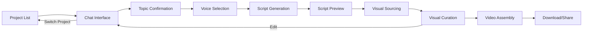

# 4. Application Workflows Overview

The AI Video Generator follows a multi-step workflow. Each step has its own UI optimized for that task.

### 4.1 Workflow Steps

**Step Progression:**
1. **Project Management** (Story 1.6) - Select or create project
2. **Chat Interface** (Epic 1) - Brainstorm ideas with AI
3. **Topic Confirmation** (Story 1.7) - Confirm video topic
4. **Voice Selection** (Epic 2, Story 2.3) - Choose narrator voice
5. **Script Generation** (Epic 2, Story 2.4) - AI generates script (automatic)
6. **Script & Voiceover Preview** (Epic 2, Story 2.6) - Review script with audio playback
7. **Visual Sourcing** (Epic 3, Story 3.5) - YouTube API searches for clips (automatic)
8. **Visual Curation** (Epic 4) - Select clips for each scene
9. **Video Assembly** (Epic 5) - Final video generation (automatic)
10. **Download/Share** (Epic 5) - Get final video + thumbnail

**Current Scope of UX Spec (Version 3.3):**
- ✅ **Project Management UI** (Story 1.6) - Fully specified (Section 5)
- ✅ **Chat Interface** (Epic 1) - Fully specified (Section 6.1-6.4)
- ✅ **Voice Selection UI** (Epic 2, Story 2.3) - Fully specified (Section 6.5)
- ✅ **Script Generation UI** (Epic 2, Story 2.4) - Fully specified (Section 6.6)
- ✅ **Script & Voiceover Preview UI** (Epic 2, Story 2.6) - Fully specified (Section 6.7)
- ✅ **Visual Sourcing Loading UI** (Epic 3, Story 3.5) - Fully specified (Section 6.8)
- ✅ **Visual Curation UI** (Epic 4, Stories 4.1-4.6) - Fully specified (Section 7 + Section 7.5 + Components 8.12-8.14) + Interactive mockup (ux-epic-4-mockup.html)
- ✅ **Video Assembly Progress UI** (Epic 5, Stories 5.1-5.4) - Fully specified (Section 7.6) - Detailed scene-by-scene progress dashboard
- ✅ **Export Page UI** (Epic 5, Story 5.5) - Fully specified (Section 7.7) - Showcase layout with video + thumbnail downloads
- ✅ **UX Pattern Consistency** - Fully specified (Section 1.2)
- ✅ **Accessibility Standards** - WCAG 2.1 AA with testing strategy (Section 3.5)
- ✅ **Touch Targets & Responsive Design** - 44px minimum, breakpoints defined (Section 3.4)

---

