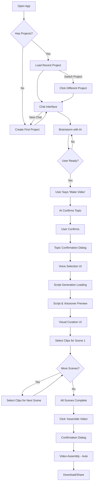

# 9. User Journey Flows

### 9.1 Complete End-to-End Workflow



### 9.2 Journey 1: First-Time User - Create First Video

**User Goal:** Create first video from scratch using the application.

**Preconditions:** User has never used the app before (no projects exist).

**Flow Steps:**

**Step 1: Welcome & First Project Creation**
- User opens app at `/`
- System detects no projects exist
- System auto-creates first project, loads chat interface
- User sees:
  - Empty sidebar with "New Chat" button
  - Chat interface with AI welcome message: "👋 Hi! I'm your AI video assistant. What video would you like to create today?"
  - Prompt to start conversation

**Step 2: Brainstorming Conversation**
- User types message: "I want to make a video about healthy eating tips"
- AI responds with questions: "Great! Should we focus on meal prep, nutrition basics, or specific diet types like Mediterranean or keto?"
- User: "Let's focus on meal prep for busy people"
- AI: "Perfect! I can help you create a video on 'Meal Prep Tips for Busy People.' Shall we cover 5-day prep strategies, time-saving recipes, or storage techniques?"
- User: "All of the above sounds good. Let's make the video."

**Step 3: Topic Confirmation**
- AI: "Understood. Shall I proceed with the video on 'Meal Prep Tips for Busy People'?"
- User: "Yes, proceed"
- Topic Confirmation Dialog appears:
  - Title: "Confirm Video Topic"
  - Field: "Meal Prep Tips for Busy People" (editable)
  - Buttons: [Cancel] [Confirm & Continue]
- User clicks "Confirm & Continue"

**Step 4: Voice Selection**
- System navigates to Voice Selection UI (Section 6.5)
- User sees 20 voice options displayed as cards in scrollable 3-column grid
- Each card shows: Voice name, gender, accent, tone, preview button
- User scrolls through available voices
- User clicks "Preview" on Voice 2 (Emma) → Audio sample plays (10 seconds)
- User decides Voice 2 fits the friendly, approachable tone desired
- User clicks Voice 2 card to select → Card highlights with indigo border + checkmark
- "Continue to Script Generation" button enables
- User clicks "Continue"

**Step 5: Script Generation** (Automatic)
- System navigates to Script Generation Loading screen (Section 6.6)
- Full-screen loading modal displays
- Spinner animates, main message: "Generating Your Script..."
- Stage messages cycle:
  - "Analyzing topic and structure..."
  - "Crafting professional narration..."
  - "Structuring scenes..."
  - "Quality check in progress..."
  - "Finalizing your script..."
- Script generation completes (takes 30-60 seconds)
- System auto-navigates to Script & Voiceover Preview UI (Section 6.7)

**Step 6: Script & Voiceover Preview**
- User arrives at Script Preview UI
- Sees page title: "Review Your Script"
- Total Duration displayed: "Total Duration: 2:12"
- 6 scene cards displayed vertically with script text
- First 3 scenes have audio players (voiceovers complete)
- Last 3 scenes show "Generating voiceover..." with spinner
- User reads Scene 1 script: "Picture this: A million humans living on Mars by 2050..."
- User clicks play button on Scene 1 audio player → Voiceover plays in Voice 2
- Progress bar fills, current time updates ("0:05 / 0:18")
- User listens to quality, confirms voiceover sounds natural
- User scrolls down, reads Scene 2 and Scene 3 scripts
- While reviewing, Scenes 4-6 voiceovers complete (real-time UI updates)
- Audio players appear for Scenes 4-6
- "Continue to Visual Sourcing" button enables (turns indigo)
- User clicks "Continue to Visual Sourcing"
- System navigates to Visual Curation UI (Section 7)

**Step 7: Visual Curation**
- User sees Visual Curation UI with:
  - Header: "Select Your Clips" + Progress "0/6 scenes complete"
  - 6 scene cards with script text + 4-6 clip options each
  - "Assemble Video" button (disabled)
- User scrolls through scenes, reads script

**Step 8: Selecting Clips**
- User clicks first clip thumbnail in Scene 1
- System highlights clip (indigo border + checkmark)
- Progress updates: "1/6 scenes complete"
- User continues selecting clips for remaining scenes

**Step 9: Assembly Trigger**
- User selects last clip (Scene 6)
- Progress: "6/6 scenes complete (100%)" - turns green
- "Assemble Video" button enables (Indigo, prominent)
- User clicks "Assemble Video"
- Confirmation dialog: "Ready to assemble? You've selected clips for all 6 scenes."
- User clicks "Confirm"

**Step 10: Video Assembly & Completion** (Future)
- Loading screen: "Assembling your video..."
- Progress bar shows assembly stages
- Completion screen: "Your video is ready!"
- Download button + Share options
- Option to start new video or return to chat

**Success Metrics:**
- User completes first video end-to-end
- Time to completion: < 10 minutes
- User understands workflow progression

### 9.3 Journey 2: Epic 2 Deep Dive - Voice Selection & Script Preview

**User Goal:** Select the perfect voice for narration and review AI-generated script before visual sourcing.

**Preconditions:** User has confirmed video topic via Topic Confirmation Dialog (Story 1.7 complete).

**Flow Steps:**

**Step 1: Arriving at Voice Selection**
- User clicks "Confirm & Continue" in Topic Confirmation Dialog
- System navigates to Voice Selection UI (Section 6.5)
- Page loads with title: "Select Your Voice"
- Subtitle: "Choose a narrator for your video"
- 20 voice option cards displayed in scrollable 3-column grid (~7 rows)
- "Continue" button disabled (gray) at bottom

**Step 2: Exploring Voice Options**
- User sees 20 voice cards in scrollable grid, including:
  - Sarah - American Female, Warm
  - James - American Male, Professional
  - Emma - American Female, Energetic
  - Michael - American Male, Calm
  - Olivia - British Female, Friendly
  - (15 additional voices available by scrolling: Sophia, Grace, Lucy, Freya, Charlotte, Matilda, Aria, David, William, Samuel, George, Lucas, Kai, Ethan, Liam)
  - Accent mix: 15 American (7 female, 8 male), 5 British (3 female, 2 male)
- All cards have gradient avatar icons and "Preview" buttons
- User scrolls through grid to view all options

**Step 3: Previewing Voices**
- User clicks "Preview" button on Voice 1 (Professional Alex)
- Audio sample plays (10 seconds): Professional male voice sample
- Preview button changes to "Playing..." with pause icon
- Card border pulses with violet color during playback
- User listens fully, audio completes, button resets to "Preview"
- User clicks "Preview" on Voice 2 (Friendly Sarah)
- Voice 1 preview auto-stops (only one plays at a time)
- Voice 2 preview plays: Friendly female British voice
- User decides Voice 2 feels warmer and more engaging

**Step 4: Selecting Voice**
- User clicks Voice 2 card (not preview button)
- Card highlights with:
  - 3px indigo border
  - Checkmark icon appears in top-right corner
  - Glow effect around card
- If Voice 1 was previously selected → Auto-deselects (only one selection allowed)
- "Continue to Script Generation" button enables (turns indigo)

**Step 5: Confirming Voice Selection**
- User reviews selected voice: "Friendly Sarah | Female | British | Friendly"
- Can still preview other voices (selection persists)
- Can change selection by clicking different card
- Satisfied with Voice 2 selection
- User clicks "Continue to Script Generation" button
- System saves voice_id to database (voice_id: 2)

**Step 6: Script Generation Loading**
- System navigates to Script Generation Loading screen (Section 6.6)
- Full-screen modal overlay displays (glassmorphism effect)
- Centered content box with spinner (64px, indigo gradient)
- Main message: "Generating Your Script..."
- Stage message appears: "Analyzing topic and structure..."
- User waits (no interaction possible, no cancel option)
- After 10 seconds → Stage message updates: "Crafting professional narration..."
- After 20 seconds → Stage message: "Structuring scenes..."
- After 30 seconds → Stage message: "Quality check in progress..."
- LLM generates 5 scenes with professional narration
- Quality validation runs → Script passes quality check
- After 45 seconds → Stage message: "Finalizing your script..."
- Script generation completes successfully

**Step 7: Arriving at Script Preview**
- System auto-navigates to Script & Voiceover Preview UI (Section 6.7)
- User sees page layout:
  - Header: "Review Your Script"
  - Center: "Total Duration: Calculating..."
  - Right: "Continue to Visual Sourcing" button (disabled, gray)
- 5 scene cards displayed vertically
- All scenes show script text immediately
- Scenes 1-2 have audio players (voiceovers complete)
- Scenes 3-5 show "Generating voiceover..." with spinner

**Step 8: Reading Script Scenes**
- User reads Scene 1 script:
  ```
  "Picture this: A million humans living on Mars by 2050.
  Sounds like science fiction, right? But SpaceX and NASA
  are betting everything on making it reality."
  ```
- Scene 1 badge: "Scene 1" (indigo), Duration: "0:18"
- User reads Scene 2 script:
  ```
  "The red planet, once just a distant dream, is now
  humanity's next home. Here's how we're actually
  going to pull it off."
  ```
- Scene 2 badge: "Scene 2", Duration: "0:15"
- User notes script quality: Natural, engaging, non-robotic language
- Satisfied with professional tone and narrative flow

**Step 9: Previewing Voiceovers**
- User clicks play button on Scene 1 audio player
- Play icon changes to pause icon
- Audio plays in Voice 2 (Friendly Sarah) with text narration
- Progress bar fills left-to-right
- Current time updates: "0:03 / 0:18"
- User listens to full voiceover
- Confirms voiceover matches script text exactly
- Confirms voice quality is natural and clear
- Audio completes → Play button resets
- User clicks play on Scene 2 audio player
- Scene 2 voiceover plays (Scene 1 auto-pauses)

**Step 10: Progressive Voiceover Loading**
- While user reviews Scene 2 audio → Scene 3 voiceover completes
- Scene 3 "Generating voiceover..." spinner disappears
- Scene 3 audio player appears with smooth fade-in transition
- Total Duration updates: "Total Duration: 1:15" (partial)
- User continues reading Scene 3 and Scene 4 scripts
- Scene 4 voiceover completes → Audio player appears
- Scene 5 voiceover completes → Audio player appears
- Total Duration updates: "Total Duration: 2:05" (final)
- "Continue to Visual Sourcing" button enables (turns indigo)

**Step 11: Reviewing All Scenes**
- User scrolls back to top to preview all voiceovers
- Clicks play on Scene 3, listens to full narration
- Satisfied with voice consistency across all scenes
- Notes that all scenes use same Voice 2 (Friendly Sarah)
- Confirms total video duration: 2:05 (acceptable length)
- Ready to proceed to visual sourcing

**Step 12: Continuing to Visual Sourcing**
- User clicks "Continue to Visual Sourcing" button
- System saves current_step = 'visual-sourcing' to database
- System navigates to Visual Curation UI (Section 7)
- User begins selecting B-roll clips for each scene

**Success Metrics:**
- User selects voice within 2 minutes (exploration + decision)
- User listens to at least 2 voice previews before selecting
- User understands script content and structure
- User previews at least 1 scene voiceover
- User completes Epic 2 workflow without errors or confusion
- Total Epic 2 time: 3-5 minutes (including script generation wait)

**Alternative Flows:**

**Alt 1: Voice Preview Failure**
- Step 3: User clicks "Preview" on Voice 3
- Audio fails to load (network error or missing file)
- Error toast: "Failed to load audio preview. You can still select this voice."
- Card shows "Preview Unavailable" message
- User can still select Voice 3 card without previewing
- Or user can try "Preview" again (retry button)

**Alt 2: Script Generation Failure**
- Step 6: Script generation reaches 95%
- LLM connection fails or timeout occurs
- Stage message changes to: "Script Generation Failed"
- Error message: "LLM connection failed. Please try again."
- Spinner stops, error icon (red X) displayed
- "Retry Script Generation" button appears
- User clicks "Retry"
- System restarts script generation process

**Alt 3: Quality Check Retry**
- Step 6: Script generation completes initial pass
- Quality validation detects robotic language ("In today's video...")
- Stage message: "Quality check in progress..."
- Quality retry message appears: "Improving script quality, regenerating..."
- Amber warning icon displayed
- LLM regenerates script with improved prompt
- Second attempt passes quality check
- System proceeds to voiceover generation
- User unaware of retry (seamless)

**Alt 4: Voiceover Generation Failure (Single Scene)**
- Step 10: Scene 3 voiceover generation fails (TTS service error)
- Scene 3 card shows error indicator (red icon)
- Error message: "Voiceover generation failed"
- Small "Retry" button appears on Scene 3 card
- Other scenes unaffected (Scenes 4-5 continue generating)
- "Continue" button remains disabled (need all scenes)
- User clicks "Retry" on Scene 3
- Scene 3 voiceover regenerates successfully
- "Continue" button enables when all complete

### 9.4 Journey 3: Returning User - Managing Multiple Projects

**User Goal:** Work on multiple video projects, switch between them, and resume work.

**Preconditions:** User has used app before, has 3 existing projects.

**Flow Steps:**

**Step 1: Return to App**
- User opens app at `/`
- System loads most recent project: "Cooking recipes"
- User sees:
  - Sidebar with 3 projects listed: "Cooking recipes" (active), "Gaming tutorials", "Travel vlogs"
  - Chat interface showing last conversation in "Cooking recipes"
  - Can resume conversation or view curation

**Step 2: Resume Work on Active Project**
- User sees previous conversation context
- User continues conversation: "Actually, let's change the focus to quick 15-minute meals"
- AI: "Great adjustment! Shall I update the script to focus on 15-minute meals?"
- User: "Yes, update it"
- System regenerates script, user proceeds to curation

**Step 3: Switch to Different Project**
- User clicks "Gaming tutorials" in sidebar
- System saves "Cooking recipes" state
- System loads "Gaming tutorials" conversation history
- Main content area updates with "Gaming tutorials" chat
- URL updates to `/projects/gaming-tutorials-id`
- Sidebar highlights "Gaming tutorials" as active

**Step 4: Create New Project**
- User clicks "New Chat" button in sidebar
- System creates new project (ID generated)
- New project appears at top of sidebar: "New Project (Just now)"
- Chat interface clears, shows AI welcome message
- User starts fresh conversation: "Help me brainstorm travel vlog ideas"
- Project name auto-updates to "Help me brainstorm travel..."

**Step 5: Navigate Back to Original Project**
- User clicks "Cooking recipes" in sidebar
- System loads saved state (if in curation, returns to exact scene)
- User continues where they left off
- No data loss, selections preserved

**Success Metrics:**
- User switches between projects successfully
- Context maintained across switches
- No confusion about which project is active

### 9.5 Journey 4: Visual Curation Deep Dive

**User Goal:** Review script, preview clips, and select perfect visuals for each scene.

**Preconditions:** User has confirmed topic, script generated, arrived at Visual Curation UI.

**Flow Steps:**

**Step 1: Landing State**
- User arrives from script generation workflow
- Visual Curation UI loads:
  - Header: "Select Your Clips" + Progress "0/5 scenes complete"
  - 5 scene cards displayed vertically
  - Each scene shows: Script text + 6 clip thumbnails
  - "Assemble Video" button disabled (gray)

**Step 2: Review Scene 1**
- User reads Scene 1 script: "The sun rises over a bustling city, signaling the start of a new day."
- User sees 6 thumbnail options: city skylines, sunrise time-lapses, urban morning scenes
- User hovers over first thumbnail → Play icon becomes prominent, slight scale
- User clicks thumbnail → Video plays inline with controls

**Step 3: Preview Multiple Options**
- User watches first clip (15 seconds)
- User clicks pause, returns to thumbnail grid
- User clicks second thumbnail → Different sunrise video plays
- User compares: "Second one has better lighting"
- User clicks second thumbnail again to select (not playing anymore)

**Step 4: Selection Confirmation**
- Second thumbnail gets:
  - Indigo border (3px)
  - Checkmark icon (top-right)
  - Subtle glow effect
- Scene 1 status badge updates: "✓ Complete" (green)
- Progress bar updates: "1/5 scenes complete (20%)"
- User scrolls to Scene 2

**Step 5: Continue Curation (Scenes 2-4)**
- User repeats preview + select for Scenes 2, 3, 4
- Progress bar fills: 2/5 → 3/5 → 4/5
- User can scroll up/down freely, change previous selections
- No forced linear order

**Step 6: Complete Last Scene**
- User selects clip for Scene 5
- Progress: "5/5 scenes complete (100%)" - turns green
- Success message: "Ready to assemble your video!"
- "Assemble Video" button enables (Indigo, no longer gray)
- Subtle celebration animation (optional: confetti or pulse)

**Step 7: Change Mind**
- User scrolls back to Scene 3
- User clicks different thumbnail in Scene 3
- Previous selection deselects automatically
- New selection applies
- Progress remains 100% (all scenes still have selections)

**Step 8: Trigger Assembly**
- User clicks "Assemble Video" button
- Confirmation dialog appears:
  - Title: "Ready to Assemble?"
  - Message: "You've selected clips for all 5 scenes. This will generate your final video."
  - Buttons: [Cancel] [Confirm]
- User clicks "Confirm"
- Loading screen: "Assembling your video..." (navigates away from curation)

**Decision Points:**
- User can preview any clip multiple times
- User can change selections anytime before assembly
- User can scroll and navigate scenes in any order
- User can cancel confirmation and return to curation

**Error Scenarios:**

**Scenario A: Clip Download Failed (Epic 4, Story 4.3)**
- User clicks clip thumbnail with error download status (⚠ red icon)
- VideoPreviewPlayer opens with YouTube embed fallback instead of downloaded segment
- Message displays: "Using YouTube preview (download unavailable)"
- Video plays from YouTube (slightly slower load, but functional)
- User can still select clip and proceed

**Scenario B: Scene with No Suggestions (Epic 4, Story 4.2)**
- User arrives at Scene 3, sees empty state instead of clip grid
- Message: "No clips found for this scene. The script may be too abstract or specific. Try editing the script text."
- Action buttons:
  - "Retry Visual Sourcing" → Triggers POST /api/projects/[id]/generate-visuals to re-run Epic 3 for this scene
  - "Skip This Scene" checkbox → User checks to exclude scene from final video
- If user skips scene → Progress counts as complete (e.g., 4/5 → 5/5 if Scene 3 skipped)
- "Assemble Video" button enables when all non-skipped scenes have selections

**Scenario C: Download Status Indicators (Epic 4, Story 4.2)**
- User arrives while some clip segments still downloading
- Clip thumbnails show download status badges:
  - ⏳ Pending (gray) - Queued for download
  - Indigo spinner - Downloading segment... 45%
  - ✓ Complete (green) - Ready to preview
  - ⚠ Error (red) - Download failed, will use YouTube embed
- User can still preview clips with "Pending" or "Downloading" status (uses YouTube embed)
- Status updates in real-time as downloads complete
- User receives toast when all downloads complete: "All video previews ready!"

**Scenario D: Network Error During Selection**
- User selects clip → POST /api/projects/[id]/select-clip fails due to network error
- Selection appears immediately (optimistic UI update)
- After 500ms, error toast appears: "Failed to save selection. Retrying..."
- System retries request automatically
- If retry fails → Toast updates: "Failed to save. Changes will be saved on next selection."
- Selection remains in UI (Zustand store), saved to localStorage as backup

**Scenario E: User Navigates Away with Incomplete Selections**
- User has selected clips for 3/5 scenes
- User clicks browser back button OR "Back to Script Preview" link
- Warning modal appears:
  - "You haven't selected clips for all scenes"
  - "You've selected clips for 3 out of 5 scenes. Your progress will be saved, but you'll need to return to complete curation."
  - Buttons: ["Stay and Continue"] ["Leave Anyway"]
- If user clicks "Leave Anyway" → Navigate away, selections saved to localStorage + database
- If user returns later → Selections restored from database, user can continue where they left off

**Success Metrics:**
- User completes all scenes within 5-10 minutes
- User understands selection mechanism (visual feedback clear)
- User feels confident in selections (preview functionality used)
- User successfully recovers from errors (retry functionality, fallback to YouTube embed)
- User understands download status indicators (80%+ of users select clips with "Complete" status first)

---

